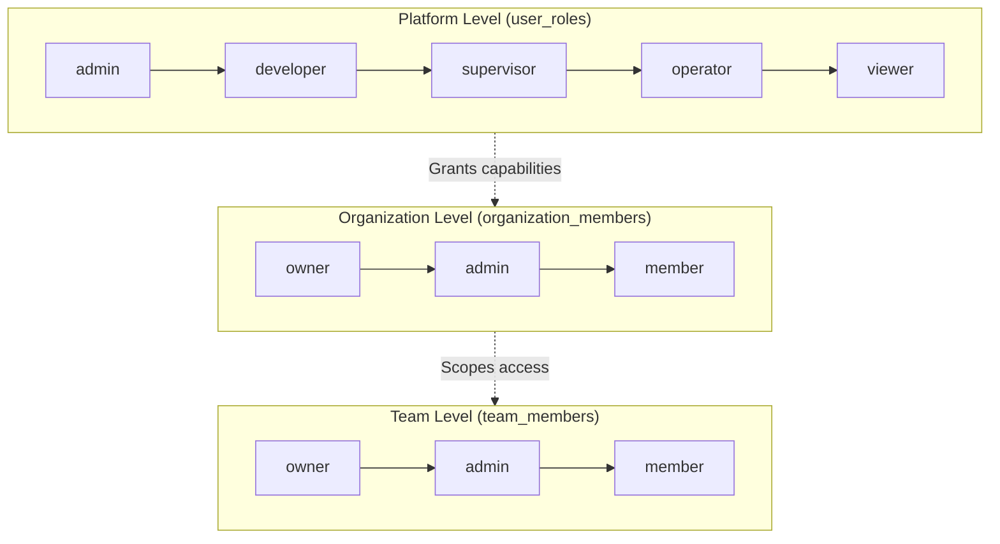

# PRD: User Roles & Access Control

**Version**: 1.0  
**Last Updated**: 2025-01-27  
**Status**: Active

---

## 1. Overview

### 1.1 Purpose
Define the multi-tiered permission system that governs user access across the JobLine.ai platform.

### 1.2 Scope
- Platform-level roles (app_role)
- Organization-level roles
- Team-level roles
- Permission inheritance and escalation

---

## 2. Role Hierarchy



---

## 3. Platform Roles (app_role)

| Role | Description | Auto-Assigned | Assignable By |
|------|-------------|---------------|---------------|
| `admin` | Full platform access, can manage all orgs | No | System only |
| `developer` | Access to testing, debugging, API tools | No | Platform admin |
| `supervisor` | Can review, approve, manage team workflows | No | Org admin |
| `operator` | Standard user, can submit handoffs, work orders | Yes (on signup) | Org admin |
| `viewer` | Read-only access to dashboards | No | Org admin |

### 3.1 Default Assignment
Every new user receives `operator` role via `handle_new_user` database trigger.

### 3.2 Role Capabilities

#### Admin
- [ ] Access Admin panel (`/admin`)
- [ ] View all organizations
- [ ] Manage platform settings
- [ ] View activity logs across platform
- [ ] Assign developer roles

#### Developer
- [ ] Access Testing panel (`/testing`)
- [ ] View debug information
- [ ] Access API documentation
- [ ] Run test suites

#### Supervisor
- [ ] Approve/reject job performance updates
- [ ] Override work order assignments
- [ ] View team analytics
- [ ] Manage station assignments

#### Operator
- [ ] Submit handoff records
- [ ] Update work order status
- [ ] Submit performance updates
- [ ] View assigned stations

#### Viewer
- [ ] View dashboards (read-only)
- [ ] View queue status
- [ ] View handoff history

---

## 4. Organization Roles

| Role | Description | Capabilities |
|------|-------------|--------------|
| `owner` | Organization creator | Full control, billing, delete org |
| `admin` | Organization administrator | Manage members, teams, settings |
| `member` | Standard member | Access org resources per app_role |

### 4.1 Owner Capabilities
- Manage billing and subscription
- Delete organization
- Transfer ownership
- All admin capabilities

### 4.2 Admin Capabilities
- Create/manage teams
- Invite/remove members
- Generate invite codes
- Manage org settings
- Assign app roles to members

### 4.3 Member Capabilities
- Join teams (when invited)
- Access org resources
- Capabilities defined by app_role

---

## 5. Team Roles

| Role | Description | Capabilities |
|------|-------------|--------------|
| `owner` | Team creator | Full team control |
| `admin` | Team administrator | Manage team members |
| `member` | Team member | Participate in team work |

---

## 6. Permission Matrix

| Action | Admin | Developer | Supervisor | Operator | Viewer |
|--------|-------|-----------|------------|----------|--------|
| View Dashboard | ✅ | ✅ | ✅ | ✅ | ✅ |
| Submit Handoff | ✅ | ✅ | ✅ | ✅ | ❌ |
| Create Work Order | ✅ | ✅ | ✅ | ❌ | ❌ |
| Approve Updates | ✅ | ❌ | ✅ | ❌ | ❌ |
| Manage Users | ✅ | ❌ | ❌ | ❌ | ❌ |
| Access Admin Panel | ✅ | ❌ | ❌ | ❌ | ❌ |
| Access Testing | ✅ | ✅ | ❌ | ❌ | ❌ |
| View Analytics | ✅ | ✅ | ✅ | ❌ | ✅ |

---

## 7. Database Implementation

### 7.1 Tables
- `user_roles`: Platform-level roles
- `organization_members`: Org membership + role
- `team_members`: Team membership + role

### 7.2 Helper Functions
```sql
has_role(_role, _user_id)        -- Check platform role
is_org_admin(_org_id, _user_id)  -- Check org admin
is_org_member(_org_id, _user_id) -- Check org membership
is_team_admin(_team_id, _user_id) -- Check team admin
is_team_member(_team_id, _user_id) -- Check team membership
is_supervisor_for_team(_team_id, _user_id) -- Check supervisor
```

---

## 8. UI Components

### 8.1 Role-Based Rendering
```tsx
// EntitlementGate - Show/hide based on role
<EntitlementGate requiredRole="supervisor">
  <ApprovalButtons />
</EntitlementGate>
```

### 8.2 Navigation Visibility
- Admin panel: `admin` only
- Testing panel: `admin` or `developer`
- Queue management: `supervisor` or higher

---

## 9. Success Metrics

| Metric | Target |
|--------|--------|
| Permission-related bugs | 0 per release |
| Role assignment time | < 2 seconds |
| Access denial accuracy | 100% |

---

## 10. Future Considerations

- [ ] Custom role creation
- [ ] Granular permission overrides
- [ ] Role expiration dates
- [ ] Audit log for role changes
