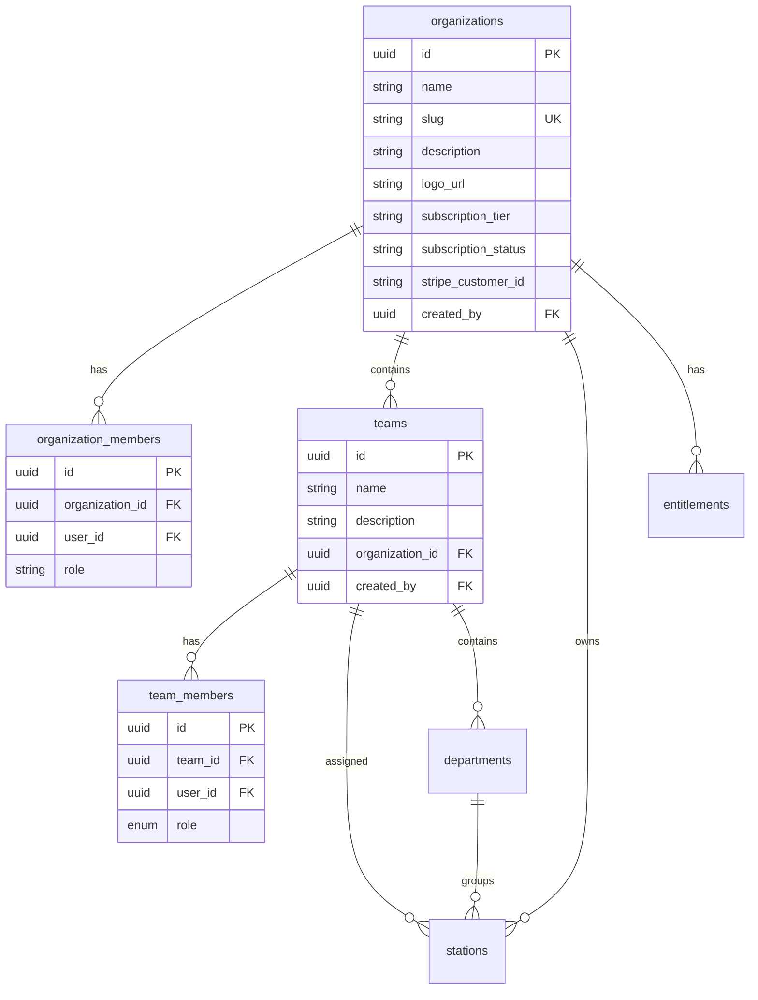
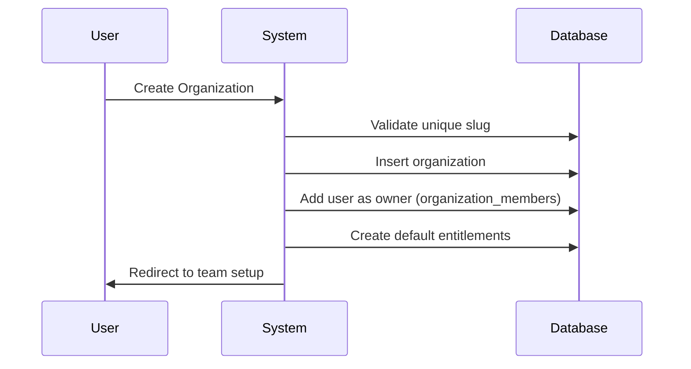
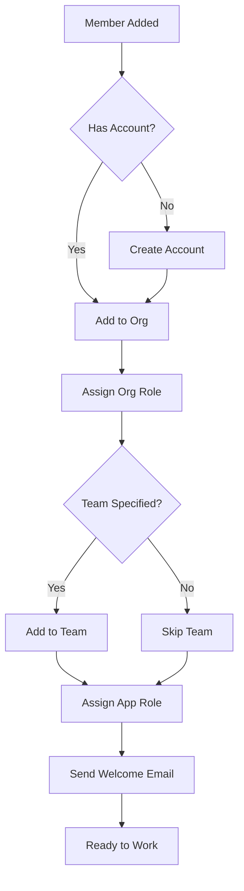

# PRD: Organization & Team Management

**Version**: 1.0  
**Last Updated**: 2025-01-27  
**Status**: Active

---

## 1. Overview

### 1.1 Purpose
Define the hierarchical structure for organizations and teams that enables multi-tenant collaboration.

### 1.2 Scope
- Organization creation and management
- Team structure within organizations
- Member management
- Station and department assignment

---

## 2. Data Model



---

## 3. Organization Lifecycle

### 3.1 Creation Flow



### 3.2 Required Fields

| Field | Type | Required | Validation |
|-------|------|----------|------------|
| name | string | ✅ | 2-100 chars |
| slug | string | ✅ | Unique, URL-safe |
| description | string | ❌ | Max 500 chars |
| logo_url | string | ❌ | Valid URL |

### 3.3 Organization Settings

- **General**: Name, description, logo
- **Billing**: Subscription, payment method
- **Manufacturing**: Work center types, shift schedules
- **Notifications**: Email preferences

---

## 4. Team Management

### 4.1 Team Structure

Each organization can have multiple teams representing:
- Shift crews (Day Shift, Night Shift)
- Department groups (CNC Team, Assembly Team)
- Project teams (Special Orders)

### 4.2 Team Creation

```typescript
interface CreateTeamInput {
  name: string;          // Required, 2-50 chars
  description?: string;  // Optional, max 200 chars
  organization_id: string; // Auto-set from context
}
```

### 4.3 Team Member Roles

| Role | Assign Members | Edit Team | Delete Team |
|------|----------------|-----------|-------------|
| owner | ✅ | ✅ | ✅ |
| admin | ✅ | ✅ | ❌ |
| member | ❌ | ❌ | ❌ |

---

## 5. Member Management

### 5.1 Adding Members

**Method 1: Invite Code**
- Generate QR code or secret code
- New user scans/enters code
- Auto-assigned to org/team with preset roles

**Method 2: Direct Add (Email)**
- Admin enters email of existing user
- User added to org/team
- Notification sent

**Method 3: Email Invitation**
- Admin sends email invite
- Recipient clicks link to join
- Account created if needed

### 5.2 Member Onboarding Flow



### 5.3 Removing Members

- Org admin can remove any member (except owner)
- Team admin can remove team members
- Removed users lose access immediately
- Data created by user remains

---

## 6. Department Structure

### 6.1 Purpose
Departments group stations within a team for organizational clarity.

### 6.2 Schema
```typescript
interface Department {
  id: string;
  team_id: string;
  name: string;
  description?: string;
}
```

### 6.3 Usage
- Stations can be assigned to departments
- Filtering/grouping in UI
- Reporting by department

---

## 7. Station Assignment

### 7.1 Hierarchy
```
Organization
└── Team
    └── Department (optional)
        └── Station
```

### 7.2 Station Ownership
- Stations belong to organizations
- Can be assigned to specific teams
- Can be grouped into departments

---

## 8. UI Components

### 8.1 Teams Page (`/teams`)
- **Teams Tab**: List/create/edit teams
- **Members Tab**: Manage organization members
- **Invite Codes Tab**: QR code generator

### 8.2 TeamSelector Component
- Dropdown in header for team switching
- Persists selection to localStorage
- Updates context across app

### 8.3 OrganizationMemberManager
- List all org members with roles
- Add/remove members
- Change roles

---

## 9. RLS Policies

### 9.1 Organizations
- Users can view orgs they belong to
- Only owners can delete
- Admins can update settings

### 9.2 Teams
- Members can view teams in their org
- Team admins can update team
- Org admins can manage all teams

### 9.3 Team Members
- Team admins can add/remove members
- Members can view other members

---

## 10. Success Metrics

| Metric | Target |
|--------|--------|
| Org creation success rate | > 99% |
| Team switch time | < 500ms |
| Member add time | < 3 seconds |
| Invite code redemption rate | > 80% |

---

## 11. Future Considerations

- [ ] Organization templates
- [ ] Team cloning
- [ ] Cross-org collaboration
- [ ] Guest access
- [ ] Team capacity limits
