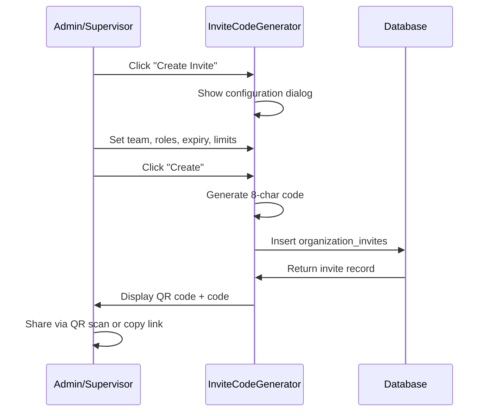
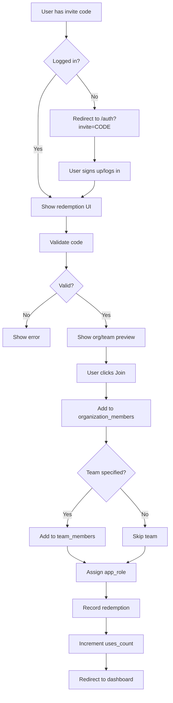

# PRD: Invite Code System

**Version**: 1.0  
**Last Updated**: 2025-01-27  
**Status**: Active

---

## 1. Overview

### 1.1 Purpose
Enable org admins and supervisors to easily onboard new members using QR codes and secret invite codes.

### 1.2 Scope
- Invite code generation
- QR code display
- Code validation and redemption
- Usage tracking and limits

---

## 2. User Stories

### 2.1 Org Admin
> As an org admin, I want to generate invite codes so that I can quickly onboard new team members without sharing sensitive credentials.

### 2.2 Supervisor
> As a supervisor, I want to create team-specific invites so that new operators join my team automatically.

### 2.3 New User
> As a new user, I want to scan a QR code and join an organization instantly so that I can start working without waiting for approval.

---

## 3. Invite Code Structure

### 3.1 Code Format
- **Length**: 8 characters
- **Character Set**: `ABCDEFGHJKLMNPQRSTUVWXYZ23456789` (no ambiguous chars: 0/O, 1/I/L)
- **Example**: `X7KM9P2H`

### 3.2 Data Model

```typescript
interface OrganizationInvite {
  id: string;
  organization_id: string;
  team_id: string | null;      // Optional team auto-join
  invite_code: string;          // Unique 8-char code
  created_by: string;           // User who created
  org_role: 'admin' | 'member'; // Role in organization
  app_role: 'supervisor' | 'operator' | null; // Platform role
  expires_at: string | null;    // Expiration date
  max_uses: number | null;      // Usage limit
  uses_count: number;           // Current usage
  is_active: boolean;           // Can be deactivated
  created_at: string;
}

interface InviteRedemption {
  id: string;
  invite_id: string;
  user_id: string;
  redeemed_at: string;
}
```

---

## 4. Generation Flow



### 4.1 Configuration Options

| Option | Type | Default | Description |
|--------|------|---------|-------------|
| Team | select | none | Auto-join team on redemption |
| Org Role | select | member | Organization role |
| App Role | select | operator | Platform role |
| Expires In | number | 7 days | Days until expiration |
| Max Uses | number | unlimited | Maximum redemptions |

---

## 5. Redemption Flow

### 5.1 Via QR Code Scan
```
https://app.jobline.ai/auth?invite=X7KM9P2H
```

### 5.2 Via Manual Entry
User enters code in redemption form.

### 5.3 Redemption Process



---

## 6. Validation Rules

### 6.1 Code Validation
```typescript
async function validateInviteCode(code: string): Promise<ValidationResult> {
  // 1. Check code exists
  // 2. Check is_active = true
  // 3. Check not expired (expires_at > now OR expires_at IS NULL)
  // 4. Check usage limit (uses_count < max_uses OR max_uses IS NULL)
  // 5. Return org/team/role details
}
```

### 6.2 Error States

| Error | Message |
|-------|---------|
| Not found | "Invalid invite code" |
| Expired | "This invite code has expired" |
| Max uses | "This invite code has reached its limit" |
| Deactivated | "This invite code is no longer active" |
| Already member | "You are already a member of this organization" |

---

## 7. UI Components

### 7.1 InviteCodeGenerator
**Location**: `/teams` → "Invite Codes" tab

**Features**:
- Create new invite dialog
- Table of existing invites
- QR code display modal
- Copy code/link buttons
- Deactivate/delete actions

### 7.2 InviteCodeRedemption
**Location**: `/auth?invite=CODE` or standalone

**Features**:
- Code input with formatting
- Validate button
- Organization/team preview
- Join confirmation
- Error display

---

## 8. Security Considerations

### 8.1 Rate Limiting
- Max 10 validation attempts per minute per IP
- Max 5 invite creations per hour per user

### 8.2 Code Security
- Codes are case-insensitive (stored uppercase)
- Brute force resistant (8 chars, 32 possible = 1 trillion combos)
- Immediate deactivation on suspicious activity

### 8.3 RLS Policies
- Org admins: Full CRUD on their org's invites
- Supervisors: Create/view invites in their org
- Public: SELECT only for validation (active, non-expired)

---

## 9. Email Notifications

### 9.1 On Redemption
Send to org admins:
- New member name/email
- Team joined
- Role assigned
- Invite code used

### 9.2 On Expiration Warning
Send to invite creator:
- 24 hours before expiration
- Current usage stats

---

## 10. Analytics

### 10.1 Tracked Events
- `invite_created`: Code generated
- `invite_validated`: Code checked
- `invite_redeemed`: User joined
- `invite_deactivated`: Manually disabled
- `invite_expired`: Auto-expired

### 10.2 Metrics Dashboard
- Active invites count
- Redemption rate
- Average time to redeem
- Most used invites

---

## 11. Success Metrics

| Metric | Target |
|--------|--------|
| Code generation success | > 99.9% |
| Validation response time | < 200ms |
| Redemption success rate | > 95% |
| Time from scan to working | < 60 seconds |

---

## 12. Future Considerations

- [ ] Bulk invite generation
- [ ] CSV export of invites
- [ ] Custom code prefixes per org
- [ ] SMS delivery of codes
- [ ] Invite approval workflow
- [ ] Department-specific invites
