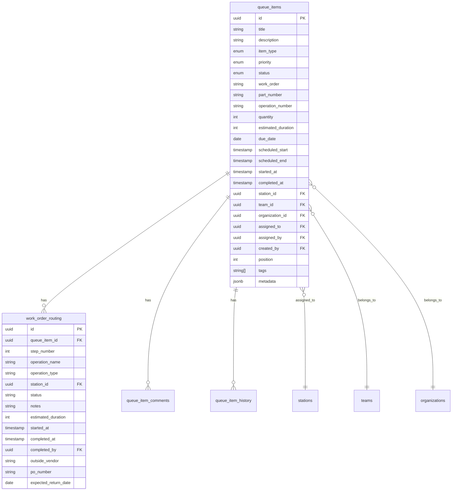
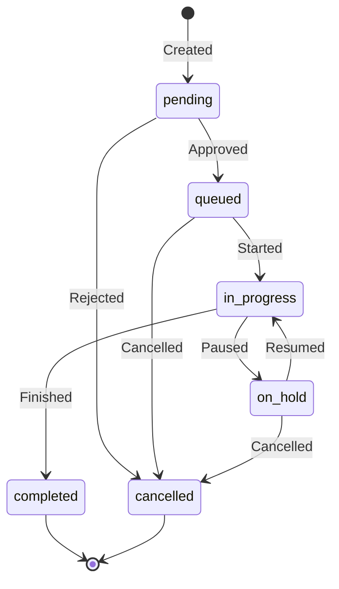
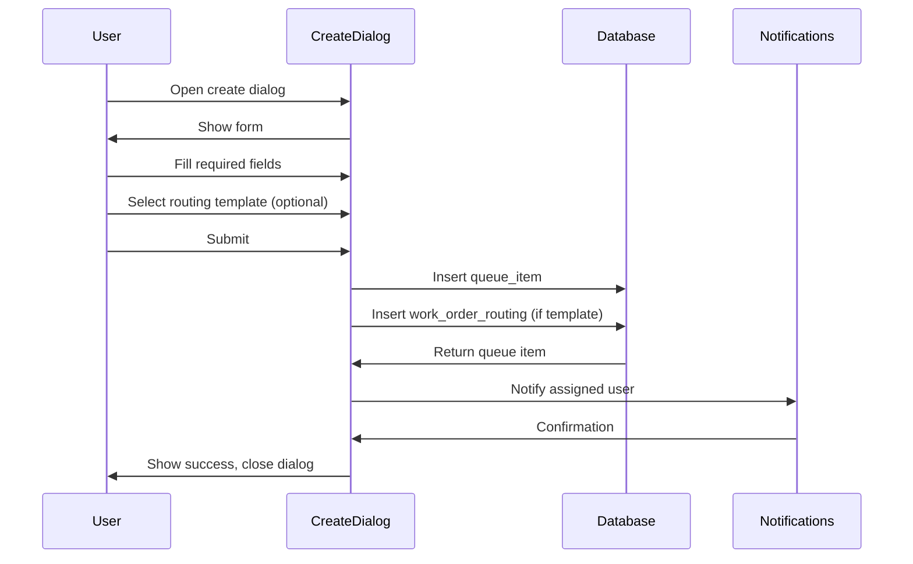

# PRD: Work Order & Queue Management

**Version**: 1.0  
**Last Updated**: 2025-01-27  
**Status**: Active

---

## 1. Overview

### 1.1 Purpose
Manage manufacturing work orders through a priority-based queue system with routing, assignment, and tracking capabilities.

### 1.2 Scope
- Queue item creation and management
- Work order routing
- Assignment and scheduling
- Status tracking
- Views: List, Kanban, Calendar

---

## 2. Data Model



---

## 3. Queue Item Types

| Type | Description | Use Case |
|------|-------------|----------|
| `work_order` | Manufacturing job | Production work |
| `station_task` | Station-specific task | Maintenance, setup |
| `team_task` | Team-level task | Training, meetings |
| `support_ticket` | Support request | Equipment issues |

---

## 4. Priority Levels

| Priority | Color | SLA | Description |
|----------|-------|-----|-------------|
| `critical` | Red | 2 hours | Production stopped |
| `urgent` | Orange | 4 hours | Risk of delay |
| `high` | Yellow | 8 hours | Important work |
| `normal` | Blue | 24 hours | Standard work |
| `low` | Gray | 48 hours | When available |

---

## 5. Status Workflow



### 5.1 Status Definitions

| Status | Description | Actions Available |
|--------|-------------|-------------------|
| `pending` | Awaiting approval | Approve, Reject |
| `queued` | Ready to start | Start, Assign, Reschedule |
| `in_progress` | Being worked | Pause, Complete |
| `on_hold` | Temporarily paused | Resume, Cancel |
| `completed` | Finished | Reopen (admin) |
| `cancelled` | Not proceeding | Restore (admin) |

---

## 6. Work Order Creation

### 6.1 Required Fields

| Field | Type | Required | Validation |
|-------|------|----------|------------|
| title | string | ✅ | 3-100 chars |
| item_type | enum | ✅ | Valid type |
| priority | enum | ✅ | Default: normal |

### 6.2 Optional Fields

| Field | Type | Description |
|-------|------|-------------|
| description | string | Detailed instructions |
| work_order | string | External WO number |
| part_number | string | Part identifier |
| operation_number | string | Op number |
| quantity | number | Units to produce |
| due_date | date | Target completion |
| estimated_duration | number | Minutes expected |
| station_id | uuid | Assigned station |
| assigned_to | uuid | Assigned user |
| tags | string[] | Categorization |

### 6.3 Creation Flow



---

## 7. Work Order Routing

### 7.1 Routing Steps
Each work order can have multiple routing steps defining the manufacturing process.

```typescript
interface RoutingStep {
  step_number: number;
  operation_name: string;
  operation_type: 'internal' | 'outside_processing';
  station_id?: string;
  estimated_duration?: number;
  notes?: string;
  // For outside processing
  outside_vendor?: string;
  po_number?: string;
  expected_return_date?: Date;
}
```

### 7.2 Routing Templates
Predefined routing patterns for common part types.

```typescript
interface RoutingTemplate {
  id: string;
  name: string;
  description?: string;
  organization_id: string;
  part_number_pattern?: string; // Regex for auto-apply
  is_default: boolean;
  steps: RoutingTemplateStep[];
}
```

### 7.3 Outside Processing
For operations sent to external vendors:
- Track vendor name
- Record PO number
- Set expected return date
- Auto-notify on delays

---

## 8. Queue Views

### 8.1 List View
- Sortable columns
- Filters: status, priority, station, team
- Bulk actions
- Inline status updates

### 8.2 Kanban View
- Columns by status
- Drag-and-drop between statuses
- Priority indicators
- Quick view on click

### 8.3 Calendar View
- Scheduled items on calendar
- Due date visualization
- Drag to reschedule
- Color by priority

---

## 9. Filtering & Search

### 9.1 Filter Options

| Filter | Type | Options |
|--------|------|---------|
| Status | multi-select | All statuses |
| Priority | multi-select | All priorities |
| Type | multi-select | All types |
| Station | select | Team stations |
| Assigned | select | Team members |
| Date Range | date picker | Due date range |
| Tags | multi-select | Available tags |

### 9.2 Search
- Full-text search on title, description
- Work order number search
- Part number search

---

## 10. Assignment

### 10.1 Manual Assignment
- Supervisor assigns to operator
- Operator can self-assign from queue

### 10.2 Auto-Assignment Rules
- Round-robin by station
- Skill-based matching
- Load balancing

### 10.3 Reassignment
- Supervisor can reassign anytime
- Operator can release (returns to queue)
- History tracked

---

## 11. Time Tracking

### 11.1 Timestamps
- `created_at`: Queue item created
- `started_at`: Work began
- `completed_at`: Work finished

### 11.2 Duration Tracking
- Estimated vs actual comparison
- Per-step timing
- Idle time detection

---

## 12. Comments & History

### 12.1 Comments
- Text comments on queue items
- User attribution
- Timestamp

### 12.2 History Log
- All status changes
- Assignment changes
- Field updates
- Before/after values

---

## 13. Notifications

### 13.1 Triggers

| Event | Notify |
|-------|--------|
| New assignment | Assigned user |
| Priority change | Assigned user, supervisor |
| Status change | Stakeholders |
| Due date approaching | Assigned user |
| Overdue | Assigned user, supervisor |

---

## 14. RLS Policies

### 14.1 Queue Items
- View: Team members can see team's items
- Create: Supervisors and above
- Update: Assigned user or supervisor
- Delete: Org admins only

### 14.2 Routing
- Follows queue item access
- Complete step: Assigned operator

---

## 15. Success Metrics

| Metric | Target |
|--------|--------|
| Queue load time | < 1 second |
| Status update time | < 500ms |
| On-time completion | > 90% |
| Average cycle time | Track baseline |

---

## 16. Future Considerations

- [ ] Recurring work orders
- [ ] Work order templates
- [ ] Batch operations
- [ ] Dependency linking
- [ ] Cost tracking
- [ ] Quality checkpoints
- [ ] Mobile app integration
