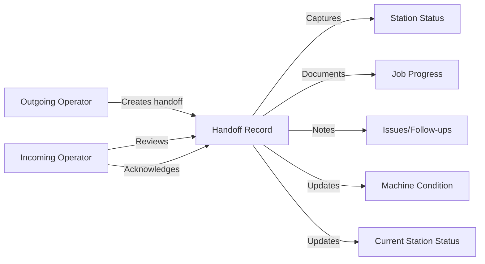
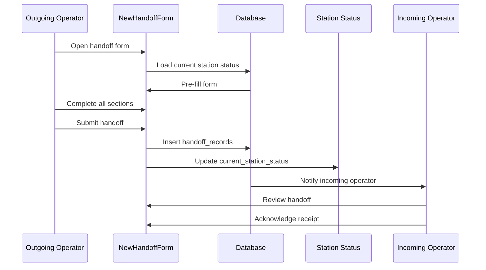

# PRD: Shift Handoff System

**Version**: 1.0  
**Last Updated**: 2025-01-27  
**Status**: Active

---

## 1. Overview

### 1.1 Purpose
Enable seamless shift transitions by capturing and communicating critical station status, job progress, and operational notes between outgoing and incoming operators.

### 1.2 Scope
- Handoff record creation
- Station status capture
- Work center-specific fields
- Machine condition tracking
- Quality and material status

---

## 2. Core Concept



---

## 3. Data Model

```typescript
interface HandoffRecord {
  id: string;
  
  // Context
  date: string;
  shift: string;
  team_id: string;
  station_id: string;
  work_center: string;
  work_center_type: string;
  machine_id: string;
  
  // Operators
  outgoing_operator_id: string;
  outgoing_operator_name: string;
  outgoing_time: string;
  incoming_operator_id: string;
  incoming_operator_name: string;
  incoming_time: string;
  supervisor_name?: string;
  supervisor_time?: string;
  
  // Job Information
  work_order: string;
  part_number: string;
  part_revision: string;
  operation_number: string;
  
  // Status
  primary_state: 'running' | 'setup' | 'down' | 'idle' | 'maintenance';
  state_reason?: string;
  delay_code?: string;
  
  // Progress
  parts_completed_this_shift: number;
  rework_count: number;
  scrap_count: number;
  last_good_part_timestamp?: string;
  
  // Quality
  critical_dims_verified: boolean;
  quality_notes?: string;
  
  // Material
  raw_material_available: boolean;
  next_material_lot_ready: boolean;
  material_issues_noted: boolean;
  material_notes?: string;
  
  // Summary
  handoff_summary: string;
  process_notes_for_next_shift?: string;
  
  // Work center specific (JSON fields)
  machine_condition?: MachineCondition;
  machine_readiness?: MachineReadiness;
  tooling_notes?: ToolingNotes;
  equipment_readiness?: EquipmentReadiness;
  issues_follow_ups?: IssueFollowUp[];
  
  // Metadata
  record_version: number;
  created_at: string;
  updated_at: string;
}
```

---

## 4. Work Center Types

### 4.1 Supported Types

| Type | Icon | Description |
|------|------|-------------|
| `cnc_lathe` | ⚙️ | CNC Lathe machines |
| `cnc_mill` | 🔧 | CNC Milling machines |
| `manual_lathe` | 🔩 | Manual lathes |
| `manual_mill` | 🛠️ | Manual milling |
| `grinding` | ⚡ | Grinding operations |
| `welding` | 🔥 | Welding stations |
| `assembly` | 📦 | Assembly lines |
| `inspection` | 🔍 | Quality inspection |
| `water_jet` | 💧 | Water jet cutting |
| `laser` | ⚡ | Laser operations |
| `paint` | 🎨 | Paint/coating |
| `packaging` | 📦 | Packaging |

### 4.2 Work Center-Specific Fields

```typescript
// CNC-specific
interface CNCCondition {
  coolant_level: 'full' | 'adequate' | 'low' | 'empty';
  chip_conveyor_status: 'running' | 'stopped' | 'jammed';
  spindle_temp: number;
  tool_life_remaining: number; // percentage
}

// Welding-specific
interface WeldingCondition {
  wire_spool_level: 'full' | 'partial' | 'low';
  gas_pressure: number;
  torch_condition: 'good' | 'needs_cleaning' | 'replace';
}

// Water jet-specific
interface WaterJetCondition {
  water_level: 'full' | 'adequate' | 'low';
  abrasive_level: 'full' | 'adequate' | 'low';
  nozzle_condition: 'good' | 'worn' | 'replace';
}
```

---

## 5. Handoff Creation Flow



---

## 6. Form Sections

### 6.1 Header Section
- Date & Shift selection
- Station selection
- Outgoing/Incoming operator names
- Timestamps

### 6.2 Job Information
- Work order number
- Part number & revision
- Operation number
- Primary state (Running/Setup/Down/Idle/Maintenance)
- Delay codes

### 6.3 Production Progress
- Parts completed this shift
- Rework count
- Scrap count
- Last good part timestamp

### 6.4 Quality Status
- Critical dimensions verified
- First article status
- Quality notes

### 6.5 Material Status
- Raw material available
- Next lot ready
- Material issues noted
- Material notes

### 6.6 Machine Condition
(Work center-specific fields)

### 6.7 Summary
- Handoff summary (required)
- Process notes for next shift
- Issues requiring follow-up

---

## 7. Current Station Status

Real-time station dashboard derived from latest handoffs.

```typescript
interface CurrentStationStatus {
  id: string;
  station_id: string;
  last_handoff_id: string;
  current_operator_id?: string;
  current_operator_name?: string;
  current_job_work_order?: string;
  current_job_part_number?: string;
  current_job_state?: string;
  parts_complete?: number;
  parts_required?: number;
  condition_status?: string;
  condition_notes?: string;
  updated_at: string;
}
```

---

## 8. Handoff History

### 8.1 View Options
- By station (all shifts)
- By operator (my handoffs)
- By date range
- By work order

### 8.2 Search & Filter
- Full-text search
- Filter by state
- Filter by issues
- Filter by work center type

---

## 9. Handoff Cards

### 9.1 Display Information
- Station name and type
- Current job info
- Primary state badge
- Parts progress
- Outgoing operator
- Key issues highlighted
- Time since handoff

### 9.2 Status Colors
| State | Color |
|-------|-------|
| running | Green |
| setup | Blue |
| down | Red |
| idle | Yellow |
| maintenance | Orange |

---

## 10. Notifications

### 10.1 Triggers

| Event | Recipients |
|-------|------------|
| Handoff created | Incoming operator, supervisor |
| Machine down | Supervisor, maintenance |
| Quality issue noted | QA team |
| Material shortage | Material handlers |

### 10.2 Email Template
- Station and shift info
- Job summary
- Critical issues highlighted
- Link to full handoff

---

## 11. Reports & Analytics

### 11.1 Shift Stats
- Total handoffs
- Production totals
- Scrap/rework rates
- Average cycle time

### 11.2 Station Performance
- Uptime percentage
- State distribution
- Issue frequency
- Trend analysis

---

## 12. RLS Policies

### 12.1 Handoff Records
- View: Team members can view team handoffs
- Create: Operators and above
- Update: Creator or supervisor (limited time)
- Delete: Admin only

### 12.2 Station Status
- View: Org members
- Update: Via handoff submission only

---

## 13. Validation Rules

### 13.1 Required Fields
- Date and shift
- Station
- Outgoing operator name
- Work order
- Part number
- Primary state
- Handoff summary

### 13.2 Business Rules
- Incoming operator cannot equal outgoing
- Future dates not allowed
- Supervisor required for down state > 1 hour

---

## 14. Success Metrics

| Metric | Target |
|--------|--------|
| Handoff completion rate | > 95% |
| Average completion time | < 5 minutes |
| Issue follow-up rate | > 90% |
| Information accuracy | > 98% |

---

## 15. Future Considerations

- [ ] Photo attachments
- [ ] Voice notes
- [ ] Mobile-optimized form
- [ ] Offline support
- [ ] Digital signatures
- [ ] Supervisor approval workflow
- [ ] Auto-generated summaries (AI)
- [ ] Cross-shift trending
