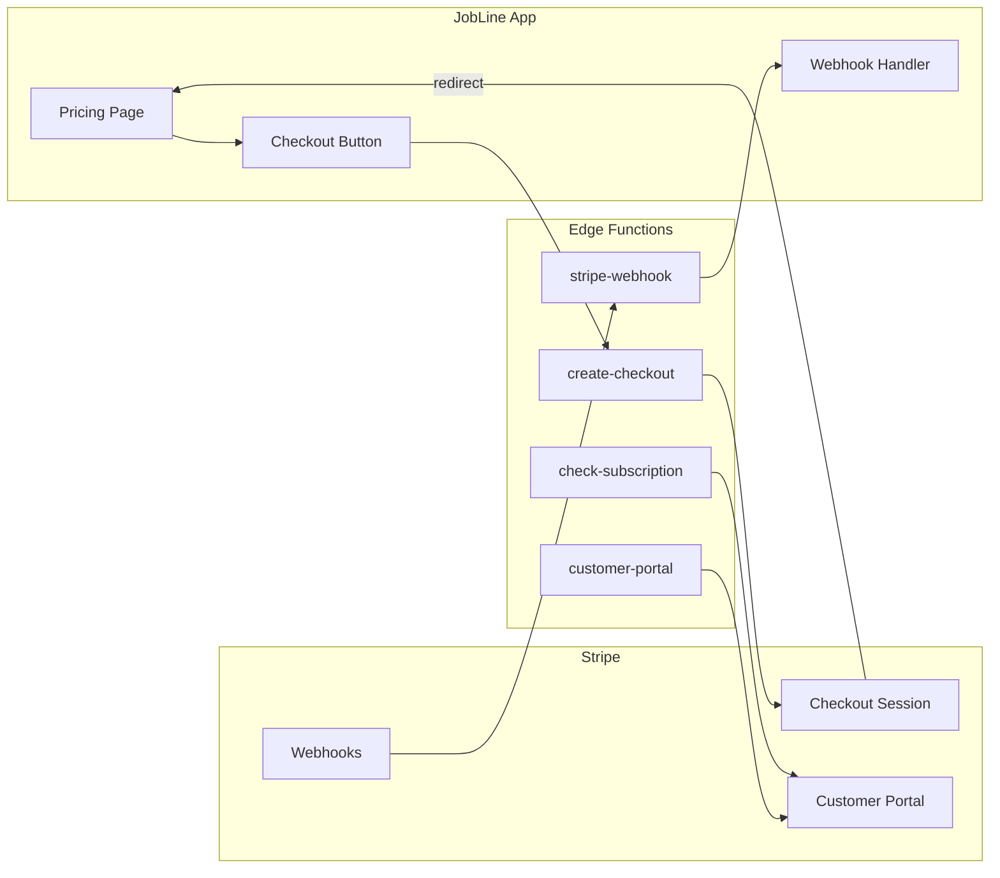
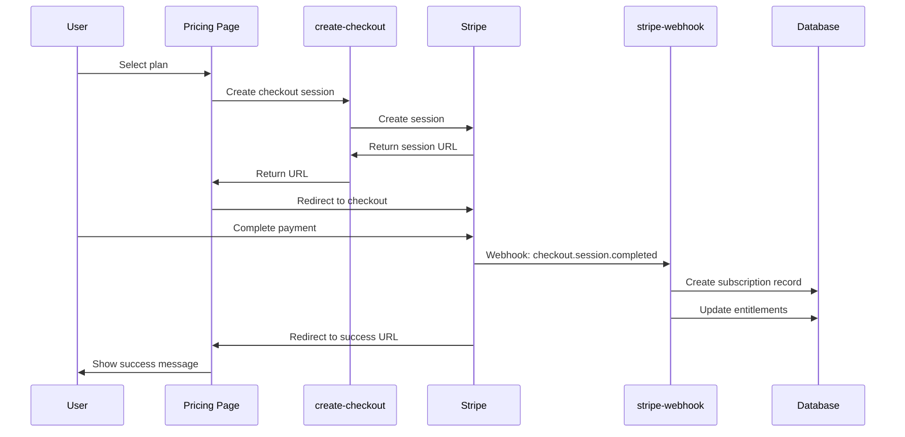

# PRD: Subscription & Billing System

**Version**: 1.0  
**Last Updated**: 2025-01-27  
**Status**: Active

---

## 1. Overview

### 1.1 Purpose
Manage organization subscriptions, entitlements, and billing through Stripe integration.

### 1.2 Scope
- Subscription tiers and pricing
- Stripe checkout integration
- Entitlement management
- Usage limits and feature gating

---

## 2. Subscription Tiers

### 2.1 Tier Overview

| Tier | Price | Users | Description |
|------|-------|-------|-------------|
| **Single** | $8.99/mo | 1 | Individual operator |
| **Team** | $24.99/mo | 4 | Small team (1 + 3) |
| **Enterprise** | $49.99/mo | 10+ | Growing organization |

### 2.2 Tier Details

#### Single User ($8.99/month)
```typescript
{
  name: 'Single User',
  price: 8.99,
  priceId: 'price_1SthCzCyekafHX78lL2vp30M',
  productId: 'prod_TrQ3QqbNqlmDiS',
  users: 1,
  features: [
    'Full dashboard access',
    'Unlimited handoff submissions',
    'Performance update tracking',
    'Real-time station monitoring',
    'Email notifications',
    'Mobile-friendly interface'
  ]
}
```

#### Team ($24.99/month)
```typescript
{
  name: 'Team',
  price: 24.99,
  priceId: 'price_1SthDFCyekafHX78ukVYmJLp',
  productId: 'prod_TrQ3SzBnvfW4yA',
  users: 4,
  features: [
    'Everything in Single User',
    '1 main user + 3 team members',
    'Team management dashboard',
    'Shared station assignments',
    'Team analytics & reports',
    'Priority email support'
  ]
}
```

#### Enterprise ($49.99/month + $7.99/user)
```typescript
{
  name: 'Enterprise',
  price: 49.99,
  priceId: 'price_1SthDUCyekafHX78MIJEHfCG',
  productId: 'prod_TrQ3Y4BKSsc591',
  users: 10,
  additionalUserPrice: 7.99,
  features: [
    'Everything in Team',
    '10+ users included',
    '$7.99/additional user',
    'Admin control panel',
    'Custom integrations',
    'Dedicated account manager',
    'SSO & advanced security',
    'API access'
  ]
}
```

---

## 3. Entitlements System

### 3.1 Data Model

```typescript
interface Entitlements {
  id: string;
  organization_id: string;
  plan: 'free' | 'single' | 'team' | 'enterprise';
  features: {
    handoff_hub: boolean;
    work_orders: boolean;
    analytics: boolean;
    api_access: boolean;
    bulk_upload: boolean;
    [key: string]: boolean;
  };
  limits: {
    users: number;
    work_orders_per_month: number;
    stations: number;
    [key: string]: number;
  };
  created_at: string;
  updated_at: string;
}
```

### 3.2 Default Entitlements (Free)

```typescript
const DEFAULT_ENTITLEMENTS = {
  plan: 'free',
  features: {
    handoff_hub: true,
    work_orders: true,
    analytics: false,
    api_access: false,
    bulk_upload: false
  },
  limits: {
    users: 1,
    work_orders_per_month: 50,
    stations: 5
  }
};
```

### 3.3 Feature Matrix

| Feature | Free | Single | Team | Enterprise |
|---------|------|--------|------|------------|
| Handoff Hub | ✅ | ✅ | ✅ | ✅ |
| Work Orders | ✅ | ✅ | ✅ | ✅ |
| Analytics | ❌ | ✅ | ✅ | ✅ |
| API Access | ❌ | ❌ | ❌ | ✅ |
| Bulk Upload | ❌ | ❌ | ✅ | ✅ |
| User Limit | 1 | 1 | 4 | 10+ |
| WO/Month | 50 | ∞ | ∞ | ∞ |
| Stations | 5 | 10 | 25 | ∞ |

---

## 4. Stripe Integration

### 4.1 Architecture



### 4.2 Edge Functions

#### create-checkout
Creates a Stripe Checkout session for new subscriptions.

```typescript
// Input
{ priceId: string }

// Output
{ url: string } // Redirect URL
```

#### check-subscription
Verifies current subscription status.

```typescript
// Output
{
  subscribed: boolean;
  tier: 'single' | 'team' | 'enterprise' | null;
  subscription_end: string | null;
}
```

#### customer-portal
Opens Stripe Customer Portal for subscription management.

```typescript
// Output
{ url: string } // Portal URL
```

#### stripe-webhook
Handles Stripe webhook events.

---

## 5. Checkout Flow



---

## 6. Webhook Events

### 6.1 Handled Events

| Event | Action |
|-------|--------|
| `checkout.session.completed` | Create subscription, update entitlements |
| `customer.subscription.updated` | Update subscription status |
| `customer.subscription.deleted` | Downgrade to free tier |
| `invoice.payment_succeeded` | Update payment status |
| `invoice.payment_failed` | Notify user, grace period |

### 6.2 Webhook Security
- Verify signature with `STRIPE_WEBHOOK_SECRET`
- Idempotency via `stripe_events` table
- Retry handling for failed events

---

## 7. Database Tables

### 7.1 subscriptions
```sql
CREATE TABLE subscriptions (
  id UUID PRIMARY KEY,
  organization_id UUID REFERENCES organizations,
  stripe_customer_id TEXT NOT NULL,
  stripe_subscription_id TEXT NOT NULL,
  stripe_price_id TEXT NOT NULL,
  status TEXT NOT NULL,
  quantity INTEGER,
  current_period_start TIMESTAMP,
  current_period_end TIMESTAMP,
  cancel_at_period_end BOOLEAN,
  canceled_at TIMESTAMP,
  metadata JSONB
);
```

### 7.2 stripe_events
```sql
CREATE TABLE stripe_events (
  id TEXT PRIMARY KEY, -- Stripe event ID
  event_type TEXT NOT NULL,
  payload JSONB,
  processed_at TIMESTAMP
);
```

---

## 8. UI Components

### 8.1 Pricing Page
- Tier comparison cards
- Feature highlights
- CTA buttons per tier
- Annual/monthly toggle (future)

### 8.2 BillingBanner
- Current plan display
- Upgrade prompts
- Usage warnings

### 8.3 BillingSettings
- Current subscription details
- Usage statistics
- Manage subscription button
- Invoice history

### 8.4 EntitlementGate
```tsx
<EntitlementGate 
  feature="analytics" 
  fallback={<UpgradePrompt />}
>
  <AnalyticsDashboard />
</EntitlementGate>
```

---

## 9. Hooks

### 9.1 useSubscription
```typescript
const {
  subscribed,
  tier,
  subscriptionEnd,
  isLoading,
  error,
  checkSubscription,
  createCheckout,
  openCustomerPortal
} = useSubscription();
```

### 9.2 useEntitlements
```typescript
const {
  entitlements,
  loading,
  canAccess,      // (feature) => boolean
  isWithinLimit,  // (limit, count) => boolean
  getLimit,       // (limit) => number
  getRemainingQuota // (limit, count) => number
} = useEntitlements();
```

---

## 10. Upgrade Prompts

### 10.1 Trigger Points
- Hitting user limit
- Hitting work order limit
- Accessing gated feature
- Monthly usage warnings

### 10.2 Prompt Messaging
- Clear value proposition
- Current usage vs limit
- Upgrade CTA
- Compare plans link

---

## 11. Grace Periods

### 11.1 Payment Failure
- 3-day grace period
- Email notifications (1, 2, 3 days)
- Feature restrictions after grace
- Full downgrade after 7 days

### 11.2 Cancellation
- Access until period end
- Reminder emails
- Win-back offers

---

## 12. Security Considerations

### 12.1 Secrets Management
- `STRIPE_SECRET_KEY` in environment
- `STRIPE_WEBHOOK_SECRET` for webhook verification
- Never expose keys to client

### 12.2 RLS
- Entitlements: Read by org members
- Subscriptions: Read by org owners/admins

---

## 13. Success Metrics

| Metric | Target |
|--------|--------|
| Checkout completion rate | > 60% |
| Upgrade conversion | > 10% of free |
| Churn rate | < 5% monthly |
| Payment success rate | > 95% |

---

## 14. Future Considerations

- [ ] Annual billing discounts
- [ ] Usage-based add-ons
- [ ] Team seat management
- [ ] Invoice customization
- [ ] Multiple payment methods
- [ ] Trial periods
- [ ] Promotional codes
- [ ] Enterprise custom pricing
