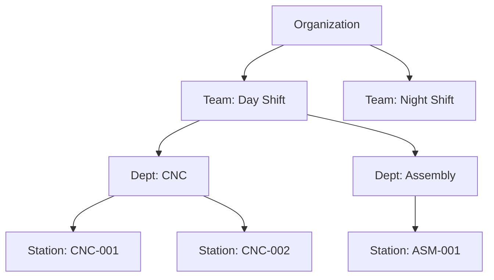
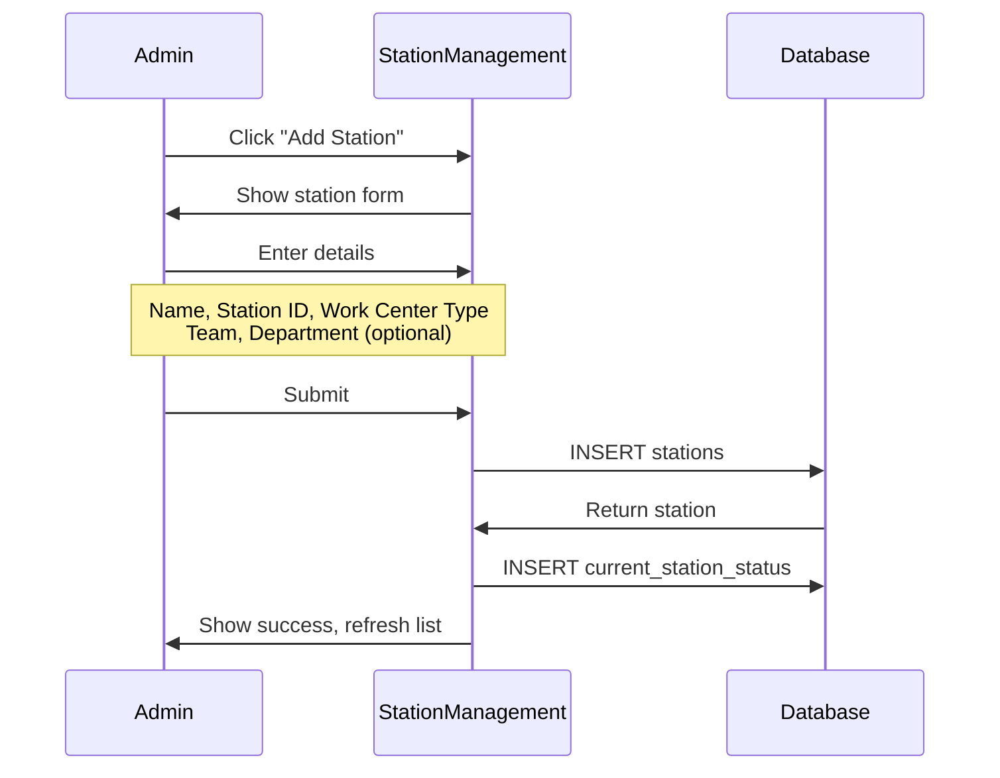
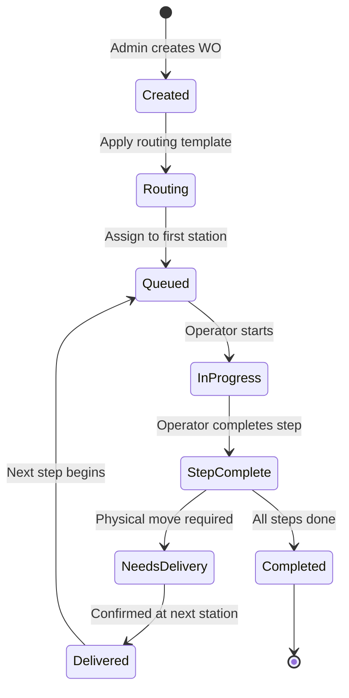
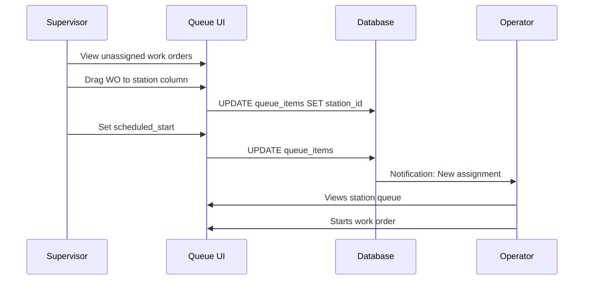
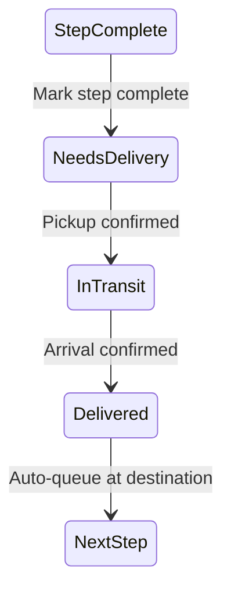
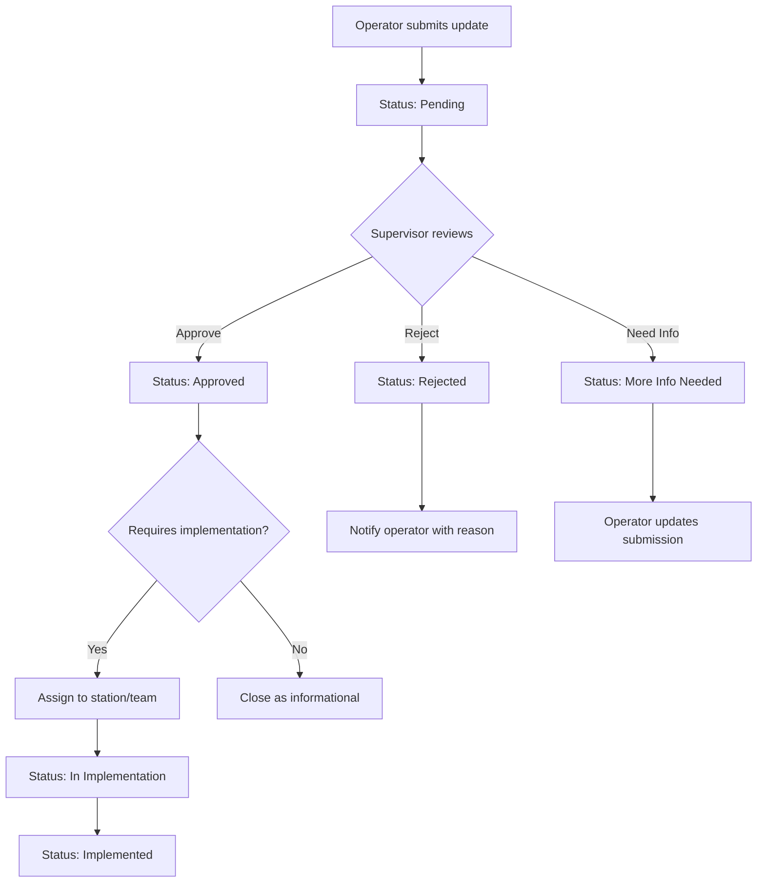

# PRD: Admin & Supervisor Operations

**Version**: 1.0  
**Last Updated**: 2025-01-27  
**Status**: Active  
**Target Users**: Org Admins, Org Owners, Supervisors

---

## 1. Overview

### 1.1 Purpose
Define the management workflows for org-level admins and supervisors responsible for orchestrating production, managing work stations, overseeing work orders, and driving continuous improvement.

### 1.2 Scope
- Work station management
- Work order creation and routing
- Task assignment and scheduling
- Delivery coordination between stations
- Performance update review
- Digital expeditor oversight

---

## 2. Role Permissions Matrix

| Capability | Org Owner | Org Admin | Supervisor |
|------------|-----------|-----------|------------|
| **Stations** |
| Create stations | ✅ | ✅ | ❌ |
| Edit stations | ✅ | ✅ | ❌ |
| Delete stations | ✅ | ✅ | ❌ |
| View all stations | ✅ | ✅ | ✅ |
| **Work Orders** |
| Create work orders | ✅ | ✅ | ✅ |
| Edit any work order | ✅ | ✅ | ✅ |
| Delete work orders | ✅ | ✅ | ❌ |
| Assign to operators | ✅ | ✅ | ✅ |
| **Routing** |
| Create routing templates | ✅ | ✅ | ❌ |
| Apply routing to WO | ✅ | ✅ | ✅ |
| Modify active routing | ✅ | ✅ | ✅ |
| **Delivery** |
| View all deliveries | ✅ | ✅ | ✅ |
| Override delivery status | ✅ | ✅ | ✅ |
| **Performance Updates** |
| Review updates | ✅ | ✅ | ✅ |
| Approve/reject | ✅ | ✅ | ✅ |
| Assign for implementation | ✅ | ✅ | ✅ |
| **Invite Codes** |
| Generate invites | ✅ | ✅ | ✅ |
| Manage all invites | ✅ | ✅ | ❌ |

---

## 3. Work Station Management

### 3.1 Station Hierarchy



### 3.2 Station Creation Flow



### 3.3 Station Data Model

```typescript
interface Station {
  id: string;
  station_id: string;        // Human-readable ID (e.g., "CNC-001")
  name: string;              // Display name
  work_center: string;       // Work center name
  work_center_type: string;  // Type for field configuration
  organization_id: string;
  team_id?: string;
  department_id?: string;
  is_active: boolean;
}
```

### 3.4 Work Center Types

| Type | Icon | Description |
|------|------|-------------|
| `cnc_lathe` | ⚙️ | CNC turning centers |
| `cnc_mill` | 🔧 | CNC machining centers |
| `manual_lathe` | 🔩 | Manual lathes |
| `manual_mill` | 🛠️ | Manual milling |
| `grinding` | ⚡ | Surface/cylindrical grinding |
| `welding` | 🔥 | TIG/MIG/EB welding |
| `water_jet` | 💧 | Water jet cutting |
| `laser` | ⚡ | Laser cutting/marking |
| `press_brake` | 📐 | Press brake forming |
| `punch_press` | 🔨 | Punch operations |
| `deburr` | ✨ | Deburring stations |
| `assembly` | 📦 | Assembly operations |
| `inspection` | 🔍 | QC inspection |
| `shipping` | 🚚 | Shipping/receiving |
| `tool_crib` | 🧰 | Tool management |

### 3.5 Station Dashboard View

Admin/Supervisor dashboard shows:
- All stations grouped by team/department
- Real-time status from `current_station_status`
- Active work order per station
- Alerts for:
  - Machine down
  - Needs delivery
  - Incoming items
  - Queued items with priority

---

## 4. Work Order Management

### 4.1 Work Order Lifecycle



### 4.2 Work Order Creation

**Required Fields**:
| Field | Type | Validation |
|-------|------|------------|
| Title | string | 3-100 chars |
| Work Order # | string | Unique per org |
| Part Number | string | Required |
| Quantity | number | > 0 |

**Optional Fields**:
| Field | Type | Purpose |
|-------|------|---------|
| Description | text | Instructions |
| Operation # | string | Manufacturing op |
| Due Date | datetime | Target completion |
| Priority | enum | Scheduling weight |
| Tags | array | Categorization |

### 4.3 Routing Configuration

```typescript
interface WorkOrderRouting {
  id: string;
  queue_item_id: string;      // Parent work order
  step_number: number;         // Sequence order
  operation_name: string;      // Step description
  operation_type: 'internal' | 'outside_processing' | 'inspection' | 'shipping';
  station_id?: string;         // Assigned station
  status: 'pending' | 'in_progress' | 'completed' | 'skipped';
  estimated_duration?: number; // Minutes
  started_at?: string;
  completed_at?: string;
  completed_by?: string;
  // Outside processing fields
  outside_vendor?: string;
  po_number?: string;
  expected_return_date?: string;
  notes?: string;
}
```

### 4.4 Standard Manufacturing Routing

```mermaid
flowchart LR
    subgraph PreProd["Pre-Production"]
        A[Quote Review] --> B[Engineering]
        B --> C[Programming]
        C --> D[Purchasing]
    end
    
    subgraph Receiving["Material"]
        D --> E[Receiving]
        E --> F[Incoming Inspection]
        F --> G[Material Cutting]
    end
    
    subgraph Production["Production"]
        G --> H[Tool Setup]
        H --> I[First Article]
        I --> J[Production Run]
        J --> K[Deburr]
    end
    
    subgraph Finishing["Finishing"]
        K --> L{Outside Proc?}
        L -->|Yes| M[Outside Processing]
        M --> N[Final Inspection]
        L -->|No| N
        N --> O[Packaging]
        O --> P[Ship]
    end
    
    style M fill:#f59e0b,color:#fff
```



### 4.5 Routing Templates

Admins can create reusable templates:

```typescript
interface RoutingTemplate {
  id: string;
  name: string;
  description?: string;
  organization_id: string;
  part_number_pattern?: string;  // Regex for auto-apply
  is_default: boolean;
  steps: RoutingTemplateStep[];
}
```

**Template Application**:
1. Select template when creating work order
2. Steps copied to `work_order_routing`
3. Each step assigned to appropriate station
4. Auto-apply based on part number pattern (optional)

---

## 5. Task Assignment & Scheduling

### 5.1 Assignment Methods

| Method | Use Case | Who Can |
|--------|----------|---------|
| Direct | Assign specific operator | Admin, Supervisor |
| Station | Assign to station queue | Admin, Supervisor |
| Self-assign | Operator picks from queue | Operator |

### 5.2 Queue Management Views

**Admin/Supervisor Queue** (`/queue`):
- Organization-wide view (default)
- Filter by station, team, status, priority
- Drag-drop priority reordering
- Bulk status updates
- Toggle to station-specific scope

**Views Available**:
- **Kanban**: Columns by status
- **List**: Sortable table
- **Calendar**: Due date visualization

### 5.3 Scheduling Flow



---

## 6. Delivery Coordination

### 6.1 Delivery States



### 6.2 Needs Delivery Alert

When an operator completes a routing step:
1. Step marked `completed`
2. Work order enters "Needs Delivery" state
3. Station card shows pulsing alert
4. Next station shows "Incoming Items"

**Alert Display**:
```
┌─────────────────────────────────────┐
│ 🚚 NEEDS DELIVERY                   │
│ ━━━━━━━━━━━━━━━━━━━━━━━━━━━━━━━━━━━ │
│ WO-2024-001 → CNC-002               │
│ Priority: URGENT 🔴                 │
│ Completed: 5 min ago                │
│                                     │
│ [Confirm Pickup] [View Details]     │
└─────────────────────────────────────┘
```

### 6.3 Delivery Confirmation Flow

```typescript
interface DeliveryConfirmation {
  routing_step_id: string;
  from_station_id: string;
  to_station_id: string;
  picked_up_at?: string;
  picked_up_by?: string;
  delivered_at?: string;
  delivered_by?: string;
  notes?: string;
}
```

**Supervisor Actions**:
- Confirm pickup on behalf of material handler
- Confirm delivery at destination station
- Override status if issues occur
- Add notes for discrepancies

---

## 7. Performance Update Review

### 7.1 Review Dashboard

Supervisors see pending updates in:
- Admin panel → Performance Updates tab
- Station cards (badge count)
- Notification alerts

### 7.2 Review Workflow



### 7.3 Review Actions

| Action | Description | Notification |
|--------|-------------|--------------|
| Approve | Accept the suggestion | Operator notified |
| Reject | Decline with reason | Operator + reason |
| Request Info | Need clarification | Operator prompted |
| Assign | Route for implementation | Assigned team/station |
| Close | Mark as complete | All stakeholders |

### 7.4 Impact Tracking

Track improvement impact:
- Cycle time changes
- Quality improvements
- Safety enhancements
- Cost savings

---

## 8. Digital Expeditor System

### 8.1 Expeditor Dashboard

Real-time view of all work in progress:

```
┌────────────────────────────────────────────────────────────┐
│ DIGITAL EXPEDITOR                           [Live] 🟢      │
├────────────────────────────────────────────────────────────┤
│                                                            │
│  📊 Production Overview                                    │
│  ┌──────────┬──────────┬──────────┬──────────┐           │
│  │ Active   │ On Hold  │ Delayed  │ Complete │           │
│  │    12    │    3     │    2     │    45    │           │
│  └──────────┴──────────┴──────────┴──────────┘           │
│                                                            │
│  🚨 Attention Required                                     │
│  ├─ WO-2024-001: Overdue at CNC-001 (2h late)            │
│  ├─ WO-2024-015: Waiting delivery to Assembly            │
│  └─ WO-2024-022: Outside processing delayed              │
│                                                            │
│  📍 Station Status Map                                     │
│  [CNC-001 🟢] [CNC-002 🟡] [CNC-003 🔴]                   │
│  [ASM-001 🟢] [ASM-002 🟢] [INS-001 🟡]                   │
│                                                            │
└────────────────────────────────────────────────────────────┘
```

### 8.2 Key Metrics

| Metric | Description | Alert Threshold |
|--------|-------------|-----------------|
| On-Time % | WOs completed by due date | < 90% |
| Avg Cycle Time | Time from start to complete | > 120% of estimate |
| WIP Count | Work in progress | > capacity |
| Bottleneck | Station with highest queue | > 5 items |
| Delivery Time | Avg time between stations | > 30 min |

### 8.3 Expeditor Actions

1. **Reprioritize**: Drag-drop to change queue order
2. **Reassign**: Move work to different station
3. **Expedite**: Flag for priority handling
4. **Split**: Divide quantity across stations
5. **Hold**: Pause work with reason
6. **Skip Step**: Bypass routing step (with approval)

---

## 9. Reporting & Analytics

### 9.1 Available Reports

| Report | Frequency | Audience |
|--------|-----------|----------|
| Daily Production Summary | Daily | Supervisors |
| Station Efficiency | Weekly | Admins |
| Work Order Aging | Daily | Expeditors |
| Delivery Performance | Weekly | Operations |
| Improvement Tracking | Monthly | Management |

### 9.2 Export Options

- PDF for sharing
- Excel for analysis
- Dashboard widgets

---

## 10. UI Entry Points

### 10.1 Admin Panel (`/admin`)
- Stations tab: CRUD operations
- Work Orders tab: Create, manage routing
- Routing tab: Template management
- Performance Updates tab: Review queue

### 10.2 Queue Page (`/queue`)
- Organization-wide view
- All filtering and views
- Bulk operations

### 10.3 Dashboard (`/dashboard`)
- Station cards with alerts
- Quick actions per station
- Real-time status updates

---

## 11. Success Metrics

| Metric | Target |
|--------|--------|
| WO creation time | < 2 minutes |
| Routing application | < 30 seconds |
| Delivery confirmation | < 5 minutes |
| Review turnaround | < 24 hours |
| Dashboard load time | < 2 seconds |

---

## 12. Future Considerations

- [ ] Capacity planning tools
- [ ] Automated scheduling optimization
- [ ] Machine learning for routing
- [ ] Integration with ERP systems
- [ ] Mobile supervisor app
- [ ] Voice-activated commands
