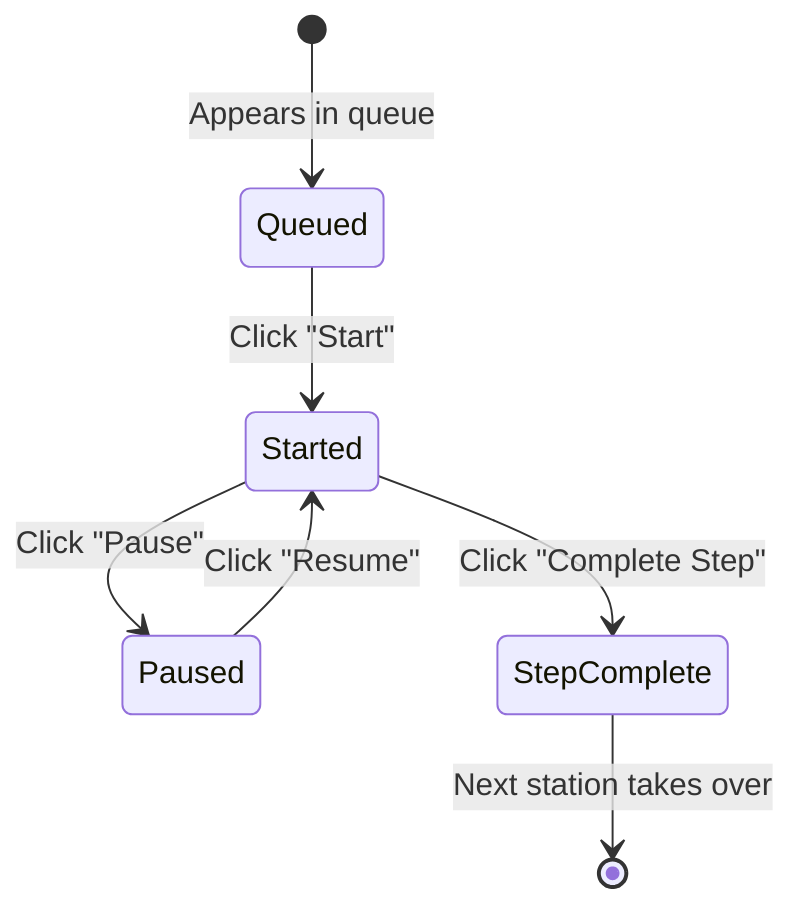
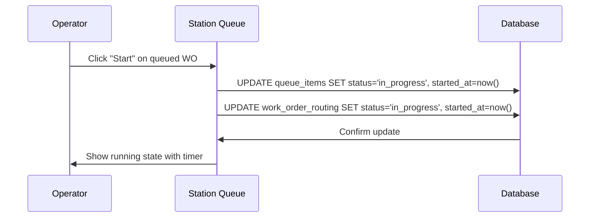
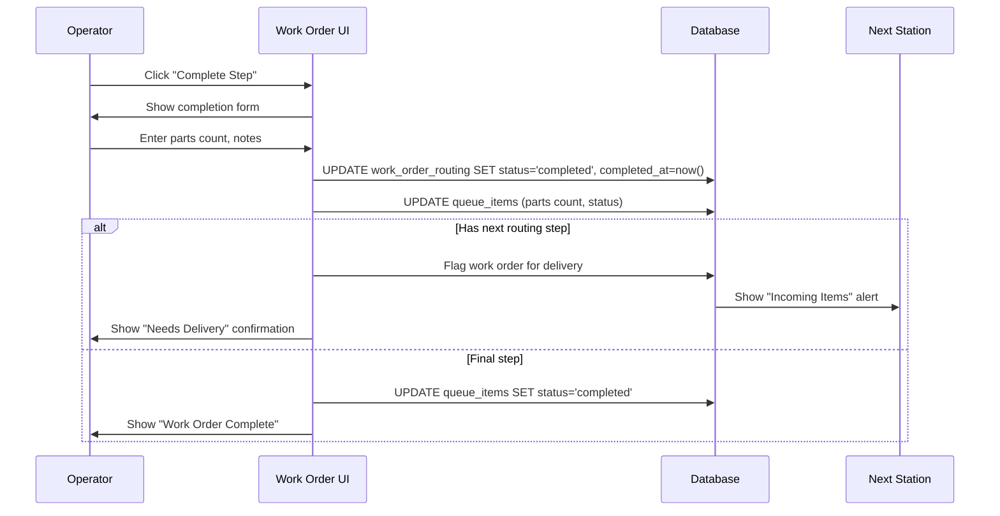
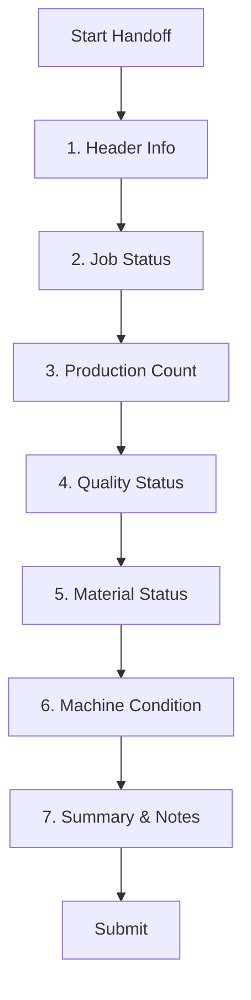
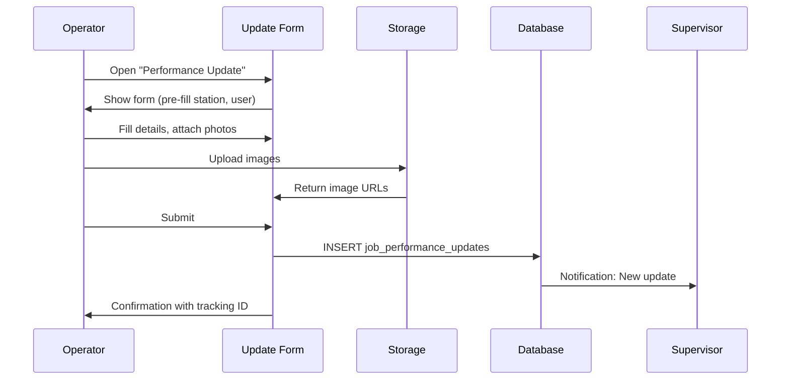

# PRD: Operator Workflow & Tasks

**Version**: 1.0  
**Last Updated**: 2025-01-27  
**Status**: Active  
**Target Users**: Operators (shop floor workers)

---

## 1. Overview

### 1.1 Purpose
Define the daily workflows, task handling, and job requirements for operators working at manufacturing stations.

### 1.2 Scope
- Station-scoped work queue
- Work order execution
- Routing step completion
- Delivery confirmation
- Shift handoffs
- Performance update submissions
- Job tracking and time logging

---

## 2. Operator Role & Permissions

### 2.1 Default Assignment
All new users receive `operator` role via signup trigger.

### 2.2 Permission Scope

| Capability | Can Do | Cannot Do |
|------------|--------|-----------|
| **Queue** | View assigned station's queue | View org-wide queue |
| **Work Orders** | Start, pause, complete assigned WOs | Create new work orders |
| **Routing** | Complete own routing steps | Skip or modify routing |
| **Delivery** | Confirm deliveries to their station | Override other stations |
| **Handoffs** | Create handoffs for their station | Edit others' handoffs |
| **Updates** | Submit performance suggestions | Approve updates |
| **Stations** | View assigned stations | Create/edit stations |

---

## 3. Operator Dashboard

### 3.1 Primary View

Operators see a focused, station-centric interface:

```
┌────────────────────────────────────────────────────────────┐
│ 🏭 CNC-001 - Haas VF-2                     [Day Shift]    │
├────────────────────────────────────────────────────────────┤
│                                                            │
│  ▶️ CURRENTLY RUNNING                                      │
│  ┌────────────────────────────────────────────────────────┐
│  │ WO-2024-001 | Part: ABC-123 Rev B | Op: 020           │
│  │ ━━━━━━━━━━━━━━━━━━━━━━━━━━━━━ 67% (45/67 pcs)         │
│  │ ⏱️ Running: 2h 34m | Est: 4h 00m                       │
│  │                                                        │
│  │ [⏸️ Pause] [✅ Complete Step] [📝 Add Note]           │
│  └────────────────────────────────────────────────────────┘
│                                                            │
│  📥 INCOMING (2)                    📋 QUEUED (3)         │
│  ┌──────────────────────┐          ┌──────────────────────┐
│  │ WO-2024-015 🟠 HIGH  │          │ WO-2024-018 🟡 NORM │
│  │ From: Receiving      │          │ Due: Today 4pm      │
│  │ [Confirm Arrival]    │          │ [Start]             │
│  └──────────────────────┘          └──────────────────────┘
│                                                            │
│  ⚡ QUICK ACTIONS                                          │
│  [📋 New Handoff] [💡 Performance Update] [🔧 Report Issue]│
│                                                            │
└────────────────────────────────────────────────────────────┘
```

### 3.2 Station Selection

If assigned to multiple stations:
- Station selector dropdown
- Persists selection to localStorage
- Quick-switch without page reload

---

## 4. Work Order Execution

### 4.1 Work Order Lifecycle (Operator View)



### 4.2 Starting a Work Order



### 4.3 Running State Display

When a work order is in progress:

| Element | Description |
|---------|-------------|
| Progress Bar | Parts complete / total |
| Timer | Elapsed time since started |
| Estimated | Expected duration |
| Part Info | Number, revision, operation |
| Actions | Pause, Complete, Add Note |

### 4.4 Pausing Work

Reasons for pause (required):
- Break/lunch
- Waiting for material
- Tool change required
- Quality hold
- Machine issue
- Other (specify)

```typescript
interface PauseEvent {
  queue_item_id: string;
  paused_at: string;
  reason: string;
  notes?: string;
}
```

### 4.5 Completing a Routing Step



### 4.6 Completion Form

Required fields:
- Parts completed this step
- Scrap count (if any)
- Rework count (if any)

Optional fields:
- Quality notes
- Issues encountered
- Notes for next operation

---

## 5. Delivery Handling

### 5.1 Incoming Items

When work arrives at operator's station:

```
┌─────────────────────────────────────────┐
│ 📥 INCOMING DELIVERY                    │
│ ━━━━━━━━━━━━━━━━━━━━━━━━━━━━━━━━━━━━━━ │
│                                         │
│ WO-2024-015 | Part: XYZ-789            │
│ From: Receiving (John S.)              │
│ Qty: 25 pcs                            │
│ Priority: 🟠 HIGH                       │
│                                         │
│ Operation: 030 - CNC Milling           │
│ Notes: First article required          │
│                                         │
│ [✅ Confirm Receipt] [❌ Reject]        │
└─────────────────────────────────────────┘
```

### 5.2 Confirm Receipt Flow

```typescript
interface ReceiptConfirmation {
  routing_step_id: string;
  received_by: string;
  received_at: string;
  quantity_received: number;
  condition: 'good' | 'damaged' | 'partial';
  notes?: string;
}
```

On confirmation:
1. Work order queued at operator's station
2. Previous station's "Needs Delivery" cleared
3. History logged
4. Ready to start

### 5.3 Reject/Issue Reporting

If delivery has issues:
- Damaged parts
- Wrong quantity
- Missing documentation
- Quality concerns

Creates alert for supervisor review.

---

## 6. Shift Handoff

### 6.1 When to Create Handoff

- End of shift
- Leaving station for extended time
- Machine status change
- Per supervisor request

### 6.2 Handoff Form Sections



### 6.3 Section Details

**1. Header Info**
- Date & Shift (auto-filled)
- Station (auto-filled from current)
- Outgoing operator (auto-filled)
- Incoming operator name

**2. Job Status**
- Current work order
- Part number & revision
- Operation number
- Primary state: Running / Setup / Down / Idle / Maintenance
- Delay code (if applicable)

**3. Production Count**
- Parts completed this shift
- Rework count
- Scrap count
- Last good part timestamp

**4. Quality Status**
- Critical dimensions verified (checkbox)
- First article status
- Quality notes

**5. Material Status**
- Raw material available (checkbox)
- Next lot ready (checkbox)
- Material issues noted (checkbox + notes)

**6. Machine Condition**
(Work center-specific fields)

| CNC | Welding | Water Jet |
|-----|---------|-----------|
| Coolant level | Wire level | Water level |
| Chip conveyor | Gas pressure | Abrasive level |
| Spindle temp | Torch condition | Nozzle condition |
| Tool life % | | Pump pressure |

**7. Summary**
- Handoff summary (required, text)
- Process notes for next shift
- Issues requiring follow-up

### 6.4 Pre-fill from Active Work Order

If a work order is running:
- Auto-fill work order number
- Auto-fill part number
- Auto-fill operation number
- Calculate parts from routing

---

## 7. Performance Updates

### 7.1 Purpose
Operators suggest improvements:
- Setup optimizations
- Tool recommendations
- Process adjustments
- Safety improvements
- Quality enhancements

### 7.2 Submission Form

```typescript
interface PerformanceUpdate {
  title: string;              // Brief description
  update_type: 'setup_change' | 'tool_recommendation' | 'process_improvement' | 
               'safety_concern' | 'quality_improvement' | 'other';
  description: string;        // Detailed explanation
  proposed_solution?: string; // How to fix
  expected_benefit?: string;  // Impact if implemented
  
  // Context (optional)
  work_order?: string;
  part_number?: string;
  operation_number?: string;
  
  // Impact flags
  affects_cycle_time: boolean;
  affects_quality: boolean;
  affects_safety: boolean;
  
  // Requirements
  requires_tooling_change: boolean;
  requires_program_update: boolean;
  requires_fixture_modification: boolean;
  requires_engineering_review: boolean;
  requires_qa_approval: boolean;
  
  // Evidence
  image_urls?: string[];      // Upload photos
  
  // Metadata
  priority: 'low' | 'normal' | 'high' | 'urgent';
}
```

### 7.3 Submission Flow



### 7.4 Tracking Submissions

Operators can view their submitted updates:
- Status (Pending, Approved, Rejected, In Implementation)
- Reviewer comments
- Implementation status

---

## 8. Quick Actions

### 8.1 Available Actions

| Action | Icon | Purpose |
|--------|------|---------|
| New Handoff | 📋 | Start shift handoff |
| Performance Update | 💡 | Submit improvement |
| Report Issue | 🔧 | Log machine/quality issue |
| View History | 📜 | See past handoffs |
| Contact Supervisor | 📞 | Request assistance |

### 8.2 Report Issue

Quick issue logging:
- Machine down
- Quality problem
- Missing material
- Safety concern
- Other

Creates notification to supervisor with priority flag.

---

## 9. Time Tracking

### 9.1 Automatic Logging

System automatically tracks:
- Work order start time (`started_at`)
- Pause periods
- Resume times
- Completion time (`completed_at`)

### 9.2 Elapsed Time Display

```
⏱️ Running: 2h 34m
   Started: 9:15 AM
   Paused: 15m total
   Active: 2h 19m
```

### 9.3 Estimated vs Actual

Visual indicator:
- 🟢 Green: On track (< 100% of estimate)
- 🟡 Yellow: Approaching (100-120%)
- 🔴 Red: Over time (> 120%)

---

## 10. Mobile Considerations

### 10.1 Responsive Design

Station queue optimized for:
- Tablets at workstations
- Large touch targets
- Minimal scrolling
- High contrast for shop floor

### 10.2 Key Mobile Features

- Swipe actions for quick operations
- Camera access for photos
- Offline queue viewing (future)
- Barcode scanning (future)

---

## 11. Notifications

### 11.1 Operator Receives

| Notification | Trigger | Priority |
|--------------|---------|----------|
| New assignment | WO assigned to station | Normal |
| Incoming delivery | Work en route | Normal |
| Delivery arrived | Needs confirmation | High |
| Update reviewed | Supervisor action | Normal |
| Shift reminder | Before shift end | Low |

### 11.2 Notification Preferences

Operators can configure:
- Email notifications on/off
- Quiet hours
- Priority filter

---

## 12. Training Mode

### 12.1 Guided Tour

First-time operators see:
1. Station selection tutorial
2. Queue interaction demo
3. Work order execution walkthrough
4. Handoff form guide
5. Performance update intro

### 12.2 Help Resources

- Contextual tooltips
- Video tutorials (future)
- FAQ section
- Contact support

---

## 13. Error Handling

### 13.1 Common Scenarios

| Scenario | System Response |
|----------|-----------------|
| Network offline | Queue cached, sync when online |
| Concurrent edit | Merge or notify conflict |
| Invalid input | Inline validation messages |
| Session timeout | Auto-save draft, re-authenticate |

### 13.2 Recovery Actions

- Draft auto-save for forms
- Retry failed submissions
- Offline mode indicator

---

## 14. Success Metrics

| Metric | Target |
|--------|--------|
| Work order start time | < 10 seconds |
| Handoff completion | < 5 minutes |
| Delivery confirmation | < 2 minutes |
| Update submission | < 3 minutes |
| Queue load time | < 1 second |
| Mobile usability score | > 4.5/5 |

---

## 15. Future Considerations

- [ ] Barcode/QR scanning for WO lookup
- [ ] Voice notes for handoffs
- [ ] AR work instructions overlay
- [ ] Wearable device integration
- [ ] Gamification (productivity badges)
- [ ] Predictive task suggestions
- [ ] Offline-first architecture
