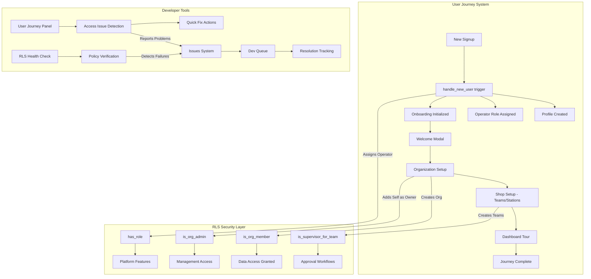
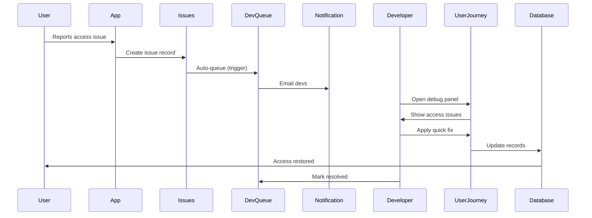

# PRD: Developer Tooling & System Integration

**Version**: 1.0  
**Last Updated**: 2026-02-09  
**Status**: Active

---

## 1. Overview

### 1.1 Purpose
Document how the developer tools (Issues, Dev Queue, RLS Health, User Journey) integrate to ensure new users can successfully complete their journey and get proper RLS access.

### 1.2 Scope
- System integration architecture
- New user journey flow with RLS checkpoints
- Developer debugging workflow
- Issue tracking and resolution flow

---

## 2. System Integration Architecture



---

## 3. New User Journey Flow

### 3.1 Step-by-Step with RLS Checkpoints

| Step | Action | RLS Functions Involved | Potential Issues |
|------|--------|------------------------|------------------|
| 1. Signup | User registers | None (public) | - |
| 2. Trigger | `handle_new_user` fires | SECURITY DEFINER | Missing profile/role/onboarding |
| 3. Welcome | Welcome modal shown | `user_onboarding` (self) | `has_seen_welcome = false` stuck |
| 4. Org Setup | Create organization | `organizations` INSERT | `created_by = auth.uid()` required |
| 5. Self-Join | Add self as org owner | `organization_members` INSERT | `auth.uid() = user_id` required |
| 6. Team Creation | Create first team | `is_org_member()` | Must complete step 5 first |
| 7. Station Setup | Add stations | `is_org_admin()` or `is_team_admin()` | Org role must be owner/admin |
| 8. Complete | Journey marked complete | `user_onboarding` UPDATE | Self-update only |

### 3.2 Common Failure Points

1. **Missing Onboarding Record**
   - Cause: User created via admin API or old signup flow
   - Detection: `user_onboarding` record missing
   - Fix: Create onboarding record via User Journey Panel

2. **Stuck at Organization Setup**
   - Cause: User couldn't create org (RLS block) or didn't complete
   - Detection: `current_step = 'organization-setup'` with no org membership
   - Fix: Check RLS, help user create org, or send invite

3. **Can't Create Teams**
   - Cause: User's org role is 'member' not 'owner'/'admin'
   - Detection: `organization_members.role = 'member'`
   - Fix: Upgrade org role or have org admin create teams

4. **No Platform Role**
   - Cause: `handle_new_user` trigger failed
   - Detection: Empty `user_roles` for user
   - Fix: Add 'operator' role via User Journey Panel

---

## 4. Developer Tools Reference

### 4.1 User Journey Debug Panel

**Location**: Admin Dashboard → User Journey tab (developer access)

**Capabilities**:
- View all users with onboarding state
- Detect access issues automatically
- Quick actions:
  - Create missing onboarding record
  - Mark welcome as seen
  - Reset to specific journey step
  - Complete journey (skip remaining steps)
  - Add/remove platform roles

**RLS Function Status Display**:
```
• is_org_member(): ✅ Passes / ❌ Denied
• is_org_admin(): ✅ Passes / ❌ Denied
• is_supervisor_for_team(): ✅ / ❌ Needs org
• has_role('operator'): ✅ / ❌
```

### 4.2 RLS Health Check

**Location**: Admin Dashboard → RLS Health tab

**Capabilities**:
- Run automated security verification
- Test RLS policies across core tables
- Detect misconfigured policies
- Generate security reports

**Tables Monitored**:
- organizations, organization_members
- teams, team_members
- stations, departments
- user_roles, user_onboarding
- profiles

### 4.3 Issues System

**Location**: Admin Dashboard → Issues tab

**Integration Points**:
- In-app issue reporting (`IssueReportDialog`)
- Automatic console log capture
- Auto-queue to Dev Queue via trigger
- Email notification to devs

**Severity Levels**:
- `critical`: Immediate attention (P1)
- `high`: Same-day resolution (P2)
- `medium`: Planned sprint (P3)
- `low`: Backlog (P4)

### 4.4 Dev Queue

**Location**: Admin Dashboard → Dev Queue tab

**Workflow**:
1. Issue reported → Auto-added to queue
2. Priority calculated from severity
3. Developer assigned
4. Status tracking: pending → in_progress → resolved
5. Time tracking for effort estimation

---

## 5. Debugging Workflow

### 5.1 User Reports "Can't Access" Issue



### 5.2 Quick Reference: Common Fixes

| Symptom | Check | Fix |
|---------|-------|-----|
| User sees "Loading..." forever | RLS blocking queries | Add org membership |
| Can't create work orders | No org or wrong step | Complete org setup, advance journey |
| Settings not saving | Profile update RLS | Verify `auth.uid() = user_id` |
| Can't see team data | Team membership missing | Add to team via panel |
| "Unauthorized" errors | Missing platform role | Add 'operator' role |
| Journey not advancing | `has_seen_welcome = false` | Mark welcome seen |

---

## 6. RLS Policy Audit Checklist

### 6.1 For New User Creation Flow

- [ ] `organizations` INSERT allows `auth.uid() = created_by`
- [ ] `organization_members` INSERT allows `auth.uid() = user_id`
- [ ] `teams` INSERT requires `is_org_member()` 
- [ ] `stations` INSERT requires `is_org_admin()` or `is_team_admin()`
- [ ] `user_onboarding` allows self-insert/update
- [ ] `user_roles` auto-populated by trigger

### 6.2 For Data Access

- [ ] All tables with `organization_id` check `is_org_member()`
- [ ] Management operations check `is_org_admin()`
- [ ] Team-specific data checks `is_team_member()`
- [ ] Supervisor features check `is_supervisor_for_team()`
- [ ] Platform admin bypass with `has_role('admin')`

---

## 7. Success Metrics

| Metric | Target |
|--------|--------|
| New user journey completion rate | > 90% |
| Average time to complete journey | < 10 minutes |
| RLS-related support tickets | < 5% of total |
| Mean time to resolve access issues | < 2 hours |
| Automated issue detection rate | > 80% |

---

## 8. Integration Points Summary

| System | Feeds Into | Receives From |
|--------|------------|---------------|
| User Journey Panel | Issues, Quick Fixes | User data, Onboarding |
| RLS Health Check | Issues, Alerts | RLS policies |
| Issues System | Dev Queue, Email | All systems, User reports |
| Dev Queue | Resolution tracking | Issues, Manual entries |
| Activity Logs | Audit trail | All user/admin actions |

---

## 9. Future Enhancements

- [ ] Automated journey recovery (detect and fix common issues)
- [ ] RLS policy simulation (test access before applying)
- [ ] Proactive health monitoring (alert before users notice)
- [ ] Self-service access troubleshooting for users
- [ ] Integration with external issue tracking (GitHub, Jira)
