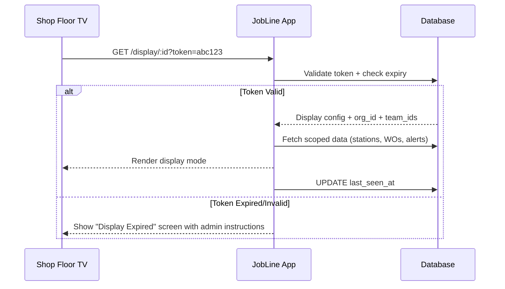

# PRD: Shop Floor Display Application

**Version**: 1.0  
**Last Updated**: 2026-03-08  
**Status**: 🚧 Draft  
**Target Users**: Supervisors, Operators (read-only display), Org Admins  
**Related PRDs**: [07 — Admin & Supervisor Operations](./07-admin-supervisor-operations.md), [08 — Operator Workflow](./08-operator-workflow.md)

---

## 1. Overview

### 1.1 Purpose

Define a dedicated **Shop Floor Display** application mode — purpose-built for wall-mounted monitors, TVs, and tablets placed on the manufacturing floor. These displays provide at-a-glance, read-only production visibility without requiring individual login, while remaining org-scoped and secured behind team-level authorization.

### 1.2 Problem Statement

Supervisors need persistent visibility into their specific team's stations and work orders without being tied to a desk. Operators need a quick-reference board showing station status, active work orders, and key metrics — not a full interactive UI. Current dashboards are designed for interactive users, not passive display scenarios.

### 1.3 Scope

- Display-mode rendering for shop floor monitors (TV-optimized layouts)
- Team-scoped station + work order visibility
- Supervisor vs. operator display variants
- Admin setup flow (display registration, team binding, refresh settings)
- Auto-refresh, auto-rotate, and ambient-mode behavior
- Org-only access (no public/anonymous viewers)

### 1.4 Out of Scope

- External kiosk input/touch interactions beyond configuration
- Non-org users or anonymous viewing
- Digital signage for marketing or public content
- Real-time video feeds

---

## 2. User Roles & Access

### 2.1 Who Can Configure Displays

| Role | Can Configure | Can View Display |
|------|--------------|-----------------|
| Platform Admin | ✅ All orgs | ✅ |
| Org Owner | ✅ Own org | ✅ |
| Org Admin | ✅ Own org | ✅ |
| Supervisor | ✅ Own team(s) | ✅ |
| Operator | ❌ | ✅ (read-only) |
| Viewer | ❌ | ❌ |

### 2.2 Display Access Model

- Displays are registered to an **organization** and scoped to one or more **teams**.
- A display token (short-lived, renewable) is generated during setup to authenticate the display device.
- Display tokens are org-scoped — they cannot access data outside the bound organization.
- Tokens auto-expire after a configurable period (default: 30 days) and must be renewed by an admin/supervisor.

---

## 3. Display Modes

### 3.1 Supervisor Display (Team Insights)

A high-level operational overview designed for area leads and supervisors.

#### Content Panels

| Panel | Description | Priority |
|-------|-------------|----------|
| **Station Status Grid** | All stations in the bound team(s) with live status indicators (Running, Setup, Down, Idle, Waiting) | P0 |
| **Work Order Queue** | Active + queued WOs for the team's stations, sorted by priority and due date | P0 |
| **Smart Alerts** | Collapsible WO alerts (overdue, stale, over-time) + Station alerts (bottleneck, no operator) | P0 |
| **Shift Utilization** | Donut chart + breakdown (Running/Setup/Idle/Down percentages) | P1 |
| **Active Operators** | Who is checked in at each station right now | P1 |
| **Recent Handoffs** | Last 3–5 handoffs for the team | P2 |
| **Production Analytics** | Throughput and trend charts (hourly/daily) | P2 |

#### Layout Behavior

- **Desktop/TV (≥1280px)**: 3-column grid — Station grid (2 cols) + sidebar (alerts, utilization, handoffs)
- **Tablet (768–1279px)**: 2-column — Stations + stacked sidebar
- **Auto-rotate**: Optionally cycle between panels every N seconds (configurable 15s–120s)

### 3.2 Operator Display (Reference Board)

A simplified, glanceable view for operators on the floor.

#### Content Panels

| Panel | Description | Priority |
|-------|-------------|----------|
| **Station Status Cards** | Large, high-contrast cards showing each station's current state, active WO, operator, and part progress | P0 |
| **Queue Summary** | Count of queued vs. in-progress vs. on-hold per station (no drill-down) | P0 |
| **Shift Clock** | Current shift name, time remaining, next shift info | P1 |
| **Announcements** | Org or team-level announcements (if any are active/pinned) | P1 |
| **Alert Banner** | Critical alerts only (machine down, overdue critical) — displayed as a persistent top banner | P1 |

#### Layout Behavior

- **TV/Large Display**: 2–4 column grid of large station cards — high-contrast, large fonts
- **Tablet**: 1–2 column scrollable
- **No interaction required** — purely informational, auto-refreshing
- **Dark mode preferred** for shop floor visibility

### 3.3 Ambient Mode (Screen Saver)

When no critical data is changing:
- Dim the display slightly
- Show rotating org branding + shift utilization summary
- Wake to full brightness on any alert state change (machine down, critical WO)

---

## 4. Admin Setup & Configuration

### 4.1 Display Registration Flow

Located in: **Admin Dashboard → Production bucket → "Displays" tab**

```
Step 1: Name the Display
  └─ e.g., "Mill Area TV", "Assembly Floor Board"

Step 2: Select Team Scope
  └─ Bind to one or more teams (or "All Teams" for org-wide)

Step 3: Choose Display Mode
  └─ Supervisor Display | Operator Display

Step 4: Configure Settings
  ├─ Refresh interval (10s – 5min, default 30s)
  ├─ Auto-rotate panels (on/off, interval)
  ├─ Dark mode (auto / always / never)
  ├─ Token expiry (7d / 30d / 90d / custom)
  └─ Alert sound (on/off — for critical alerts)

Step 5: Generate Display URL + Token
  └─ QR code + copyable URL for easy setup on TV/tablet
```

### 4.2 Display Management Table

| Column | Description |
|--------|-------------|
| Display Name | User-defined label |
| Team Scope | Bound team(s) or "All Teams" |
| Mode | Supervisor / Operator |
| Status | Active / Expired / Paused |
| Last Seen | Timestamp of last data fetch |
| Token Expiry | When the current token expires |
| Actions | Edit, Regenerate Token, Pause, Delete |

### 4.3 Database Schema

```sql
-- Display registrations
CREATE TABLE public.shop_floor_displays (
  id UUID PRIMARY KEY DEFAULT gen_random_uuid(),
  organization_id UUID NOT NULL REFERENCES organizations(id) ON DELETE CASCADE,
  display_name TEXT NOT NULL,
  display_mode TEXT NOT NULL DEFAULT 'supervisor' CHECK (display_mode IN ('supervisor', 'operator')),
  team_ids UUID[] DEFAULT '{}',  -- empty = all teams
  display_token TEXT NOT NULL UNIQUE,
  token_expires_at TIMESTAMPTZ NOT NULL,
  refresh_interval_seconds INTEGER NOT NULL DEFAULT 30,
  auto_rotate_enabled BOOLEAN DEFAULT false,
  auto_rotate_interval_seconds INTEGER DEFAULT 30,
  dark_mode TEXT DEFAULT 'auto' CHECK (dark_mode IN ('auto', 'always', 'never')),
  alert_sound_enabled BOOLEAN DEFAULT false,
  is_active BOOLEAN DEFAULT true,
  last_seen_at TIMESTAMPTZ,
  created_by UUID NOT NULL,
  created_at TIMESTAMPTZ DEFAULT now(),
  updated_at TIMESTAMPTZ DEFAULT now()
);

ALTER TABLE public.shop_floor_displays ENABLE ROW LEVEL SECURITY;

-- RLS: Org members can view, org admins/supervisors can manage
CREATE POLICY "Org members can view displays"
  ON public.shop_floor_displays FOR SELECT
  TO authenticated
  USING (public.is_org_member(auth.uid(), organization_id));

CREATE POLICY "Org admins can manage displays"
  ON public.shop_floor_displays FOR ALL
  TO authenticated
  USING (public.is_org_admin(auth.uid(), organization_id) 
    OR public.is_supervisor_in_org(auth.uid(), organization_id));
```

---

## 5. Display URL & Authentication

### 5.1 URL Structure

```
/display/:displayId?token=<display_token>
```

### 5.2 Authentication Flow



### 5.3 Security Constraints

- Display tokens grant **read-only** access to the bound organization's data
- Tokens cannot perform mutations (no writes, no status changes)
- Token validation uses a `SECURITY DEFINER` function to bypass user-level RLS
- All data queries are scoped by `organization_id` and `team_ids`
- No PII is shown on display (no emails, phone numbers — only display names)
- Token can be revoked instantly by pausing or deleting the display

---

## 6. Data Refresh & Performance

### 6.1 Refresh Strategy

| Method | Interval | Use Case |
|--------|----------|----------|
| **Polling** | Configurable (10s–5min) | Primary — simple, reliable |
| **Realtime** | Instant | Future — subscribe to station status changes |

### 6.2 Performance Targets

| Metric | Target |
|--------|--------|
| Initial render | < 2s |
| Data refresh | < 500ms |
| Memory usage | < 150MB (for 8h+ continuous display) |
| CPU idle | < 5% between refreshes |

### 6.3 Optimization Techniques

- Minimal DOM — no unnecessary interactive elements
- No router transitions — single-page render
- Memoized components — only re-render changed stations
- Stale-while-revalidate — show old data during refresh
- Automatic memory cleanup — periodic GC-friendly resets

---

## 7. Visual Design Requirements

### 7.1 General

- **High contrast** for shop floor lighting conditions
- **Large typography** — readable from 10–15 feet away
- **Minimal chrome** — no navigation bars, no menus, no interactive affordances
- **Status-first** — color-coded station cards dominate the viewport
- **Responsive to aspect ratio** — support 16:9 (TV), 4:3, and portrait (tablet)

### 7.2 Color System (Display Mode)

| Status | Color | Usage |
|--------|-------|-------|
| Running | `hsl(var(--primary))` | Active production |
| Setup | `hsl(var(--chart-4))` | Changeover |
| Down | `hsl(var(--destructive))` | Machine failure |
| Idle | `hsl(var(--muted))` | No activity |
| Waiting | `hsl(var(--chart-3))` | Pending material/operator |

### 7.3 Typography Scale (TV)

| Element | Size | Weight |
|---------|------|--------|
| Station Name | 2rem (32px) | Bold |
| Work Order # | 1.5rem (24px) | Semi-bold |
| Status Label | 1.25rem (20px) | Medium |
| Detail Text | 1rem (16px) | Regular |
| Timestamp | 0.875rem (14px) | Regular |

---

## 8. Feature Phases

### Phase 1 — MVP (Current Sprint)

- [ ] `shop_floor_displays` table + RLS
- [ ] Admin UI: Create/edit/delete displays
- [ ] Display URL route (`/display/:id`)
- [ ] Token validation + org-scoped data fetch
- [ ] Supervisor display mode (station grid + WO queue + alerts)
- [ ] Operator display mode (large station cards + queue summary)
- [ ] Auto-refresh polling
- [ ] Dark mode support

### Phase 2 — Enhanced

- [ ] Auto-rotate panel cycling
- [ ] Ambient mode (dim + wake on alerts)
- [ ] Realtime subscriptions (replace polling)
- [ ] Alert sound notifications
- [ ] Shift clock integration
- [ ] Announcement banner
- [ ] Display health monitoring (last-seen tracking)

### Phase 3 — Advanced

- [ ] Multi-display synchronization (master/slave)
- [ ] Custom layout builder (drag-drop panels)
- [ ] OEE (Overall Equipment Effectiveness) live widget
- [ ] Integration with physical alert lights (IoT bridge)
- [ ] Scheduled display profiles (day shift vs. night shift layouts)

---

## 9. Testing Requirements

### 9.1 Unit Tests

- Token generation and validation
- Team-scoped data filtering
- Display mode rendering (supervisor vs. operator)
- Auto-refresh lifecycle

### 9.2 Integration Tests

- Display registration → token generation → data fetch → render
- Token expiry → expired screen
- Admin revoke → immediate display disconnect
- Multi-team binding → correct station aggregation

### 9.3 Manual QA

- 8-hour continuous display stability test
- Readability from 10ft, 15ft distances
- Dark mode in bright shop floor lighting
- Tablet portrait + landscape rendering

---

## 10. Metrics & Success Criteria

| Metric | Target |
|--------|--------|
| Display uptime | > 99.5% (during business hours) |
| Data freshness | < 30s from event to display |
| Setup time | < 5 minutes from admin to live display |
| Adoption | 50%+ of orgs with 3+ stations use at least 1 display |

---

## 11. Open Questions

1. Should displays support touch interaction for operator acknowledgment (e.g., "I see this alert")?
2. Should there be a "presentation mode" for shift meetings (fullscreen, slide-style)?
3. How to handle displays during scheduled maintenance windows?
4. Should display tokens be rotatable via API for automated device management?

---

## Cross-References

- **Smart Alerts**: [PRD 07 § Smart Alert Configuration](./07-admin-supervisor-operations.md)
- **Station Status**: [PRD 08 § Operator Dashboard](./08-operator-workflow.md)
- **Team Scoping**: [PRD 02 § Organization & Team Management](./02-organization-team-management.md)
- **Entitlements**: [PRD 06 § Subscription & Billing](./06-subscription-billing.md) — Display count may be gated by plan
