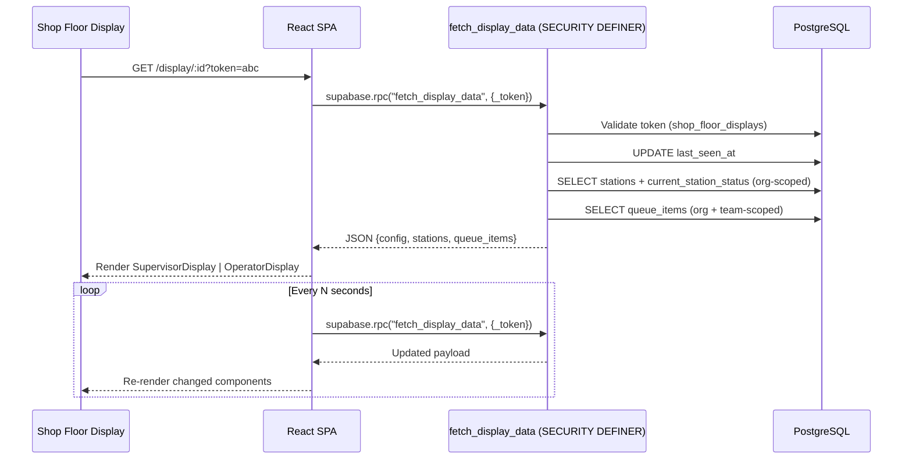

# Shop Floor Display — Code Audit & Quality Report

**Version**: 1.0  
**Audit Date**: 2026-03-09  
**Scope**: `src/pages/ShopFloorDisplay.tsx`, `src/hooks/useShopFloorDisplays.ts`, `fetch_display_data` RPC, `validate_display_token` RPC, `src/pages/ShopFloorDisplay.test.tsx`, `src/hooks/useShopFloorDisplays.test.ts`, `src/components/TeamManagement.tsx` (display setup)

---

## 1. Overall Score

| Category | Score (1–10) | Notes |
|----------|:---:|-------|
| **Security & Org Scoping** | 8 | Token-based SECURITY DEFINER RPC; org + team filtering correct. Minor concern: `STABLE` on `fetch_display_data` performs a write (`UPDATE last_seen_at`) — should be `VOLATILE`. |
| **Performance** | 6 | Single RPC call is good, but no memoization of fetch callback deps, no stale-while-revalidate, no request deduplication, full JSON payload every poll. |
| **Code Quality** | 6 | 576-line monolith page; inline sub-components without extraction; `as any` / `as unknown as` type casts; duplicated status mapping logic. |
| **Reusability** | 5 | `StationCell`, `getStatusInfo`, `PRIORITY_COLORS` are not exported/shared — duplicated concepts exist in supervisor dashboard. No shared display component library. |
| **Test Coverage** | 6 | Happy + error paths covered for page and hook. Tests for hook mock at wrong context path (`useUserOrganization` vs `OrgContext`). No test for periodic refresh, dark mode, or team-scoped grouping. |
| **Accessibility** | 4 | No `aria-live` regions for auto-refreshing data. No `role` attributes on status indicators. Alert banner uses `animate-pulse` with no `prefers-reduced-motion` guard. |
| **UX / Design Adherence** | 7 | Follows PRD layout (supervisor 3-col, operator card grid). Missing: ambient mode, shift clock, announcement banner, auto-rotate panel cycling (Phase 2 items acknowledged). |
| **Weighted Average** | **6.1** | |

---

## 2. Detailed Findings

### 2.1 Security & Data Scoping

| # | Finding | Severity | Recommendation |
|---|---------|----------|----------------|
| S1 | `fetch_display_data` is marked `STABLE` but performs `UPDATE last_seen_at` — Postgres may cache/skip the write in certain planner conditions | 🟡 Medium | Change to `VOLATILE` |
| S2 | Token is passed as a URL query parameter (`?token=...`) — visible in browser history, server logs, referrer headers | 🟡 Medium | Document risk; consider POST-based token validation or short-lived session cookie after initial validation |
| S3 | `display_token` generated client-side in `useShopFloorDisplays.regenerateToken` — no server-side entropy guarantee | 🟡 Medium | Move token generation to a DB trigger or `SECURITY DEFINER` function using `gen_random_uuid()` or `encode(gen_random_bytes(32), 'hex')` |
| S4 | RLS policies on `shop_floor_displays` reference `is_org_admin` and `is_supervisor_in_org` — correct scoping ✅ | ✅ OK | — |
| S5 | `GRANT EXECUTE ... TO anon` on `fetch_display_data` — correct for session-less displays ✅ | ✅ OK | — |
| S6 | Queue items filter includes station fallback (`qi.station_id IN (SELECT id FROM stations WHERE team_id = ANY(...))`) — prevents data leakage for cross-team station assignments ✅ | ✅ OK | — |

### 2.2 Performance

| # | Finding | Severity | Recommendation |
|---|---------|----------|----------------|
| P1 | Every poll fetches the full JSON payload (config + all stations + all queue items) even if nothing changed | 🟡 Medium | Add `_last_updated_at` param; return `304`-equivalent `{changed: false}` when no data has changed. Or use Realtime subscriptions. |
| P2 | `LIMIT 50` on queue items is hardcoded — large orgs may miss items; small orgs waste bandwidth | 🟢 Low | Make configurable per display or paginate |
| P3 | No `useMemo` on `fetchData` dependency — `token` is stable but `useCallback` rebuilds if closure identity changes | 🟢 Low | Stable as-is since `token` comes from `useSearchParams`, but document assumption |
| P4 | Subquery in queue filter (`qi.station_id IN (SELECT id FROM stations WHERE team_id = ANY(...))`) executes per-poll | 🟢 Low | Consider materializing team→station mapping or using a JOIN |
| P5 | No memory cleanup strategy for 8h+ continuous operation (PRD §6.3) | 🟡 Medium | Implement periodic full-page reload (e.g., every 4h) to reset JS heap |

### 2.3 Code Quality

| # | Finding | Severity | Recommendation |
|---|---------|----------|----------------|
| C1 | `ShopFloorDisplay.tsx` is 576 lines with 4 components + 2 helpers — monolith | 🟡 Medium | Extract to `components/shop-floor-display/` folder: `SupervisorDisplay.tsx`, `OperatorDisplay.tsx`, `StationCell.tsx`, `displayUtils.ts` |
| C2 | `as any` cast on line 92 (`const result = data as any`) and `as unknown as` in hook line 40 | 🟡 Medium | Define proper return type for RPC; use Zod runtime validation |
| C3 | `getStatusInfo` duplicates logic already present in supervisor dashboard status mappings | 🟡 Medium | Extract to shared `lib/stationStatus.ts` |
| C4 | `PRIORITY_COLORS` map uses hardcoded Tailwind classes (`bg-amber-500 text-white`) instead of semantic tokens | 🟡 Medium | Map to design system tokens: `bg-chart-4`, `bg-chart-3`, etc. |
| C5 | `useShopFloorDisplays.ts` uses `useOrgContext` but test mocks `useUserOrganization` — fragile coupling | 🟡 Medium | Align mock target to actual import |
| C6 | `displayId` from `useParams` is fetched but never used (token is the sole auth mechanism) | 🟢 Low | Either validate `displayId` matches token's display or remove from route |

### 2.4 Reusability

| # | Finding | Severity | Recommendation |
|---|---------|----------|----------------|
| R1 | `StationCell` component is useful across dashboards but not exported | 🟡 Medium | Move to `components/shared/StationCell.tsx` with configurable size variant (compact/large) |
| R2 | `getStatusInfo` and `PRIORITY_COLORS` are display-local — same logic exists in queue and dashboard | 🟡 Medium | Create `lib/displayConstants.ts` shared across features |
| R3 | `useShopFloorDisplays` hook is well-structured and reusable ✅ | ✅ OK | — |
| R4 | No shared `DisplayHeader` or `AlertBanner` component — each mode renders its own | 🟢 Low | Extract shared chrome components |
| R5 | Team grouping logic in `SupervisorDisplay` (`teamGroups` memo) is useful for other team-scoped views | 🟢 Low | Extract to `useTeamGrouping(items, keyFn)` hook |

### 2.5 Test Coverage

| # | Finding | Severity | Recommendation |
|---|---------|----------|----------------|
| T1 | Page test: error states covered (no token, invalid token, RPC failure) ✅ | ✅ OK | — |
| T2 | Page test: supervisor + operator mode rendering covered ✅ | ✅ OK | — |
| T3 | Page test mocks `from()` for old client-side queries but page now uses `rpc()` — tests still pass but mock chains are dead code | 🟡 Medium | Remove stale `mockFrom` chains from tests |
| T4 | No test for periodic refresh behavior (`setInterval`) | 🟡 Medium | Add timer-based test with `vi.useFakeTimers()` |
| T5 | No test for dark mode class application | 🟢 Low | Add DOM assertion for `document.documentElement.classList` |
| T6 | No test for team grouping in supervisor mode | 🟡 Medium | Add test with multi-team station data |
| T7 | Hook test: mock path mismatch (`useUserOrganization` vs `OrgContext`) — may silently pass due to module resolution | 🟡 Medium | Fix mock to target `@/contexts/OrgContext` |

### 2.6 Accessibility

| # | Finding | Severity | Recommendation |
|---|---------|----------|----------------|
| A1 | Auto-refreshing content has no `aria-live="polite"` region — screen readers won't announce updates | 🟡 Medium | Wrap KPI section in `aria-live` region |
| A2 | Status badges use color alone for meaning — no icon or text alternative for color-blind users | 🟡 Medium | Status text labels are present ✅ but consider adding icons |
| A3 | `animate-pulse` on alert banner — no `prefers-reduced-motion` media query guard | 🟢 Low | Add `motion-safe:animate-pulse` class |
| A4 | Progress bars lack `role="progressbar"` and `aria-valuenow`/`aria-valuemax` | 🟡 Medium | Add ARIA attributes |

---

## 3. Architecture Diagram

---

## 4. Prioritized Action Items

### Immediate (P0)

1. **Fix `STABLE` → `VOLATILE`** on `fetch_display_data` RPC (S1)
2. **Fix hook test mock path** to match `OrgContext` import (T7)
3. **Remove stale `mockFrom` chains** from page test (T3)

### Short-Term (P1)

4. **Extract page into component folder** — split 576-line monolith (C1)
5. **Create shared `lib/stationStatus.ts`** for `getStatusInfo` + `PRIORITY_COLORS` (C3, C4, R2)
6. **Move token generation server-side** (S3)
7. **Add `aria-live` and `role="progressbar"`** (A1, A4)
8. **Add timer + dark mode tests** (T4, T5, T6)

### Medium-Term (P2)

9. **Implement delta-based polling** to reduce payload size (P1)
10. **Add periodic page reload** for memory management (P5)
11. **Extract shared `StationCell` component** with size variants (R1)
12. **Replace `as any` with Zod schema validation** (C2)

---

## 5. Cross-References

- **Main PRD**: [14 — Shop Floor Display](./14-shop-floor-display.md)
- **Component Standards**: [11 — Component Standards](./11-component-standards.md)
- **Hooks Reference**: [15 — Hooks Reference](./15-hooks-reference.md)
- **Multi-Tenant Isolation**: Architecture memory — org_id scoping pattern
