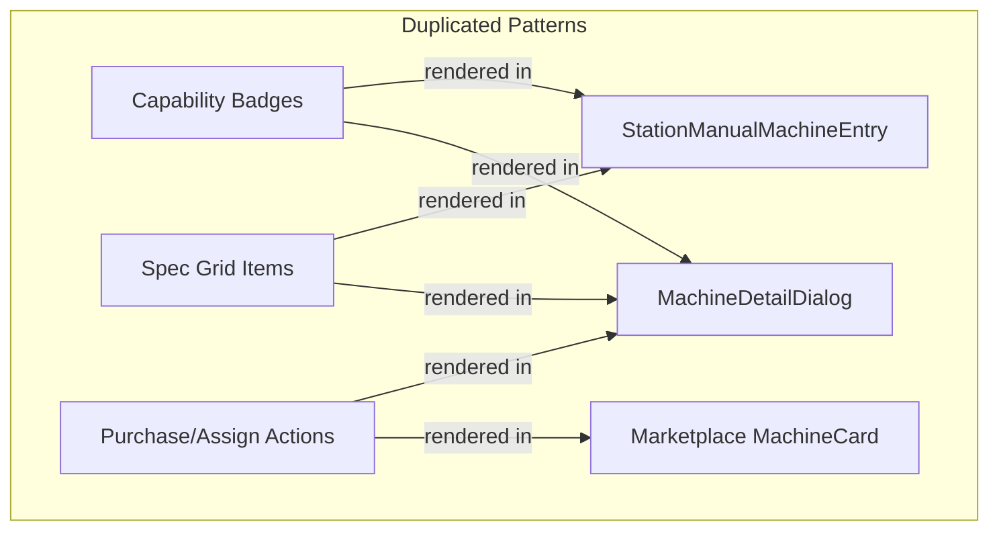

# PRD 19 — Marketplace & Machine Profile Refactoring

**Status**: ✅ Active  
**Last Updated**: 2026-03-08  
**Scope**: `src/components/station/`, `src/hooks/useStationMachineProfile.ts`, `src/components/machine/`

---

## 1. Audit Findings

### 1.1 Critical Issues

| # | Finding | Severity | File(s) |
|---|---------|----------|---------|
| F1 | **MachineCard name collision** — marketplace defines its own `MachineCard` (inline, 85 lines) while `src/components/machine/MachineCard.tsx` is the live-monitoring card. Confusing imports, no reuse. | High | `MachineProfileMarketplace.tsx`, `machine/MachineCard.tsx` |
| F2 | **573-line monolith** — `MachineProfileMarketplace.tsx` inlines 3 sub-components (`MachineCard`, `MachineDetailDialog`, `SpecItem`). Violates single-responsibility. | High | `MachineProfileMarketplace.tsx` |
| F3 | **587-line manual entry** — `StationManualMachineEntry.tsx` uses 40+ individual `useState` calls instead of `useReducer` or `react-hook-form`. No dirty tracking. | High | `StationManualMachineEntry.tsx` |
| F4 | **Hook monolith** — `useStationMachineProfile.ts` (303 lines) mixes library browsing, purchase flow, and station assignment into one file with unrelated exports. | Medium | `useStationMachineProfile.ts` |
| F5 | **Dead wrapper** — `StationManufacturerAttach.tsx` is a 23-line passthrough to `MachineProfileMarketplace`. | Low | `StationManufacturerAttach.tsx` |
| F6 | **Spec rendering duplication** — Capability badges and spec items rendered identically in `MachineDetailDialog` and `StationManualMachineEntry`. No shared components. | Medium | Both files |
| F7 | **No tests** — Zero test coverage in `src/components/station/`. | High | All station components |
| F8 | **`as any` casts** — All Supabase queries in `useStationMachineProfile.ts` use `as any` casts, bypassing type safety. | Medium | `useStationMachineProfile.ts` |
| F9 | **No loading skeletons** in manual entry dialog — jumps from blank to loaded. | Low | `StationManualMachineEntry.tsx` |

### 1.2 Duplication Map



---

## 2. Target Architecture

### 2.1 File Structure (After)

```
src/
├── components/
│   └── station/
│       ├── index.ts                          # barrel exports
│       ├── MachineProfileMarketplace.tsx      # orchestrator only (~150 lines)
│       ├── MarketplaceCatalogCard.tsx         # NEW — renamed from inline MachineCard
│       ├── MachineDetailDialog.tsx            # NEW — extracted
│       ├── MachineSpecGrid.tsx                # NEW — shared spec rendering
│       ├── MachineCapabilityBadges.tsx         # NEW — shared capability badges
│       ├── StationMachineContextDialog.tsx    # keep — already clean
│       ├── StationManualMachineEntry.tsx      # refactored — use react-hook-form
│       └── __tests__/
│           ├── MarketplaceCatalogCard.test.tsx
│           ├── MachineDetailDialog.test.tsx
│           ├── MachineSpecGrid.test.tsx
│           └── MachineCapabilityBadges.test.tsx
├── hooks/
│   ├── useMachineLibrary.ts                  # NEW — extracted from useStationMachineProfile
│   ├── useStationMachineAssignment.ts        # NEW — extracted
│   └── useStationMachineProfile.ts           # DEPRECATED — re-exports only
```

### 2.2 Shared Components

#### `MachineSpecGrid`
Renders a grid of spec items (travel, envelope, weight, tolerance) from a machine profile object. Used by both `MachineDetailDialog` and `StationManualMachineEntry` (read-only preview).

#### `MachineCapabilityBadges`
Renders capability badges (5-Axis, Live Tooling, etc.) from boolean flags. Accepts either a `MachineLibraryEntry` or manual profile shape.

#### `MarketplaceCatalogCard`
Renamed from the inline `MachineCard` to eliminate the name collision with `machine/MachineCard.tsx` (live monitoring).

### 2.3 Hook Decomposition

| Hook | Responsibility | Source |
|------|---------------|--------|
| `useMachineLibrary` | Fetch verified library, purchases, purchase flow, verify payment | Extracted from `useStationMachineProfile` |
| `useStationMachineAssignment` | Fetch/set/unset station-to-purchase assignment | Extracted from `useStationMachineProfile` |
| `useStationMachineProfile` | **Deprecated wrapper** — re-exports both hooks + constants for backward compat | Existing file, thinned |

---

## 3. Implementation Phases

### Phase 1: Extract Shared UI (Current Sprint)
1. Create `MachineSpecGrid` and `MachineCapabilityBadges`
2. Extract `MarketplaceCatalogCard` and `MachineDetailDialog` from monolith
3. Update `MachineProfileMarketplace` to import extracted components
4. Delete `StationManufacturerAttach` wrapper, update imports
5. Add tests for all new components

### Phase 2: Hook Decomposition
1. Split `useStationMachineProfile.ts` into `useMachineLibrary.ts` + `useStationMachineAssignment.ts`
2. Keep backward-compatible re-exports
3. Add tests for hooks

### Phase 3: Form Modernization (Future)
1. Migrate `StationManualMachineEntry` from 40+ `useState` to `react-hook-form` + `zod`
2. Add dirty tracking and validation
3. Add loading skeleton

---

## 4. Component Contracts

### MachineSpecGrid Props
```typescript
interface MachineSpecGridProps {
  specs: {
    max_x_travel?: number | null;
    max_y_travel?: number | null;
    max_z_travel?: number | null;
    max_part_weight?: number | null;
    max_part_envelope_length?: number | null;
    max_part_envelope_width?: number | null;
    max_part_envelope_height?: number | null;
    typical_tolerance?: number | null;
    max_spindle_rpm?: number | null;
    spindle_taper?: string | null;
    spindle_power_hp?: number | null;
    tool_magazine_capacity?: number | null;
    max_tool_diameter?: number | null;
    max_tool_length?: number | null;
    max_turning_diameter?: number | null;
    max_turning_length?: number | null;
    bar_capacity_mm?: number | null;
  };
  compact?: boolean;
}
```

### MachineCapabilityBadges Props
```typescript
interface MachineCapabilityBadgesProps {
  capabilities: {
    five_axis_simultaneous?: boolean;
    fourth_axis?: boolean;
    live_tooling?: boolean;
    y_axis_turn?: boolean;
    sub_spindle?: boolean;
    probing?: boolean;
    through_spindle_coolant?: boolean;
    pallet_pool?: boolean;
    bar_feeder?: boolean;
  };
  materials?: string[];
}
```

---

## 5. Testing Requirements

| Component | Test Type | Coverage |
|-----------|-----------|----------|
| `MachineSpecGrid` | Render test | Shows spec values, hides nulls |
| `MachineCapabilityBadges` | Render test | Shows only truthy caps, materials |
| `MarketplaceCatalogCard` | Render test | Owned/unowned states, action buttons |
| `MachineDetailDialog` | Render test | Spec grid present, action buttons |
| `useMachineLibrary` | Unit test | Filter logic, purchase state |
| `useStationMachineAssignment` | Unit test | Assign/unassign flow |

---

## 6. Migration Checklist

- [ ] Extract `MachineSpecGrid` + `MachineCapabilityBadges`
- [ ] Extract `MarketplaceCatalogCard` (rename from inline MachineCard)
- [ ] Extract `MachineDetailDialog`
- [ ] Slim `MachineProfileMarketplace.tsx` to orchestrator
- [ ] Delete `StationManufacturerAttach.tsx`
- [ ] Update all imports
- [ ] Update barrel `index.ts`
- [ ] Add component tests
- [ ] Split hooks (Phase 2)
- [ ] Form modernization (Phase 3)
