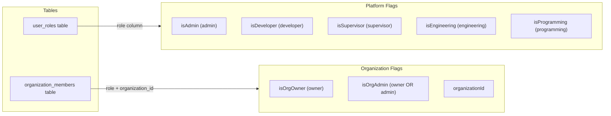
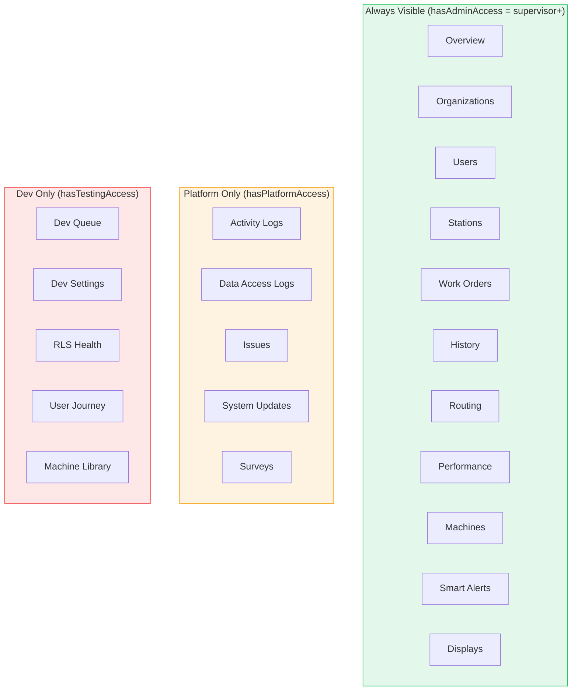
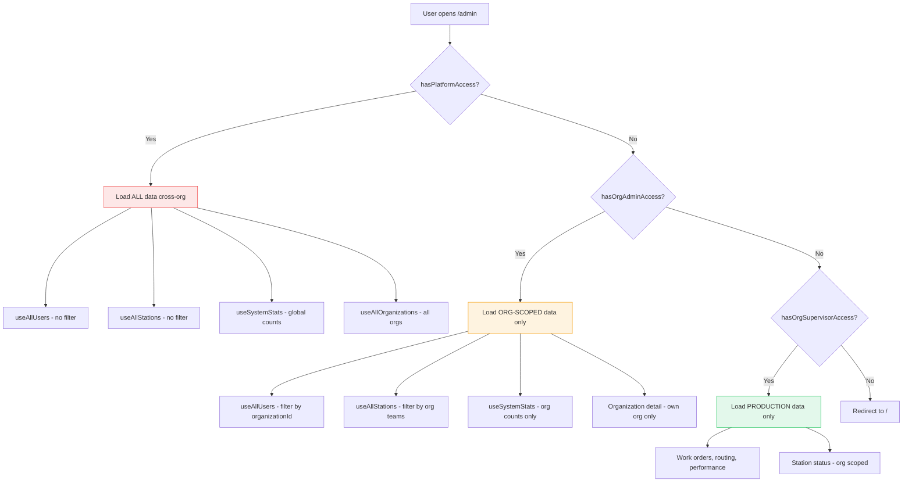

# PRD: Admin Dashboard — Org-Scoped Architecture & useAdminAccess Hook

**Version**: 1.0  
**Last Updated**: 2026-03-08  
**Status**: Active  
**Relates To**: [01-user-roles-access-control.md](./01-user-roles-access-control.md), [07-admin-supervisor-operations.md](./07-admin-supervisor-operations.md)

---

## 1. Problem Statement

The Admin Dashboard (`/admin`) serves **two fundamentally different audiences** through a single route:

| Audience | Scope | Purpose |
|----------|-------|---------|
| **Platform Admin / SDK Developer** | Global (cross-org) | System debugging, all-org oversight, dev tools |
| **Org Owner / Org Admin / Supervisor** | Single organization | Production management, user management, work orders |

Confusion arises when org-scoped users see platform-level concepts (e.g., "Organizations" tab showing all orgs) or when platform admins operate without org context. This document defines the **correct separation of concerns**.

---

## 2. useAdminAccess Hook — Definitive Reference

### 2.1 Location
`src/hooks/useAdminData.ts` → `useAdminAccess()`

### 2.2 Data Sources



### 2.3 Computed Access Levels (Cascading)

| Computed Flag | Logic | Who Gets It | UI Scope |
|---------------|-------|-------------|----------|
| `hasPlatformAdminAccess` | `isAdmin` | Platform admins only | Global — all orgs |
| `hasPlatformAccess` | `isAdmin \|\| isDeveloper` | Platform admins + SDK devs | Global tools, logs, dev panels |
| `hasOrgAdminAccess` | `isOrgAdmin \|\| isAdmin` | Org owner/admin + platform admin | Org management (members, stations, settings) |
| `hasOrgSupervisorAccess` | `isSupervisor \|\| hasOrgAdminAccess` | Supervisors + org admins + platform admin | Production oversight (WO, routing, performance) |
| `hasDimensionAccess` | `isEngineering \|\| isProgramming \|\| hasOrgSupervisorAccess` | Engineering/programming + supervisors+ | Dimension tolerances, routing specs |
| `hasAdminAccess` *(legacy alias)* | `= hasOrgSupervisorAccess` | Same as supervisor+ | **Gate for /admin route access** |
| `hasTestingAccess` | `isDeveloper \|\| isAdmin` | SDK devs + platform admins | Testing panel, dev tools |

### 2.4 Access Cascade Diagram

```
Platform Admin ─────────────────────────────────────────────► ALL
    │
    ├── SDK Developer ──────────────────────────────────────► hasPlatformAccess + hasTestingAccess
    │
    ├── Org Owner ──────────────────────────────────────────► hasOrgAdminAccess
    │       │
    │       └── Org Admin ──────────────────────────────────► hasOrgAdminAccess
    │               │
    │               └── Supervisor (platform role) ─────────► hasOrgSupervisorAccess
    │                       │
    │                       └── Engineering / Programming ──► hasDimensionAccess
    │
    └── Operator (default) ─────────────────────────────────► (no admin access)
```

---

## 3. Admin Dashboard Tab Architecture

### 3.1 Tab Buckets & Visibility



### 3.2 Key Separation Rules

| Tab | Org-Scoped? | What Org Users See | What Platform Admins See |
|-----|-------------|-------------------|--------------------------|
| **Overview** | ✅ | Their org's stats + users + stations | All orgs overview (cross-tenant) |
| **Organizations** | ⚠️ MIXED | Should show ONLY their org | Currently shows all orgs (needs scoping) |
| **Users** | ✅ | Their org members only | All platform users grouped by org |
| **Stations** | ✅ | Their org stations only | All stations cross-org |
| **Work Orders** | ✅ | Their org WOs only | All WOs (via RLS) |
| **Routing** | ✅ | Their org templates | All templates (via RLS) |
| **Performance** | ✅ | Their org updates | All updates (via RLS) |
| **Activity Logs** | ❌ Platform only | Hidden | Global activity logs |
| **Data Access** | ❌ Platform only | Hidden | Global audit trail |
| **Dev Tools** | ❌ Dev only | Hidden | Dev debugging panels |

### 3.3 Confusion Points (Current State)

| Issue | Current Behavior | Correct Behavior |
|-------|-----------------|-------------------|
| `isAdmin` prop passed to components | Boolean — means "platform admin" | Components should check `hasOrgAdminAccess` for org management |
| `useAllUsers()` fetches ALL profiles | No org filter — returns all users | Org users should only see their org members |
| `useAllStations()` fetches ALL stations | No org filter | Org users should only see their org stations |
| `useAllTeams()` fetches ALL teams | No org filter | Org users should only see their org teams |
| `useSystemStats()` counts ALL records | Global counts | Org users should see org-scoped counts |
| `useAllOrganizations()` fetches ALL orgs | Always global | Only platform admins need cross-org view |

---

## 4. Correct Data Scoping Strategy

### 4.1 Hook Behavior by Access Level



### 4.2 RLS Enforcement

All data hooks rely on backend RLS policies that enforce `organization_id` matching. Even if the frontend doesn't filter, the database **should** return only authorized rows. However, frontend filtering is still important for:
- Correct UI labeling ("Your Organization" vs "All Organizations")
- Accurate count displays
- Preventing UI confusion where an org admin sees an empty "All Orgs" tab

---

## 5. Component Props Audit

### 5.1 Current `isAdmin` Prop Usage

Many components receive `isAdmin: boolean` which conflates platform admin with org admin:

| Component | Receives `isAdmin` | Actually Needs |
|-----------|-------------------|----------------|
| `UserManagement` | `isAdmin` + `isSupervisorOrAbove` | `hasOrgAdminAccess` for member management, `hasPlatformAdminAccess` for role assignment |
| `StationManagement` | `isAdmin` | `hasOrgAdminAccess` for CRUD, `hasPlatformAdminAccess` for cross-org view |
| `OrganizationOversight` | `isAdmin` | `hasPlatformAdminAccess` for all-org view, `hasOrgAdminAccess` for own-org detail |
| `WorkOrderManagement` | `isAdmin` | `hasOrgSupervisorAccess` (everyone on this page can manage WOs) |
| `RoutingTemplateManagement` | `isAdmin` + `canManageTemplates` | `canManageTemplates` is correct — includes supervisor |
| `PerformanceUpdatesReview` | `isAdmin` | `hasOrgSupervisorAccess` |

### 5.2 Recommended Prop Refactor

Replace `isAdmin: boolean` with a structured access object:

```typescript
interface AdminComponentAccess {
  isPlatformAdmin: boolean;     // Global cross-org access
  canManageOrg: boolean;        // Org owner/admin level
  canManageProduction: boolean; // Supervisor+ level
  organizationId: string | null;
}
```

---

## 6. Naming Clarification

| Term | Meaning | Where It Lives |
|------|---------|---------------|
| **Platform Admin** | Global super-admin (user_roles: `admin`) | `isAdmin` / `hasPlatformAdminAccess` |
| **SDK Developer** | Platform dev tools access (user_roles: `developer`) | `isDeveloper` / `hasPlatformAccess` |
| **Org Owner** | Organization creator, billing contact (org_members: `owner`) | `isOrgOwner` |
| **Org Admin** | Organization manager (org_members: `admin` OR `owner`) | `isOrgAdmin` / `hasOrgAdminAccess` |
| **Supervisor** | Production oversight (user_roles: `supervisor`) | `isSupervisor` / `hasOrgSupervisorAccess` |
| **Operator** | Default shop floor user (user_roles: `operator`) | No admin access |

> **"SDK Admin"** is NOT a formal role. It refers to the combination of `hasPlatformAccess` (admin + developer) which grants access to platform-level tools. This should always be called **"Platform Access"** or **"SDK/Developer Access"** in documentation.

---

## 7. Security Boundaries

### 7.1 What Org Admins CANNOT Do

- ❌ View other organizations' data
- ❌ Assign `admin` or `developer` platform roles
- ❌ Access Activity Logs, Data Access Logs, System Updates
- ❌ Access Dev Tools (RLS Health, User Journey, Dev Queue)
- ❌ Delete other organizations
- ❌ View global system stats (total users across platform)

### 7.2 What Org Admins CAN Do

- ✅ View/manage their own org's members, teams, stations
- ✅ Create/edit/delete work orders within their org
- ✅ Manage routing templates for their org
- ✅ Review performance updates from their org
- ✅ Assign `supervisor`, `operator`, `viewer` roles to org members
- ✅ Generate invite codes for their org
- ✅ Bulk upload data for their org

### 7.3 Critical RLS Functions Used

| Function | Purpose | Used By |
|----------|---------|---------|
| `has_role(user_id, role)` | Check platform role | All admin queries |
| `is_org_member(user_id, org_id)` | Verify org membership | Data scoping |
| `is_org_admin(user_id, org_id)` | Check org admin/owner | Write operations |
| `is_supervisor_in_org(user_id, org_id)` | Supervisor + org check | Production data |

---

## 8. Improvement Roadmap

| Priority | Task | Impact |
|----------|------|--------|
| 🔴 High | Scope `useAllUsers`, `useAllStations`, `useAllTeams` by `organizationId` for non-platform users | Prevents data leakage in UI |
| 🔴 High | Replace `isAdmin` component prop with `AdminComponentAccess` object | Eliminates role confusion |
| 🟡 Medium | Split `useSystemStats` into `usePlatformStats` and `useOrgStats` | Correct count displays |
| 🟡 Medium | Hide "Organizations" tab for non-platform users (show "My Organization" instead) | UX clarity |
| 🟢 Low | Rename `hasAdminAccess` legacy alias to deprecation warning | Code clarity |
| 🟢 Low | Add `scope` badge to each tab ("Org" vs "Platform") | Visual disambiguation |

---

## 9. Quick Reference — Who Sees What

```
┌─────────────────────────────────────────────────────────────────┐
│                    /admin Route Access                           │
├─────────────────────────────────────────────────────────────────┤
│                                                                 │
│  PLATFORM ADMIN          SDK DEVELOPER         ORG ADMIN        │
│  ═══════════════         ═════════════         ═════════        │
│  ✅ All tabs             ✅ All tabs           ✅ Org bucket    │
│  ✅ Activity logs        ✅ Activity logs      ✅ Production    │
│  ✅ Dev tools            ✅ Dev tools          ❌ Activity      │
│  ✅ Cross-org data       ✅ Cross-org data     ❌ Dev tools     │
│  ✅ Role assignment      ❌ Role assignment    ❌ Cross-org     │
│                                                                 │
│  SUPERVISOR              OPERATOR              VIEWER           │
│  ═══════════             ════════              ══════           │
│  ✅ Production tabs      ❌ No /admin access   ❌ No access    │
│  ✅ Performance review   → Redirected to /     → Read-only     │
│  ❌ Org management                              dashboards      │
│  ❌ Activity/Dev                                                │
│                                                                 │
└─────────────────────────────────────────────────────────────────┘
```
