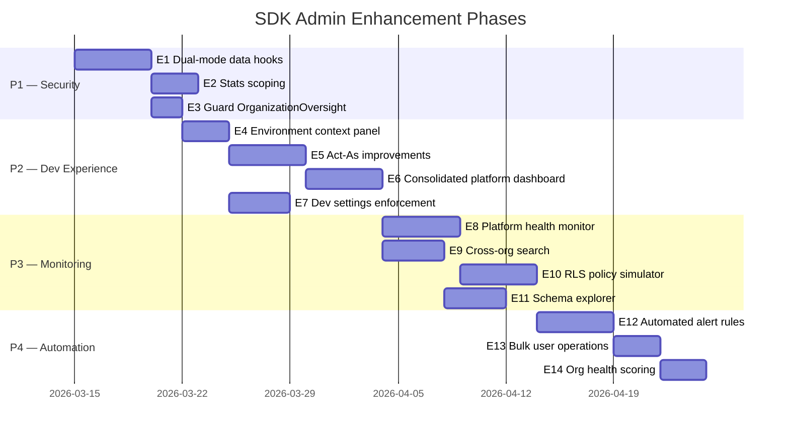

# PRD: SDK Admin — Platform Tools, Views & Enhancements

**Version**: 1.0  
**Last Updated**: 2026-03-08  
**Status**: Draft  
**Target Users**: Platform Admin (`admin`), SDK Developer (`developer`)  
**Relates To**: [09-developer-tooling-integration.md](./09-developer-tooling-integration.md), [22-admin-dashboard-org-scoped.md](./22-admin-dashboard-org-scoped.md)

---

## 1. Definition & Scope

### 1.1 What is "SDK Admin"?

**SDK Admin** is NOT a formal database role. It is the shorthand for users with `hasPlatformAccess` — the combination of the `admin` and `developer` platform roles that grants access to **cross-organization, system-wide tools** that are invisible to org-scoped users.

```
hasPlatformAccess = isAdmin || isDeveloper
```

| Flag | Roles | Purpose |
|------|-------|---------|
| `hasPlatformAdminAccess` | `admin` only | Full system control, role assignment, org deletion |
| `hasPlatformAccess` | `admin` + `developer` | All debugging, monitoring, and dev tooling |
| `hasTestingAccess` | `admin` + `developer` | `/testing` route + Dev Tools bucket in admin |

### 1.2 What SDK Admin Is NOT

- ❌ Not an org-level role — org owners/admins do NOT get SDK Admin access
- ❌ Not a database enum value — no `sdk_admin` in `app_role`
- ❌ Not the same as `hasAdminAccess` (which is the legacy alias for `hasOrgSupervisorAccess`)

---

## 2. Current SDK Admin Views

### 2.1 Admin Dashboard — Platform-Only Tabs

Located in `/admin`, visible only when `hasPlatformAccess === true`:

#### Activity Bucket

| Tab | Component | Purpose | Current State |
|-----|-----------|---------|---------------|
| **Activity Logs** | `ActivityLogs` | All user actions across platform | ✅ Working — global view |
| **Data Access Logs** | `DataAccessLogs` | RLS audit trail, table-level reads/writes | ✅ Working — global view |
| **Issues** | `IssuesManagement` | User-reported bugs across all orgs | ✅ Working — global view |
| **System Updates** | `SystemUpdatesManager` | Changelog, release notes, forced acknowledgements | ✅ Working |
| **Surveys** | `VisitorSurveyAnalytics` | Landing page visitor feedback | ✅ Working |

#### Dev Tools Bucket (red-bordered)

| Tab | Component | Purpose | Current State |
|-----|-----------|---------|---------------|
| **Dev Queue** | `DevIssueQueue` + `NotificationQueueStatus` | Prioritized issue backlog + notification delivery status | ✅ Working |
| **Dev Settings** | `DevSettingsPanel` | System-wide toggles (RLS strict mode, auto-assign, etc.) | ⚠️ Settings stored in `app_settings` but not always enforced |
| **RLS Health** | `RLSHealthCheck` | Automated security policy verification | ✅ Working |
| **User Journey** | `UserJourneyDebugPanel` | Onboarding state debugging, quick fixes | ✅ Working |
| **Machine Library** | `MachineLibraryManagement` | Marketplace machine profiles | ✅ Working |

### 2.2 Testing Page (`/testing`)

Accessible via `hasTestingAccess`:
- Test suite runner
- Coverage tracking
- API documentation access

### 2.3 Global Platform Tools (visible in Admin header)

| Tool | Access | Purpose |
|------|--------|---------|
| **Seed Test Data** | `hasTestingAccess` | Populate demo data for development |
| **Bulk Upload** | `hasAdminAccess` (supervisor+) | ⚠️ Also visible to org users — not SDK-exclusive |
| **Platform Badge** | All admin users | Shows role label (Platform Admin / SDK Developer / etc.) |

---

## 3. Cross-Org Data Access (SDK Admin Exclusive)

### 3.1 Current Hooks — Global Scope

These hooks fetch ALL data without org filtering. They are designed for SDK Admin use but currently lack explicit org-scoping guards:

| Hook | Data Returned | Used By | Issue |
|------|--------------|---------|-------|
| `useAllUsers()` | All profiles + roles + org memberships | UserManagement | Also used by org admins — needs dual mode |
| `useAllTeams()` | All teams + member/station counts | TeamOversight | No org filter for non-platform users |
| `useAllStations()` | All stations + team names | StationManagement | No org filter for non-platform users |
| `useAllOrganizations()` | All orgs + owner info + counts | OrganizationOversight | Should be SDK-only or filtered |
| `useSystemStats()` | Global counts (users, orgs, teams, etc.) | AdminStatsCards | Org users see inflated global numbers |

### 3.2 Correct Behavior

```mermaid
flowchart TD
    A[Hook Called] --> B{hasPlatformAccess?}
    B -->|Yes| C[Return ALL data - no filter]
    B -->|No| D[Filter by user's organizationId]
    
    C --> E[Label: "Platform Overview"]
    D --> F[Label: "Your Organization"]
    
    style C fill:#ef444420,stroke:#ef4444
    style D fill:#22c55e20,stroke:#22c55e
```

---

## 4. Enhancement Roadmap

### 4.1 🔴 Priority 1 — Security & Correctness

#### E1: Dual-Mode Data Hooks
**Problem**: `useAllUsers`, `useAllTeams`, `useAllStations` return global data to org admins.  
**Solution**: Accept an optional `organizationId` parameter. When provided, filter all queries by org. When `null` (platform admin), return everything.

```typescript
// Proposed signature
export function useAllUsers(options?: { organizationId?: string }) {
  // If organizationId provided → filter profiles by org membership
  // If null/undefined → return all (platform admin mode)
}
```

**Affected Components**: `UserManagement`, `StationManagement`, `OrganizationOversight`, `AdminStatsCards`

#### E2: Stats Scoping
**Problem**: `useSystemStats` returns global counts even for org admins.  
**Solution**: Create `useOrgStats(organizationId)` for org users. Keep `useSystemStats` for platform admins only.

```typescript
// Platform admin sees:
{ totalUsers: 847, totalOrganizations: 23, totalTeams: 156, ... }

// Org admin sees:
{ totalMembers: 12, totalTeams: 3, totalStations: 8, ... }
```

#### E3: Guard OrganizationOversight Component
**Problem**: All admin users see the "Organizations" tab with full org list.  
**Solution**: For non-platform users, replace with "My Organization" detail view showing their own org's structure, members, and subscription info.

---

### 4.2 🟡 Priority 2 — SDK Developer Experience

#### E4: Environment Context Panel
**Component**: `EnvironmentContext` (exists but underused)  
**Enhancement**: Always-visible sidebar or header widget showing:
- Current environment (dev/staging/prod)
- Supabase project ID (masked for non-admins)
- Active RLS mode (strict/permissive)
- Last deployment timestamp
- Edge function count + health

#### E5: Act-As / Impersonation Improvements
**Current**: `ActAsBanner` + `act_as_sessions` table exists.  
**Enhancements**:
- Quick-switch dropdown to impersonate any org user
- Visual "impersonation mode" indicator across all pages (not just admin)
- Auto-end session after 30 minutes
- Audit log entry on start/end with reason field
- Restrict to platform admin only (currently: verify this)

#### E6: Consolidated Platform Dashboard
**Problem**: SDK admin has no single "home" view — they jump between admin tabs.  
**Solution**: New "Platform Overview" tab combining:
- Health score (RLS pass rate, error rate, uptime)
- Active user count (24h)
- Recent issues (top 5 by severity)
- Orgs by activity (most active, newest, inactive)
- Edge function invocation stats
- Notification delivery queue status

#### E7: Dev Settings Enforcement
**Problem**: `DevSettingsPanel` toggles are stored in `app_settings` but many are cosmetic — not enforced in actual queries or business logic.  
**Enhancements**:
- Map each setting to its enforcement point in code
- Add "Enforced: Yes/No" badge per setting
- Wire `rls_strict_mode` to actual RLS policy behavior
- Wire `auto_issue_assignment` to dev queue trigger
- Add "Test This Setting" button that simulates the effect

---

### 4.3 🟡 Priority 3 — Monitoring & Observability

#### E8: Real-Time Platform Health Monitor
**New Component**: `PlatformHealthDashboard`  
**Features**:
- Live WebSocket connection count
- Active realtime channels
- Database connection pool utilization
- Edge function error rates (last 1h / 24h)
- Storage usage by org (top consumers)
- API request volume graph (recharts)

#### E9: Cross-Org Search
**Problem**: No way to search for a user, work order, or station across all orgs.  
**Solution**: Global search bar (platform admin only) that queries:
- `profiles` (by email, display_name)
- `organizations` (by name, slug)
- `queue_items` (by work order number)
- `stations` (by station_id, name)
- Returns results grouped by organization

#### E10: RLS Policy Simulator
**Problem**: `RLSHealthCheck` tests existing policies but can't simulate "what if" scenarios.  
**Solution**: Interactive tool where SDK admin can:
- Select a user
- Select a table + operation (SELECT/INSERT/UPDATE/DELETE)
- See which policies would apply
- Test with specific row data
- Preview the SQL that RLS generates

#### E11: Database Schema Explorer
**Problem**: Developers must read `types.ts` to understand relationships.  
**Solution**: Visual schema browser showing:
- Table list with row counts
- Column definitions with types
- Foreign key relationships (visual graph)
- RLS policy list per table
- Index information
- Quick link to create migration

---

### 4.4 🟢 Priority 4 — Workflow Automation

#### E12: Automated Alerting Rules
**Problem**: SDK admins manually check for issues.  
**Solution**: Configurable alert rules:

| Rule | Trigger | Action |
|------|---------|--------|
| New critical issue | `issues.severity = 'critical'` | Email + in-app notification |
| RLS health degradation | Health score drops below 80% | Dev Queue auto-entry |
| Org signup spike | > 5 orgs created in 1 hour | Activity log flag |
| Failed user journeys | > 3 users stuck at same step | Auto-create issue |
| Edge function errors | > 10 errors in 5 minutes | Alert banner |

#### E13: Bulk User Operations
**Problem**: No batch operations for user management across orgs.  
**Solution**: Platform admin can:
- Export all users as CSV
- Bulk assign/remove platform roles
- Bulk send password reset emails
- Deactivate inactive accounts (last login > 90 days)

#### E14: Org Health Scoring
**Problem**: No way to identify struggling organizations.  
**Solution**: Per-org health score based on:
- Active users (last 7 days) / total members
- Work orders created this month
- Handoff completion rate
- Error rate from activity logs
- Onboarding completion rate
- Display as color-coded badges in OrganizationOversight

---

## 5. Component Ownership Matrix

| Component | Owner | Access Gate | Org-Scoped? |
|-----------|-------|-------------|-------------|
| `ActivityLogs` | SDK Admin | `hasPlatformAccess` | ❌ Global |
| `DataAccessLogs` | SDK Admin | `hasPlatformAccess` | ❌ Global |
| `IssuesManagement` | SDK Admin | `hasPlatformAccess` | ❌ Global |
| `SystemUpdatesManager` | SDK Admin | `hasPlatformAccess` | ❌ Global |
| `VisitorSurveyAnalytics` | SDK Admin | `hasPlatformAccess` | ❌ Global |
| `DevIssueQueue` | SDK Admin | `hasTestingAccess` | ❌ Global |
| `DevSettingsPanel` | SDK Admin | `hasTestingAccess` | ❌ Global |
| `RLSHealthCheck` | SDK Admin | `hasTestingAccess` | ❌ Global |
| `UserJourneyDebugPanel` | SDK Admin | `hasTestingAccess` | ❌ Global |
| `MachineLibraryManagement` | SDK Admin | `hasTestingAccess` | ❌ Global (marketplace) |
| `NotificationQueueStatus` | SDK Admin | `hasTestingAccess` | ❌ Global |
| `SeedTestDataButton` | SDK Admin | `hasTestingAccess` | ❌ Creates test data |
| `ActAsBanner` | SDK Admin | `hasPlatformAdminAccess` | ⚠️ Impersonates into org context |
| `ConsoleLogViewer` | SDK Admin | `hasTestingAccess` | ❌ Client-side |
| `ErrorStackTrace` | SDK Admin | `hasTestingAccess` | ❌ Client-side |
| `EnvironmentContext` | SDK Admin | `hasPlatformAccess` | ❌ System info |

---

## 6. Proposed New Components

| Component | Purpose | Access | Priority |
|-----------|---------|--------|----------|
| `PlatformOverviewTab` | Consolidated health/stats for SDK admins | `hasPlatformAccess` | 🟡 P2 |
| `CrossOrgSearch` | Global search across all orgs | `hasPlatformAdminAccess` | 🟡 P3 |
| `RLSPolicySimulator` | Interactive "what if" policy testing | `hasTestingAccess` | 🟡 P3 |
| `SchemaExplorer` | Visual database schema browser | `hasTestingAccess` | 🟢 P4 |
| `PlatformHealthDashboard` | Real-time system metrics | `hasPlatformAccess` | 🟡 P3 |
| `AlertRulesManager` | Configurable automated alerts | `hasPlatformAdminAccess` | 🟢 P4 |
| `OrgHealthScorecard` | Per-org health metrics | `hasPlatformAccess` | 🟢 P4 |
| `BulkUserOps` | Batch user operations | `hasPlatformAdminAccess` | 🟢 P4 |

---

## 7. Access Gate Cheat Sheet

```
/admin route ──── hasAdminAccess (= hasOrgSupervisorAccess)
  │
  ├── Org Bucket tabs ──── Always visible (supervisor+)
  │     └── Data scoped by organizationId for non-platform users
  │
  ├── Production Bucket tabs ──── Always visible (supervisor+)
  │     └── Data scoped by org RLS policies
  │
  ├── Activity Bucket tabs ──── hasPlatformAccess only
  │     └── Global data, no org filter
  │
  └── Dev Tools Bucket tabs ──── hasTestingAccess only
        └── System-level tools, no org filter

/testing route ──── hasTestingAccess
  └── Test runner, coverage, API docs
```

---

## 8. Success Metrics

| Metric | Current | Target |
|--------|---------|--------|
| Time to diagnose user access issue | ~15 min | < 5 min |
| RLS health check coverage | ~60% of tables | > 95% |
| Dev settings actually enforced | ~30% | 100% |
| Mean time to detect critical issue | Reactive | < 2 min (automated) |
| Cross-org search availability | ❌ None | Full-text across core tables |
| Platform health visibility | Manual checks | Real-time dashboard |

---

## 9. Implementation Order


