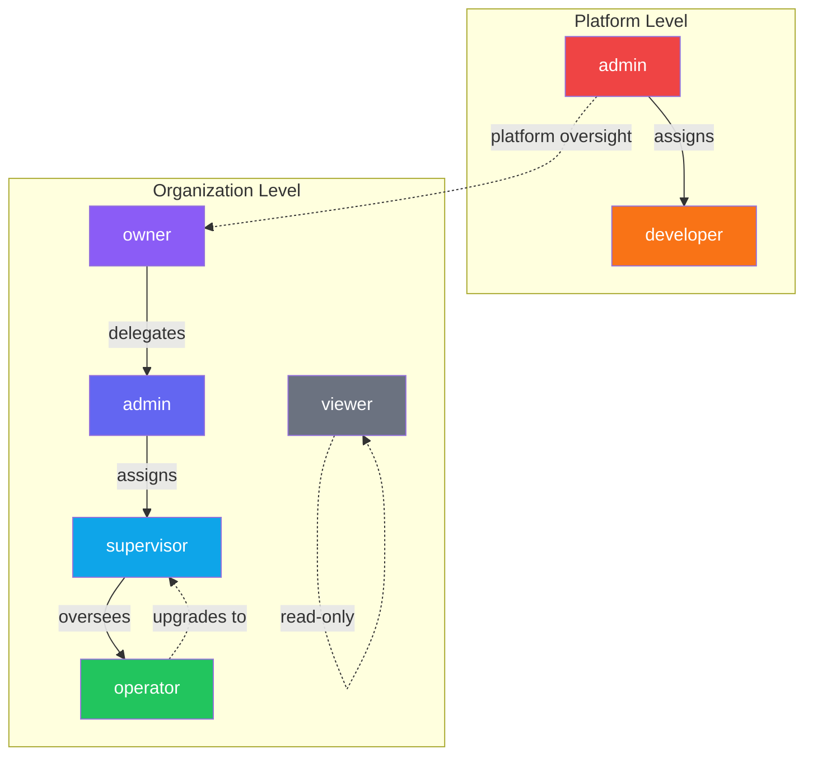

# Role-Based PRD Views

**Last Updated**: 2025-01-27

---

## Overview

This directory contains role-specific views of the product requirements, organizing features and workflows by user persona.

---

## Role Documents

| Role | Document | Description |
|------|----------|-------------|
| Platform Admin & Developer | [platform-admin-developer.md](./platform-admin-developer.md) | Global system access, testing tools |
| Org Owner & Admin | [org-owner-admin.md](./org-owner-admin.md) | Organization management, billing |
| Supervisor | [supervisor.md](./supervisor.md) | Production oversight, expediting |
| Operator | [operator.md](./operator.md) | Shop floor execution |
| Viewer | [viewer.md](./viewer.md) | Read-only dashboards |

---

## Role Hierarchy

---

## Quick Reference

### Platform Admin
- **Access**: Everything
- **Entry Points**: `/admin`, `/testing`, all pages
- **Key Actions**: Assign developer roles, view global logs, platform settings

### Developer
- **Access**: Testing tools, debug info
- **Entry Points**: `/testing`
- **Key Actions**: Run tests, view coverage, access API docs

### Org Owner
- **Access**: Full organization control
- **Entry Points**: `/settings`, `/admin`, `/teams`
- **Key Actions**: Billing, delete org, transfer ownership, all admin actions

### Org Admin
- **Access**: Organization management (except billing/delete)
- **Entry Points**: `/settings`, `/admin`, `/teams`
- **Key Actions**: Manage members, teams, stations, work orders

### Supervisor
- **Access**: Production oversight
- **Entry Points**: `/dashboard`, `/queue`, `/admin` (limited)
- **Key Actions**: Expedite, assign, review updates, coordinate delivery

### Operator
- **Access**: Station-specific work
- **Entry Points**: `/dashboard` (station view)
- **Key Actions**: Start/pause/complete work, handoffs, submit improvements

### Viewer
- **Access**: Read-only dashboards
- **Entry Points**: `/dashboard`, `/queue` (read-only)
- **Key Actions**: View status, view history, view reports

---

## Permission Quick Check

| Feature | Admin | Dev | Owner | OrgAdmin | Supervisor | Operator | Viewer |
|---------|-------|-----|-------|----------|------------|----------|--------|
| Platform settings | ✅ | ❌ | ❌ | ❌ | ❌ | ❌ | ❌ |
| Testing panel | ✅ | ✅ | ❌ | ❌ | ❌ | ❌ | ❌ |
| Org billing | ❌ | ❌ | ✅ | ❌ | ❌ | ❌ | ❌ |
| Manage members | ❌ | ❌ | ✅ | ✅ | ❌ | ❌ | ❌ |
| Create stations | ❌ | ❌ | ✅ | ✅ | ❌ | ❌ | ❌ |
| Create work orders | ❌ | ❌ | ✅ | ✅ | ✅ | ❌ | ❌ |
| Approve updates | ❌ | ❌ | ✅ | ✅ | ✅ | ❌ | ❌ |
| Execute work | ❌ | ❌ | ✅ | ✅ | ✅ | ✅ | ❌ |
| Create handoffs | ❌ | ❌ | ✅ | ✅ | ✅ | ✅ | ❌ |
| View dashboards | ✅ | ✅ | ✅ | ✅ | ✅ | ✅ | ✅ |

---

## Implementation Notes

1. **Role Checking Order**: Always check in order: Platform → Org → Team
2. **Default Role**: New signups get `operator` app_role only
3. **Org/Team Roles**: Assigned via invite codes or manual assignment
4. **RLS Priority**: Org membership checked before team membership
