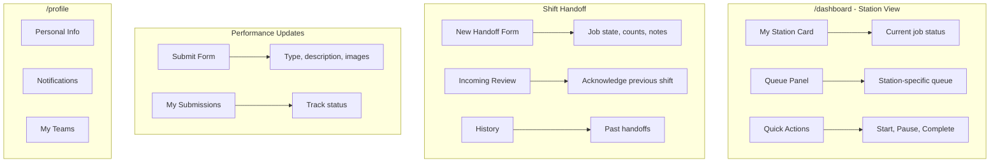
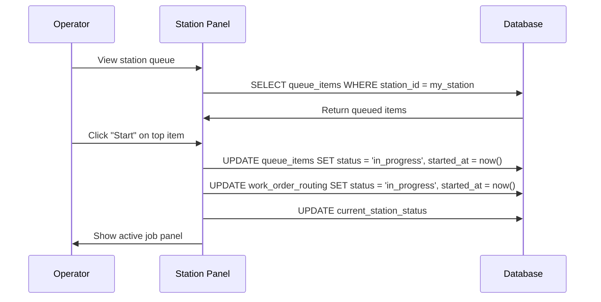
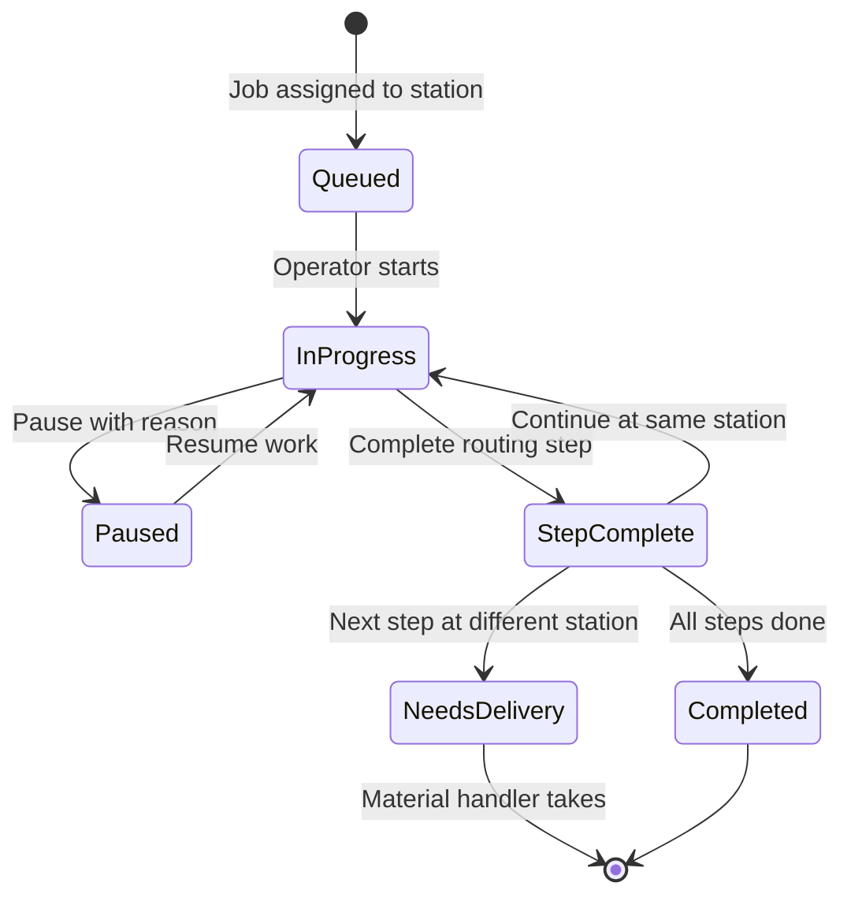
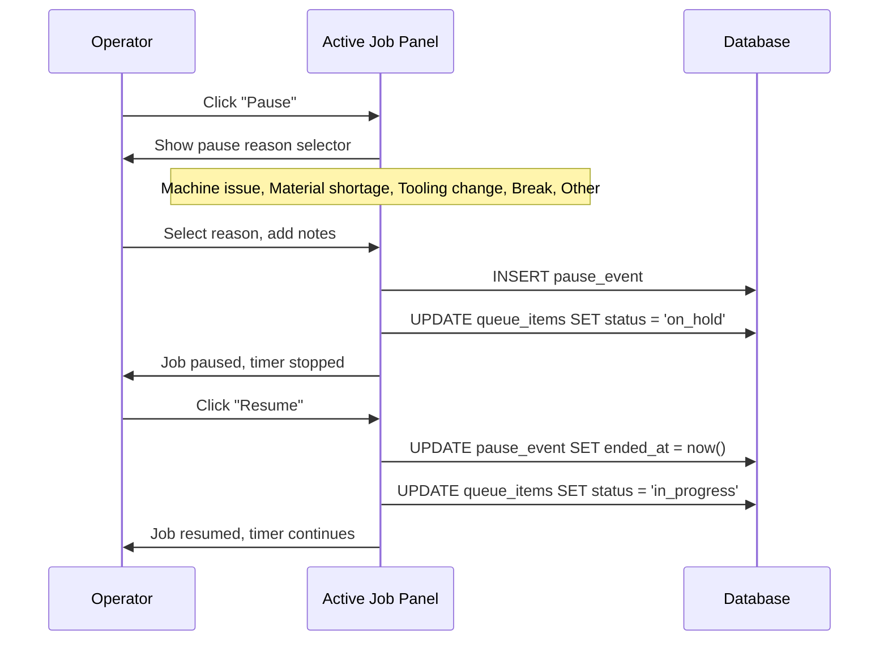
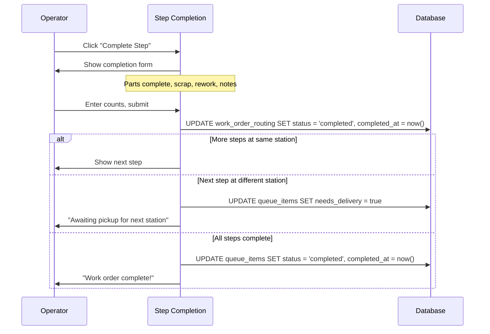
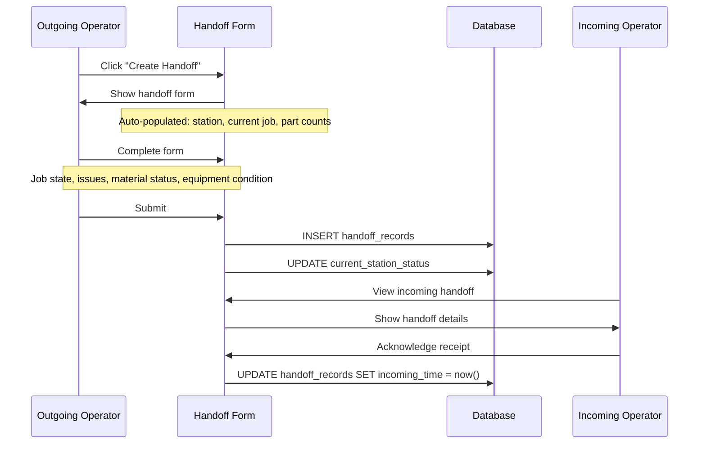
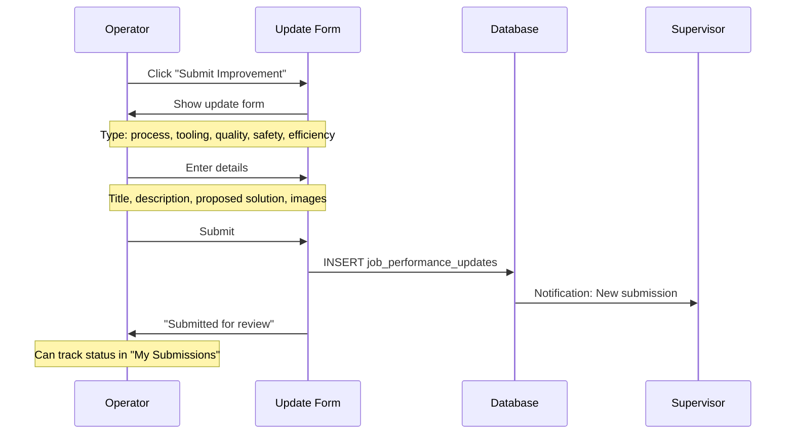

# PRD View: Operator

**Version**: 1.0  
**Last Updated**: 2025-01-27  
**Target Role**: `operator` (app_role - default for new signups)

---

## 1. Role Overview

Operators are the shop floor users who execute work orders, manage their station queue, document handoffs between shifts, and submit continuous improvement suggestions.

---

## 2. Access Matrix

| Feature Area | Access Level |
|--------------|--------------|
| **Station View** |
| View assigned station | ✅ Read |
| View station queue | ✅ Read |
| View station status | ✅ Read |
| **Work Order Execution** |
| Start work order | ✅ Write |
| Pause work order | ✅ Write |
| Complete routing step | ✅ Write |
| Update part counts | ✅ Write |
| Self-assign from queue | ✅ Write (if enabled) |
| **Handoffs** |
| Create handoff record | ✅ Write |
| View shift history | ✅ Read |
| Mark as incoming | ✅ Write |
| **Performance Updates** |
| Submit improvement | ✅ Write |
| View own submissions | ✅ Read |
| Upload images | ✅ Write |
| **Deliveries** |
| Confirm receipt | ✅ Write |
| Request pickup | ✅ Write |
| **Profile** |
| Update own profile | ✅ Write |
| Notification preferences | ✅ Write |

---

## 3. UI Entry Points



---

## 4. Relevant PRD Sections

| PRD | Sections | Purpose |
|-----|----------|---------|
| [01-User Roles](../01-user-roles-access-control.md) | §3.2 Operator capabilities | Role definition |
| [08-Operator Workflow](../08-operator-workflow.md) | All sections | Core workflows |
| [05-Handoff System](../05-handoff-system.md) | §3-4 Handoff creation | Shift transitions |
| [04-Work Order Queue](../04-work-order-queue.md) | §4 Status Updates | Work execution |

---

## 5. Key Workflows

### 5.1 Starting Work on a Job



### 5.2 Work Order Execution Cycle



### 5.3 Pause Workflow



### 5.4 Completing Routing Step



### 5.5 Shift Handoff



### 5.6 Submitting Performance Update



---

## 6. Station Queue Interface

### 6.1 Queue Card Display

```
┌────────────────────────────────────────────────────┐
│ 🔧 CNC-001 Queue                         [3 items] │
├────────────────────────────────────────────────────┤
│ ▶ IN PROGRESS                                      │
│ ┌────────────────────────────────────────────────┐ │
│ │ WO-2024-001 | PN-12345 Rev A                   │ │
│ │ Op 20 - CNC Turning                            │ │
│ │ Qty: 25/100 complete | 🕐 2h 15m elapsed       │ │
│ │ [Pause] [Complete Step]                        │ │
│ └────────────────────────────────────────────────┘ │
│                                                    │
│ 📋 UP NEXT                                         │
│ ┌────────────────────────────────────────────────┐ │
│ │ 🔴 URGENT | WO-2024-002 | PN-67890            │ │
│ │ Due: Today 4:00 PM                             │ │
│ │ [Start When Ready]                             │ │
│ └────────────────────────────────────────────────┘ │
│ ┌────────────────────────────────────────────────┐ │
│ │ 🟡 HIGH | WO-2024-003 | PN-11111              │ │
│ │ Due: Tomorrow 10:00 AM                         │ │
│ └────────────────────────────────────────────────┘ │
└────────────────────────────────────────────────────┘
```

### 6.2 Active Job Panel

```
┌────────────────────────────────────────────────────┐
│ ACTIVE JOB                                   🟢    │
├────────────────────────────────────────────────────┤
│ Work Order:    WO-2024-001                         │
│ Part Number:   PN-12345 Rev A                      │
│ Operation:     20 - CNC Turning                    │
│ Quantity:      100 pcs                             │
│                                                    │
│ ┌──────────────┬──────────────┬──────────────┐    │
│ │ Complete     │ Scrap        │ Rework       │    │
│ │     25       │      2       │      1       │    │
│ │   [+] [-]    │   [+] [-]    │   [+] [-]    │    │
│ └──────────────┴──────────────┴──────────────┘    │
│                                                    │
│ Elapsed Time: 2h 15m 32s                          │
│                                                    │
│ ┌────────────────────────────────────────────────┐ │
│ │ [⏸ Pause]  [✓ Complete Step]  [📝 Add Note]  │ │
│ └────────────────────────────────────────────────┘ │
└────────────────────────────────────────────────────┘
```

---

## 7. Data Access Patterns

### 7.1 Operator-Scoped Queries

```typescript
// Get operator's assigned station queue
const { data: stationQueue } = await supabase
  .from('queue_items')
  .select(`
    *,
    routing:work_order_routing(*)
  `)
  .eq('station_id', assignedStationId)
  .in('status', ['queued', 'in_progress', 'on_hold'])
  .order('priority', { ascending: false })
  .order('position');

// Get current handoff for review
const { data: incomingHandoff } = await supabase
  .from('handoff_records')
  .select('*')
  .eq('station_id', stationId)
  .is('incoming_time', null)
  .order('created_at', { ascending: false })
  .limit(1)
  .single();
```

### 7.2 RLS Policies

```sql
-- Operators can view their station's queue
CREATE POLICY "Operators view station queue"
ON public.queue_items
FOR SELECT
USING (
  station_id IN (
    SELECT s.id FROM stations s
    JOIN team_members tm ON s.team_id = tm.team_id
    WHERE tm.user_id = auth.uid()
  )
);

-- Operators can create handoffs for their station
CREATE POLICY "Operators create handoffs"
ON public.handoff_records
FOR INSERT
WITH CHECK (
  outgoing_operator_id = auth.uid()
  AND station_id IN (
    SELECT s.id FROM stations s
    JOIN team_members tm ON s.team_id = tm.team_id
    WHERE tm.user_id = auth.uid()
  )
);

-- Operators can submit performance updates
CREATE POLICY "Operators submit updates"
ON public.job_performance_updates
FOR INSERT
WITH CHECK (user_id = auth.uid());
```

---

## 8. Work Center Specific Fields

Different work center types show contextual fields:

| Work Center | Additional Fields |
|-------------|-------------------|
| CNC Lathe/Mill | Tool life, program number, offsets |
| Manual Machine | Setup notes, tooling list |
| Grinding | Wheel condition, coolant status |
| Welding | Wire spool level, gas pressure, amperage |
| Water Jet | Abrasive level, water pressure, nozzle wear |
| Assembly | Component checklist, torque values |
| Inspection | Measurement data, inspection report |

---

## 9. Implementation Checklist

### Station Interface
- [ ] Station card with current status
- [ ] Queue panel (station-filtered only)
- [ ] Active job panel with counters
- [ ] Start/Pause/Complete buttons

### Work Execution
- [ ] Start work order
- [ ] Pause with reason capture
- [ ] Resume from pause
- [ ] Part count updates (complete, scrap, rework)
- [ ] Routing step completion
- [ ] Delivery request on step complete

### Handoffs
- [ ] Handoff creation form
- [ ] Work center specific fields
- [ ] Incoming handoff review
- [ ] Acknowledgment flow
- [ ] History view

### Performance Updates
- [ ] Submission form with types
- [ ] Image upload
- [ ] My submissions list with status tracking
- [ ] Notification on status change

---

## 10. Related Documentation

- [User Role Architecture](../../user-role-architecture.md)
- [08-Operator Workflow PRD](../08-operator-workflow.md)
- [05-Handoff System PRD](../05-handoff-system.md)
