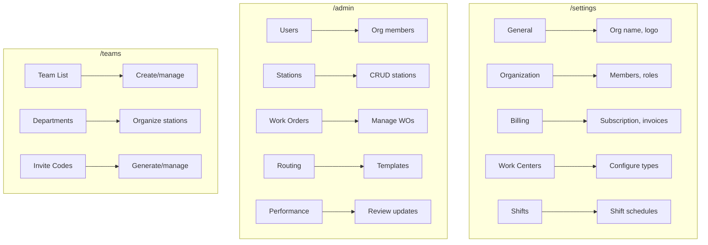
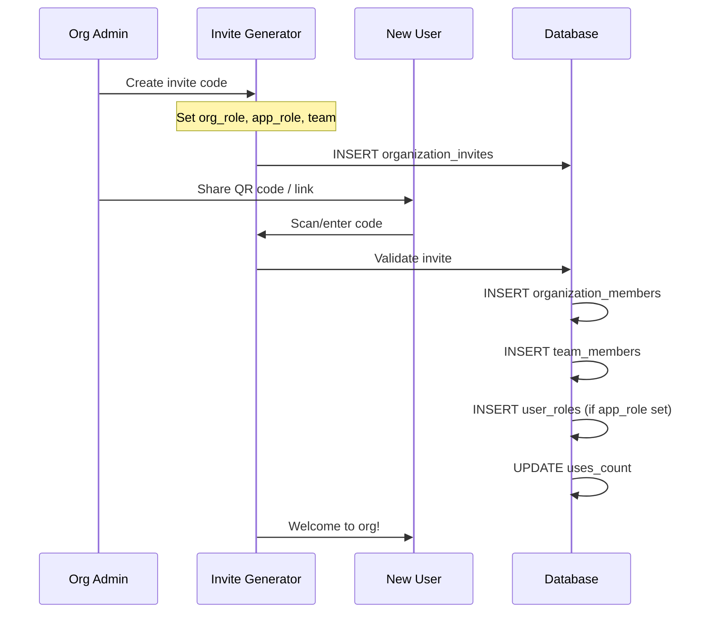
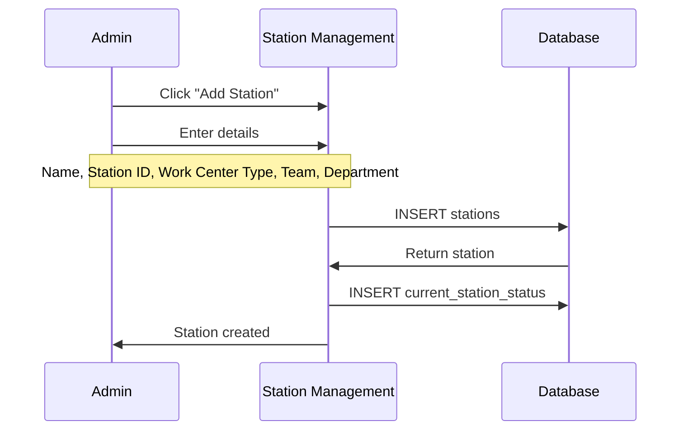
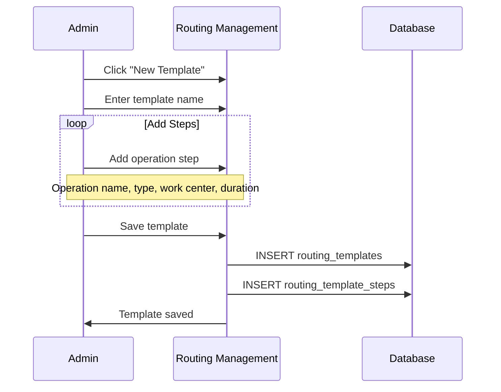

# PRD View: Organization Owner & Admin

**Version**: 1.0  
**Last Updated**: 2025-01-27  
**Target Roles**: `owner`, `admin` (organization_members.role)

---

## 1. Role Overview

### 1.1 Organization Owner
Creator of the organization with full control including billing, deletion, and ownership transfer.

### 1.2 Organization Admin
Delegated administrator who manages day-to-day operations: members, teams, stations, and settings.

---

## 2. Access Matrix

| Feature Area | Owner | Admin |
|--------------|-------|-------|
| **Organization Management** |
| Edit org settings | ✅ | ✅ |
| Delete organization | ✅ | ❌ |
| Transfer ownership | ✅ | ❌ |
| Manage billing | ✅ | ❌ |
| **Member Management** |
| Invite members | ✅ | ✅ |
| Remove members | ✅ | ✅ |
| Assign org roles | ✅ | ✅ |
| Assign app roles | ✅ | ✅ |
| **Team Management** |
| Create teams | ✅ | ✅ |
| Delete teams | ✅ | ✅ |
| Manage team members | ✅ | ✅ |
| **Station Management** |
| Create stations | ✅ | ✅ |
| Edit stations | ✅ | ✅ |
| Delete stations | ✅ | ✅ |
| **Work Orders** |
| Create work orders | ✅ | ✅ |
| Edit any work order | ✅ | ✅ |
| Delete work orders | ✅ | ✅ |
| **Routing** |
| Create routing templates | ✅ | ✅ |
| Apply routing | ✅ | ✅ |
| **Invite Codes** |
| Generate invites | ✅ | ✅ |
| Manage all invites | ✅ | ✅ |
| View redemption history | ✅ | ✅ |

---

## 3. UI Entry Points



---

## 4. Relevant PRD Sections

| PRD | Sections | Purpose |
|-----|----------|---------|
| [01-User Roles](../01-user-roles-access-control.md) | §4 Organization Roles | Role definitions |
| [02-Org Management](../02-organization-team-management.md) | All sections | Core org management |
| [03-Invite System](../03-invite-system.md) | All sections | Member onboarding |
| [06-Subscription](../06-subscription-billing.md) | §3-5 Billing flows | Owner billing |
| [07-Admin Operations](../07-admin-supervisor-operations.md) | §3 Stations, §4 Work Orders, §5 Routing | Production management |

---

## 5. Key Workflows

### 5.1 Onboarding New Team Member



### 5.2 Creating Work Station



### 5.3 Setting Up Routing Template



---

## 6. Data Access Patterns

### 6.1 Organization-Scoped Queries

```typescript
// All queries automatically scoped by RLS
const { data: stations } = await supabase
  .from('stations')
  .select('*')
  .eq('organization_id', orgId);

const { data: members } = await supabase
  .from('organization_members')
  .select(`
    *,
    profiles (display_name, email, avatar_url)
  `)
  .eq('organization_id', orgId);
```

### 6.2 RLS Policies

```sql
-- Org admins can manage stations
CREATE POLICY "Org admins manage stations"
ON public.stations
FOR ALL
USING (
  organization_id IN (
    SELECT organization_id FROM organization_members
    WHERE user_id = auth.uid() AND role IN ('owner', 'admin')
  )
);

-- Org admins can create/manage invites
CREATE POLICY "Org admins manage invites"
ON public.organization_invites
FOR ALL
USING (is_org_admin(organization_id, auth.uid()));
```

---

## 7. Entitlement Gates

Features gated by subscription tier:

| Feature | Starter | Team | Enterprise |
|---------|---------|------|------------|
| Max members | 5 | 25 | Unlimited |
| Max teams | 1 | 5 | Unlimited |
| Max stations | 10 | 50 | Unlimited |
| Routing templates | 3 | 20 | Unlimited |
| Custom work centers | ❌ | ✅ | ✅ |
| Advanced analytics | ❌ | ✅ | ✅ |
| Priority support | ❌ | ❌ | ✅ |

---

## 8. Implementation Checklist

### Organization Setup
- [ ] Org settings page (name, logo, description)
- [ ] Billing settings (owner only)
- [ ] Member management table with role assignment
- [ ] Entitlement display and upgrade prompts

### Team Management
- [ ] Team CRUD operations
- [ ] Department management within teams
- [ ] Team member assignment

### Station Management
- [ ] Station CRUD with work center types
- [ ] Station-team-department hierarchy
- [ ] Station status tracking

### Invite System
- [ ] Invite code generator with QR
- [ ] Role pre-assignment (org + app + team)
- [ ] Expiration and usage limits
- [ ] Redemption tracking

### Work Orders & Routing
- [ ] Work order creation with all fields
- [ ] Routing template builder
- [ ] Template application to work orders

---

## 9. Related Documentation

- [User Role Architecture](../../user-role-architecture.md)
- [02-Organization Management PRD](../02-organization-team-management.md)
- [03-Invite System PRD](../03-invite-system.md)
- [07-Admin Operations PRD](../07-admin-supervisor-operations.md)
