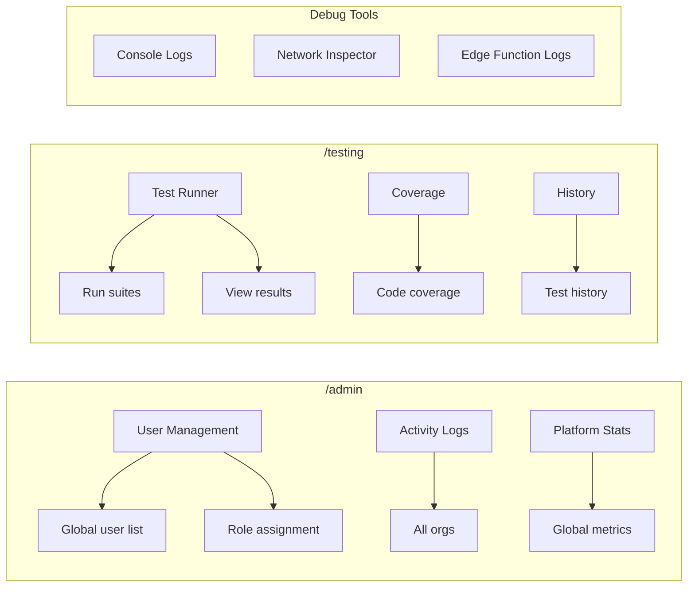
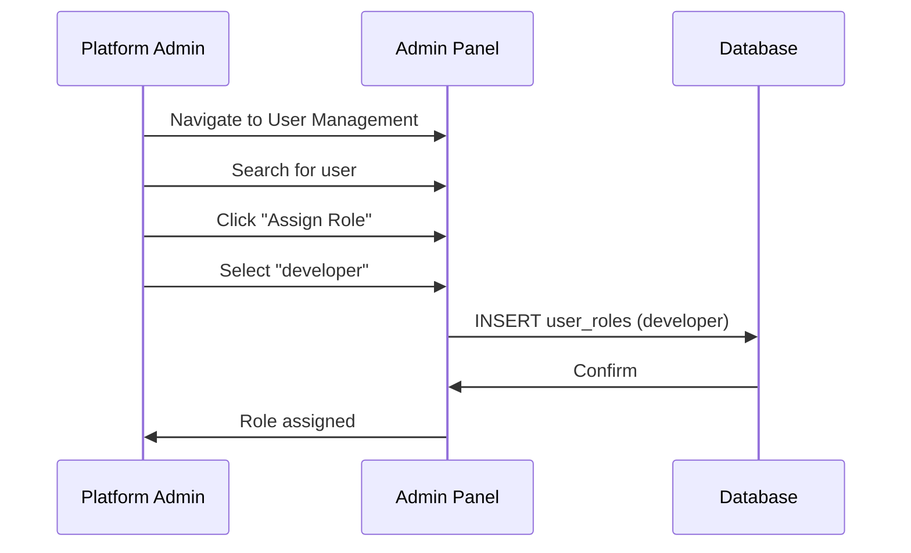
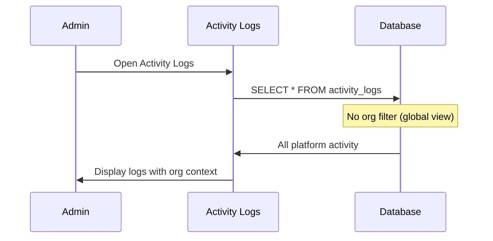

# PRD View: Platform Admin & Developer

**Version**: 1.0  
**Last Updated**: 2025-01-27  
**Target Roles**: `admin`, `developer` (app_role)

---

## 1. Role Overview

### 1.1 Platform Admin
Global system administrator with unrestricted access across all organizations. Reserved for JobLine.ai platform operators.

### 1.2 Developer
Technical role with access to testing, debugging, and API tools. Works alongside admins on platform development.

---

## 2. Access Matrix

| Feature Area | Admin | Developer |
|--------------|-------|-----------|
| **System Management** |
| View all organizations | ✅ | ❌ |
| Platform settings | ✅ | ❌ |
| Activity logs (global) | ✅ | ✅ |
| Assign developer roles | ✅ | ❌ |
| **Development Tools** |
| Testing panel (`/testing`) | ✅ | ✅ |
| Debug information | ✅ | ✅ |
| API documentation | ✅ | ✅ |
| Run test suites | ✅ | ✅ |
| Edge function logs | ✅ | ✅ |
| **Data Access** |
| Cross-org data view | ✅ | ❌ |
| User management (global) | ✅ | ❌ |
| Subscription oversight | ✅ | ❌ |

---

## 3. UI Entry Points



---

## 4. Relevant PRD Sections

| PRD | Sections | Purpose |
|-----|----------|---------|
| [01-User Roles](../01-user-roles-access-control.md) | §3 Platform Roles, §6 Permission Matrix | Role definitions |
| [02-Org Management](../02-organization-team-management.md) | §8 Admin Panel | Global org oversight |
| [06-Subscription](../06-subscription-billing.md) | §7 Admin Dashboard | Billing oversight |

---

## 5. Key Workflows

### 5.1 Assigning Developer Role



### 5.2 Viewing Global Activity



---

## 6. Security Considerations

### 6.1 Critical Access Controls
- Platform admin role CANNOT be self-assigned
- Developer role must be assigned by platform admin only
- All admin actions logged with IP address
- No org-specific data modification without explicit context

### 6.2 RLS Policy Behavior
```sql
-- Platform admins bypass org scoping
CREATE POLICY "Platform admins see all"
ON public.organizations
FOR SELECT
USING (has_role(auth.uid(), 'admin'));

-- Developers limited to testing resources
CREATE POLICY "Developers access test data"
ON public.test_runs
FOR ALL
USING (has_role(auth.uid(), 'developer') OR has_role(auth.uid(), 'admin'));
```

---

## 7. Implementation Checklist

- [ ] Admin panel restricted to `admin` role
- [ ] Testing panel accessible to `admin` and `developer`
- [ ] Global user search (admin only)
- [ ] Cross-org activity log viewing
- [ ] Developer role assignment UI
- [ ] Audit logging for all admin actions

---

## 8. Related Documentation

- [User Role Architecture](../../user-role-architecture.md)
- [01-User Roles PRD](../01-user-roles-access-control.md)
