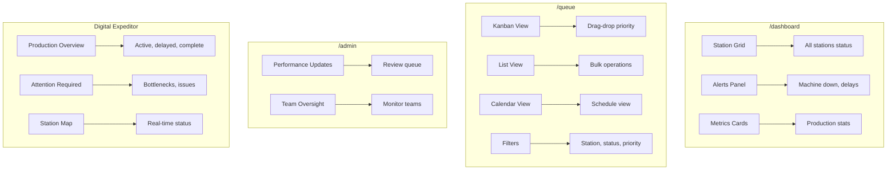
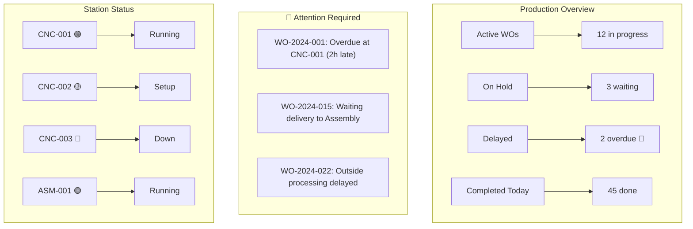
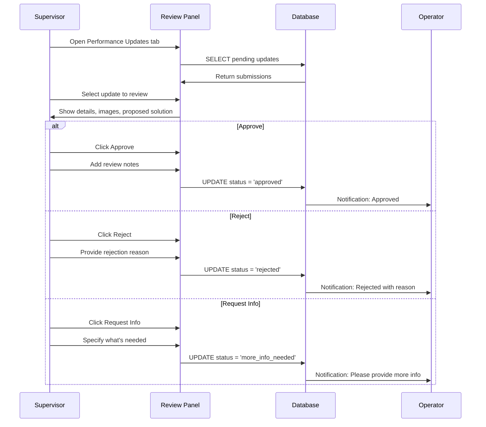
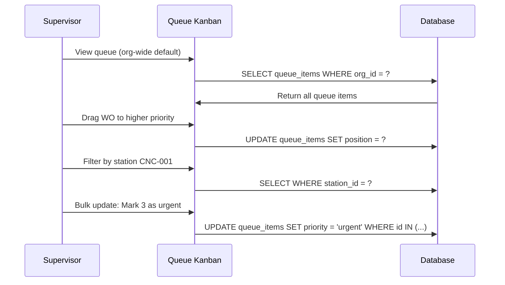
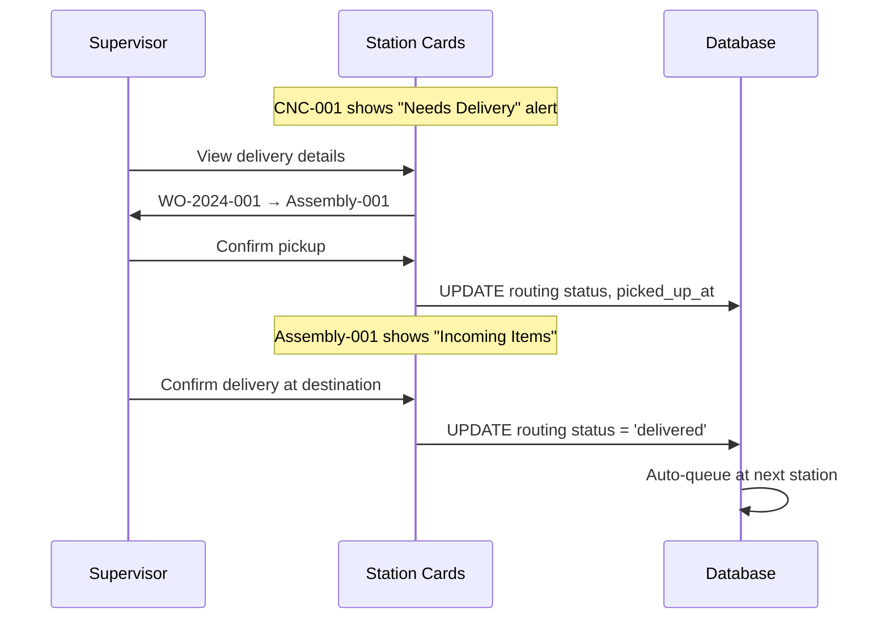

# PRD View: Supervisor

**Version**: 1.0  
**Last Updated**: 2025-01-27  
**Target Role**: `supervisor` (app_role)

---

## 1. Role Overview

Supervisors oversee production workflows, manage team assignments, review performance updates, and coordinate the digital expeditor system. They bridge management and shop floor operations.

---

## 2. Access Matrix

| Feature Area | Access Level |
|--------------|--------------|
| **Dashboard** |
| View all org stations | ✅ Read |
| View station status | ✅ Read |
| View production metrics | ✅ Read |
| **Queue Management** |
| View organization queue | ✅ Read |
| Create work orders | ✅ Write |
| Edit work orders | ✅ Write |
| Assign to operators | ✅ Write |
| Reprioritize queue | ✅ Write |
| **Routing** |
| Apply routing to WO | ✅ Write |
| Modify active routing | ✅ Write |
| Create templates | ✅ Write |
| **Performance Updates** |
| Review submissions | ✅ Read/Write |
| Approve/reject | ✅ Write |
| Assign for implementation | ✅ Write |
| **Delivery Coordination** |
| View all deliveries | ✅ Read |
| Override delivery status | ✅ Write |
| **Handoffs** |
| View all team handoffs | ✅ Read |
| Review/acknowledge | ✅ Write |
| **Invite Codes** |
| Generate for team | ✅ Write |
| Manage own invites | ✅ Write |

---

## 3. UI Entry Points



---

## 4. Relevant PRD Sections

| PRD | Sections | Purpose |
|-----|----------|---------|
| [01-User Roles](../01-user-roles-access-control.md) | §3.2 Supervisor capabilities | Role definition |
| [04-Work Order Queue](../04-work-order-queue.md) | §3 Queue Views, §5 Assignment | Queue management |
| [07-Admin Operations](../07-admin-supervisor-operations.md) | §4-8 All supervisor sections | Core workflows |
| [05-Handoff System](../05-handoff-system.md) | §5 Supervisor Review | Handoff oversight |

---

## 5. Key Workflows

### 5.1 Digital Expeditor Dashboard



### 5.2 Reviewing Performance Update



### 5.3 Queue Priority Management



### 5.4 Delivery Coordination



---

## 6. Expeditor Actions

| Action | Description | Keyboard |
|--------|-------------|----------|
| **Reprioritize** | Drag-drop to change queue order | - |
| **Reassign** | Move work to different station | `R` |
| **Expedite** | Flag for priority handling | `E` |
| **Split** | Divide quantity across stations | `S` |
| **Hold** | Pause work with reason | `H` |
| **Skip Step** | Bypass routing step (with approval) | `K` |

---

## 7. Key Metrics to Monitor

| Metric | Description | Alert Threshold |
|--------|-------------|-----------------|
| On-Time % | WOs completed by due date | < 90% |
| Avg Cycle Time | Time from start to complete | > 120% estimate |
| WIP Count | Work in progress | > capacity |
| Bottleneck Station | Station with highest queue | > 5 items |
| Delivery Time | Avg time between stations | > 30 min |
| Pending Reviews | Performance updates awaiting review | > 10 |

---

## 8. Data Access Patterns

### 8.1 Supervisor-Scoped Queries

```typescript
// Queue items for the org (supervisor default view)
const { data: queueItems } = await supabase
  .from('queue_items')
  .select(`
    *,
    station:stations(name, station_id),
    routing:work_order_routing(*)
  `)
  .eq('organization_id', orgId)
  .order('priority', { ascending: false })
  .order('position');

// Performance updates pending review
const { data: pendingUpdates } = await supabase
  .from('job_performance_updates')
  .select('*')
  .eq('team_id', teamId)
  .eq('status', 'pending')
  .order('created_at');
```

### 8.2 RLS Policies

```sql
-- Supervisors can view org-wide queue
CREATE POLICY "Supervisors view org queue"
ON public.queue_items
FOR SELECT
USING (
  is_supervisor_in_org(organization_id, auth.uid())
  OR is_org_admin(organization_id, auth.uid())
);

-- Supervisors can review performance updates in their org
CREATE POLICY "Supervisors review updates"
ON public.job_performance_updates
FOR UPDATE
USING (
  is_supervisor_for_team(team_id, auth.uid())
  OR is_org_admin(
    (SELECT organization_id FROM teams WHERE id = team_id),
    auth.uid()
  )
);
```

---

## 9. Implementation Checklist

### Dashboard
- [ ] Station grid with real-time status
- [ ] Alert panel for issues (down, delayed, delivery needed)
- [ ] Production metrics cards
- [ ] Clickable stations to drill down

### Queue Management
- [ ] Organization-wide view (default)
- [ ] Toggle for station-specific view
- [ ] Kanban with drag-drop priority
- [ ] Bulk operations (status, priority, assignment)
- [ ] Advanced filters

### Performance Reviews
- [ ] Pending updates queue
- [ ] Detail view with images
- [ ] Approve/Reject/Request Info actions
- [ ] Assignment to team/station
- [ ] Review notes

### Expeditor System
- [ ] Production overview dashboard
- [ ] Attention required alerts
- [ ] Station status map
- [ ] Quick actions (expedite, reassign, hold)

---

## 10. Related Documentation

- [User Role Architecture](../../user-role-architecture.md)
- [07-Admin Operations PRD](../07-admin-supervisor-operations.md)
- [04-Work Order Queue PRD](../04-work-order-queue.md)
