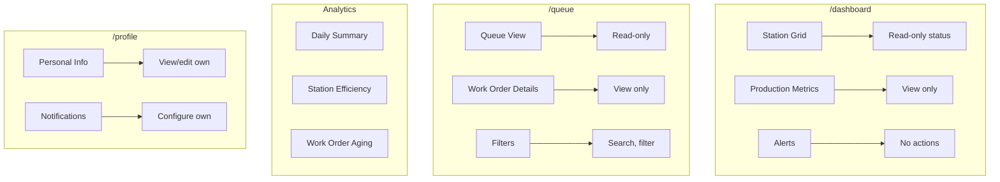

# PRD View: Viewer

**Version**: 1.0  
**Last Updated**: 2025-01-27  
**Target Role**: `viewer` (app_role)

---

## 1. Role Overview

Viewers have read-only access to dashboards, queue status, and handoff history. This role is designed for stakeholders who need visibility into operations without the ability to modify data (e.g., management, customers with portal access, auditors).

---

## 2. Access Matrix

| Feature Area | Access Level |
|--------------|--------------|
| **Dashboard** |
| View station grid | ✅ Read |
| View production metrics | ✅ Read |
| View alerts | ✅ Read |
| **Queue** |
| View queue status | ✅ Read |
| View work order details | ✅ Read |
| Filter/search | ✅ Read |
| Create/edit work orders | ❌ |
| **Handoffs** |
| View handoff history | ✅ Read |
| View handoff details | ✅ Read |
| Create handoffs | ❌ |
| **Analytics** |
| View reports | ✅ Read |
| Export data | ✅ Read (if entitled) |
| **Other** |
| Submit improvements | ❌ |
| Manage stations | ❌ |
| Manage users | ❌ |

---

## 3. UI Entry Points



---

## 4. Relevant PRD Sections

| PRD | Sections | Purpose |
|-----|----------|---------|
| [01-User Roles](../01-user-roles-access-control.md) | §3.2 Viewer, §6 Permission Matrix | Role definition |
| [04-Work Order Queue](../04-work-order-queue.md) | §3 Views (read-only) | Queue visibility |
| [07-Admin Operations](../07-admin-supervisor-operations.md) | §9 Reporting | Analytics access |

---

## 5. UI Restrictions

### 5.1 Hidden Elements

The following UI elements are hidden for viewers:
- "Create Work Order" button
- "New Handoff" button
- "Submit Improvement" button
- Edit/delete actions on any records
- Admin panel navigation
- Team management actions
- Invite code generator

### 5.2 Read-Only Indicators

```
┌────────────────────────────────────────────────────┐
│ 👁️ VIEW ONLY MODE                                 │
├────────────────────────────────────────────────────┤
│ You are viewing as a Viewer with read-only access. │
│ Contact an admin to request additional permissions.│
└────────────────────────────────────────────────────┘
```

### 5.3 Disabled Actions

All action buttons should be hidden rather than disabled to avoid confusion.

---

## 6. Data Access Patterns

### 6.1 Viewer-Scoped Queries

```typescript
// Viewers can read queue items in their org
const { data: queueItems } = await supabase
  .from('queue_items')
  .select(`
    *,
    station:stations(name, station_id)
  `)
  .eq('organization_id', orgId);

// Viewers can read handoff history
const { data: handoffs } = await supabase
  .from('handoff_records')
  .select('*')
  .eq('team_id', teamId)
  .order('created_at', { ascending: false })
  .limit(50);
```

### 6.2 RLS Policies

```sql
-- Viewers can read org data (SELECT only)
CREATE POLICY "Viewers read queue"
ON public.queue_items
FOR SELECT
USING (
  is_org_member(organization_id, auth.uid())
);

-- Viewers can read handoff history
CREATE POLICY "Viewers read handoffs"
ON public.handoff_records
FOR SELECT
USING (
  team_id IN (
    SELECT t.id FROM teams t
    JOIN organization_members om ON t.organization_id = om.organization_id
    WHERE om.user_id = auth.uid()
  )
);

-- No INSERT/UPDATE/DELETE policies for viewers
```

---

## 7. Use Cases

### 7.1 Management Dashboard

Executive or management users who need to monitor production without direct involvement:
- View real-time station status
- Monitor queue health
- Review production metrics
- Track on-time delivery rates

### 7.2 Customer Portal (Future)

External stakeholders viewing their order status:
- View specific work orders (filtered)
- See estimated completion dates
- Track progress through routing

### 7.3 Audit Access

Temporary access for auditors or quality reviewers:
- Historical handoff review
- Work order documentation
- Compliance verification

---

## 8. Implementation Checklist

### Dashboard
- [ ] Station grid (view only)
- [ ] Production metrics display
- [ ] No action buttons visible

### Queue
- [ ] Queue views (list, kanban, calendar)
- [ ] Work order detail view
- [ ] Filters and search
- [ ] No create/edit/delete buttons

### Handoffs
- [ ] Handoff history list
- [ ] Handoff detail view
- [ ] No create button

### UI Treatment
- [ ] Hide all write actions
- [ ] Show "View Only" indicator if helpful
- [ ] Proper entitlement gating

---

## 9. Entitlement Gate Implementation

```tsx
// Example: EntitlementGate usage for viewer restrictions
<EntitlementGate requiredRole="operator">
  <Button onClick={handleCreateWorkOrder}>Create Work Order</Button>
</EntitlementGate>

// This button won't render for viewers since they lack operator role
```

---

## 10. Related Documentation

- [User Role Architecture](../../user-role-architecture.md)
- [01-User Roles PRD](../01-user-roles-access-control.md)
