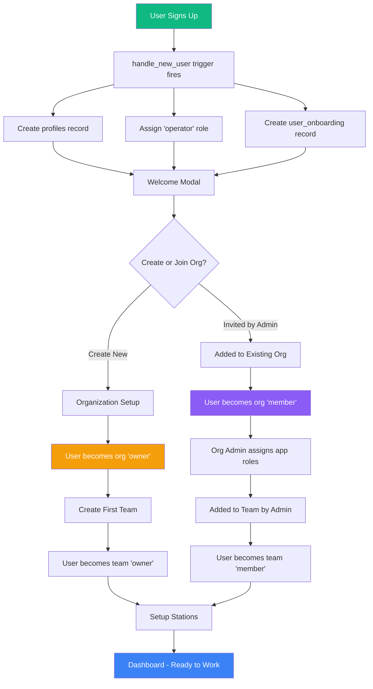
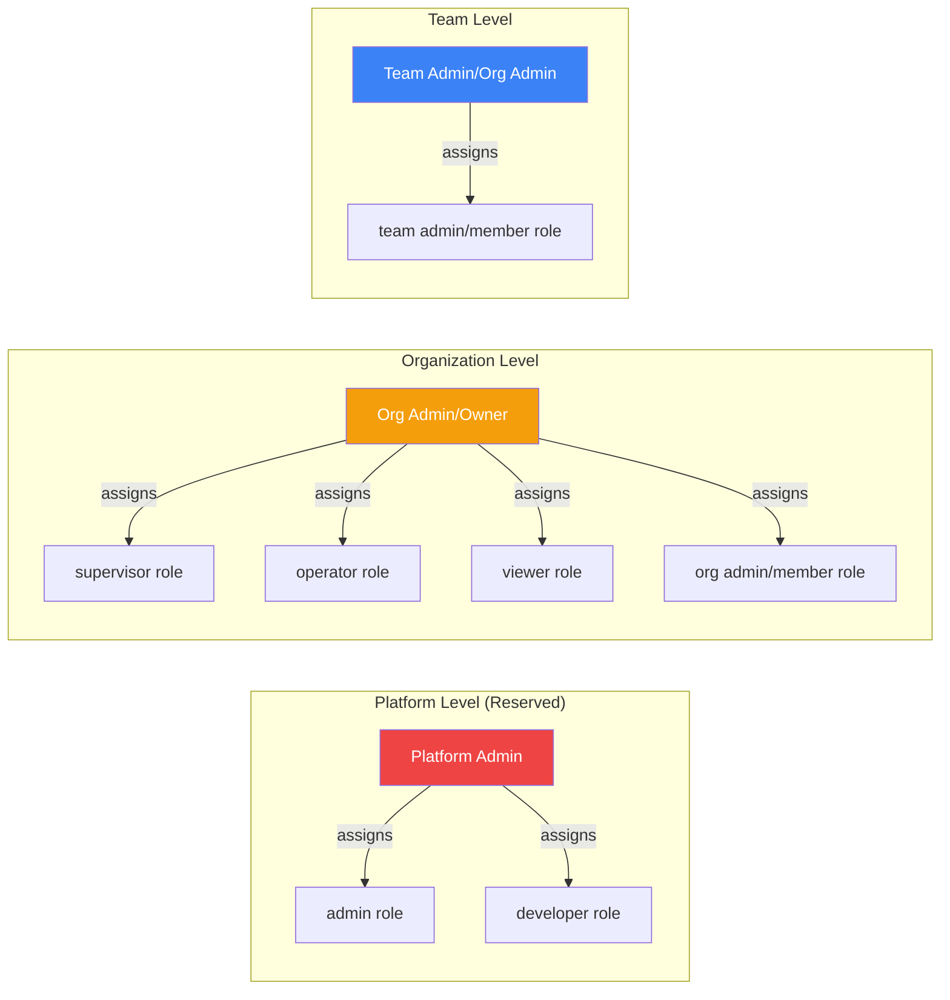
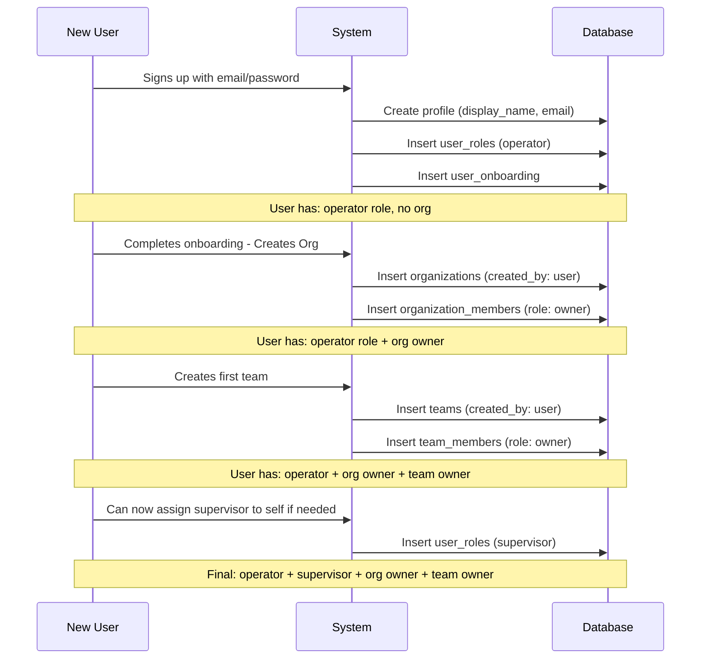
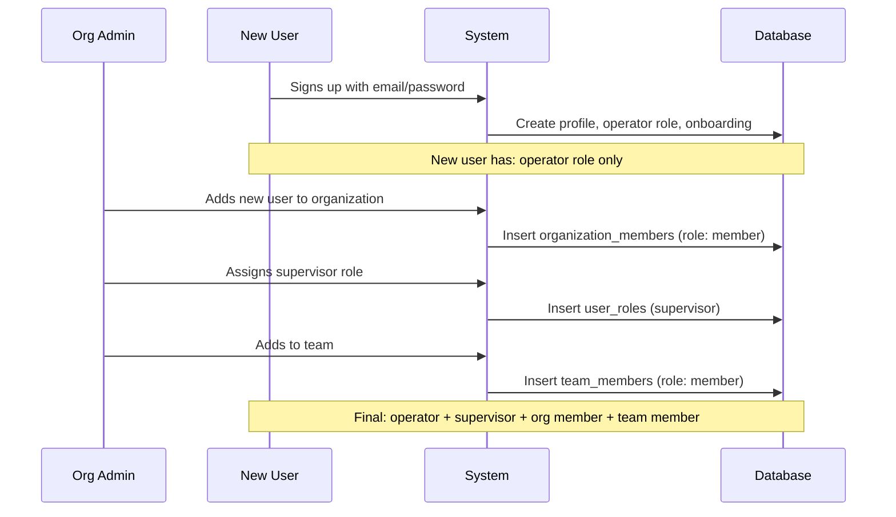
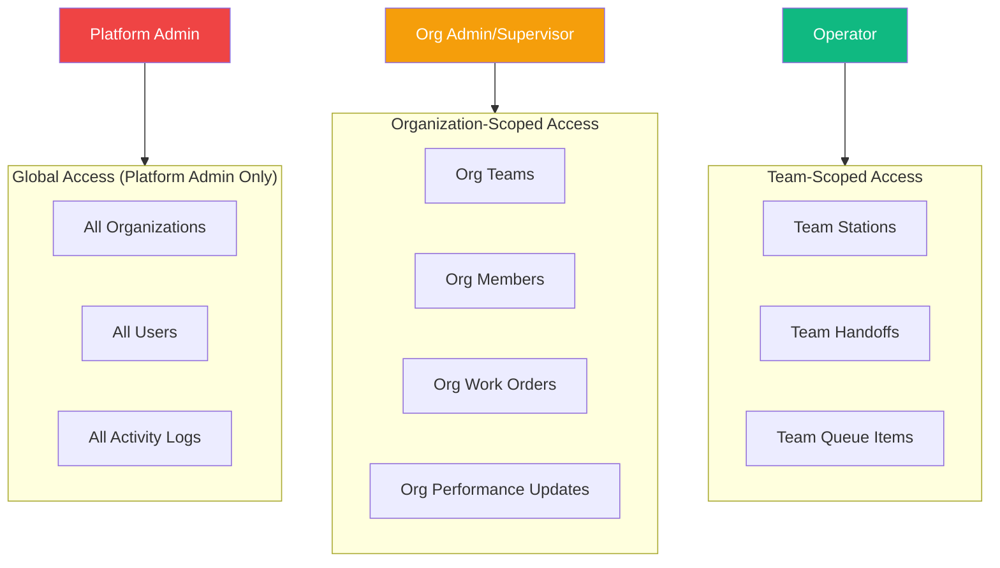

# User Role Architecture & Signup Flow

## Overview

This document describes the multi-level role architecture and the correct flow for new user signups in the organization-scoped SaaS application.

---

## Role Hierarchy

The application uses a **three-tier role system**:

| Level | Table | Roles | Purpose |
|-------|-------|-------|---------|
| **Platform** | `user_roles` | `admin`, `developer`, `supervisor`, `operator`, `viewer` | App-wide permissions |
| **Organization** | `organization_members` | `owner`, `admin`, `member` | Org management permissions |
| **Team** | `team_members` | `owner`, `admin`, `member` | Team-level permissions |

### Platform Roles (`user_roles`)

| Role | Who Can Assign | Description |
|------|----------------|-------------|
| `admin` | Platform owner only | Global super-admin, full system access |
| `developer` | Platform owner only | Access to testing suites, SDK, billing |
| `supervisor` | Org admins | Can oversee teams, review performance updates |
| `operator` | Auto-assigned on signup | Base role, can submit handoffs and updates |
| `viewer` | Org admins | Read-only access |

### Organization Roles (`organization_members`)

| Role | Who Can Assign | Description |
|------|----------------|-------------|
| `owner` | System (on org creation) | Full org control, billing, cannot be removed |
| `admin` | Org owner/admin | Can manage org members, teams, assign roles |
| `member` | Org owner/admin | Standard org membership |

### Team Roles (`team_members`)

| Role | Who Can Assign | Description |
|------|----------------|-------------|
| `owner` | System (on team creation) | Full team control |
| `admin` | Team owner/org admin | Can manage team members, stations |
| `member` | Team admin/org admin | Can view team data, submit handoffs |

---

## New User Signup Flow

### What Happens on Signup

When a new user signs up, the `handle_new_user` database trigger automatically:

1. Creates a `profiles` record with their email and display name
2. Assigns the `operator` role in `user_roles` (base access level)
3. Creates a `user_onboarding` record to track onboarding progress

**Initial State After Signup:**
- Platform Role: `operator` ✅
- Organization: None ❌
- Team: None ❌

### Signup Flow Diagram

---

## Role Assignment Permissions

### Who Can Assign What?

---

## Complete User Journey

### Scenario 1: User Creates Organization (Founder)

### Scenario 2: User is Invited to Existing Organization

---

## Access Control Matrix

| Action | admin | developer | supervisor | operator | viewer |
|--------|-------|-----------|------------|----------|--------|
| View all orgs/users | ✅ | ❌ | ❌ | ❌ | ❌ |
| Access testing suite | ❌ | ✅ | ❌ | ❌ | ❌ |
| View billing/subscriptions | ❌ | ✅ | ❌ | ❌ | ❌ |
| Review performance updates | ✅ | ❌ | ✅ (org-scoped) | ❌ | ❌ |
| Manage work orders | ✅ | ❌ | ✅ (org-scoped) | ❌ | ❌ |
| Submit handoffs | ✅ | ❌ | ✅ | ✅ | ❌ |
| Submit performance updates | ✅ | ❌ | ✅ | ✅ | ❌ |
| View team data | ✅ | ❌ | ✅ (org-scoped) | ✅ (team-scoped) | ✅ (team-scoped) |

---

## RLS Policy Summary

### Key Security Functions

| Function | Purpose |
|----------|---------|
| `has_role(user_id, role)` | Check if user has platform role |
| `is_org_member(user_id, org_id)` | Check org membership |
| `is_org_admin(user_id, org_id)` | Check org admin/owner status |
| `is_supervisor_in_org(user_id, org_id)` | Check supervisor role + org membership |
| `is_team_member(user_id, team_id)` | Check team membership |
| `is_team_admin(user_id, team_id)` | Check team admin/owner status |

### Data Isolation

---

## Summary

1. **New users automatically get `operator` role** - this is the base access level
2. **Users must create or join an organization** to access full functionality
3. **Organization founders become `owner`** with full control
4. **Invited users become `member`** with roles assigned by org admins
5. **Platform `admin` and `developer` roles are reserved** for platform owners only
6. **Org admins can only assign `supervisor`, `operator`, `viewer`** roles within their org
7. **All data is scoped** by organization → team → station hierarchy
