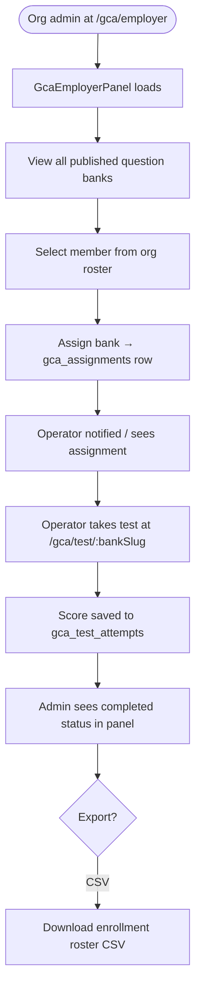

# GCA — G-Code Academy — User Path

Last updated: 2026-04-18

---

## 1. Roles

| Role | Entry point | Subscription required |
|---|---|---|
| **Anonymous visitor** | `/gcode-academy` | None |
| **Free learner** | Sign in with Google | None (free tier) |
| **GCA Pro learner** | Upgrade via `/pricing` or inline CTA | $19/mo or annual |
| **Org operator** | Assigned by org admin via `/gca/employer` | Org plan includes GCA |
| **Org admin / supervisor** | `/gca/employer` | Shop+ plan |

---

## 2. Full User Journey

```mermaid
flowchart TD
    A([Visitor lands on /gcode-academy]) --> B{Signed in?}
    B -- No --> C[View landing: hero, tracks, study banks]
    C --> D{CTA clicked}
    D -- Launch Academy --> E[/resources/gcode-academy static site]
    D -- Create Free Profile --> F[/auth — Google sign-in]
    D -- Take test --> G{Signed in?}
    G -- No --> F
    F --> H[Auth callback → redirect back]
    B -- Yes --> I[Landing with Study section visible]
    I --> J[Browse 10 question bank cards]
    J --> K[Click Take test → /gca/test/:bankSlug]

    K --> L{Bank is Pro-only?}
    L -- Yes + free user --> M[Lock screen with Upgrade CTA]
    M --> N[startGcaCheckout monthly/annual]
    N --> O[Stripe checkout]
    O -- Success --> P[Webhook → gca_subscriptions row]
    P --> K

    L -- No / Pro user --> Q[GcaTestPlayer loads]
    Q --> R[Answer all questions radio/checkbox]
    R --> S{All answered?}
    S -- No --> R
    S -- Yes --> T[Submit test button enabled]
    T --> U[useSubmitGcaAttempt mutation]
    U --> V[Client-side scoring: earned/total points]
    V --> W[Insert gca_test_attempts row]
    W --> X{Passed ≥ passing_score_pct?}
    X -- No --> Y[Result: Did not pass — review explanations]
    Y --> Z[Try again → reset answers]
    Z --> R
    X -- Yes --> AA[Result: Passed ✓]
    AA --> AB[Last attempt score shown in header]
    AA --> AC{Want certificate?}
    AC -- Yes --> AD[BuyCertificateDialog — $12 one-time]
    AD --> AE[create-cert-checkout edge fn]
    AE --> AF[Stripe checkout — guest allowed]
    AF --> AG[Webhook → gca_certificates row + Resend email]
    AG --> AH[/verify/:certId public page]

    style M fill:#1e3a5f,color:#93c5fd
    style AA fill:#1e3a2f,color:#86efac
    style Y fill:#3b1c1c,color:#fca5a5
```

---

## 3. Employer / Org Admin Path



---

## 4. ITAR Considerations

- `/gca/employer` is authenticated + org-scoped — `noindex`, RLS enforces org_id isolation.
- Question banks are canonical (platform-level, `organization_id = NULL`) — no org data in questions.
- `gca_test_attempts` rows are user+bank scoped — operators cannot see each other's scores.
- Certificates contain only name, bank titles, and cert ID — no machine/part/program data.

---

## 5. Key Routes

| Route | Auth | Description |
|---|---|---|
| `/gcode-academy` | Public | Marketing landing + Study bank cards |
| `/resources/gcode-academy` | Public | Static HTML curriculum |
| `/gca/test/:bankSlug` | Public (submit requires auth) | In-app test player |
| `/gca/employer` | Org admin/supervisor | Assign banks, track progress |
| `/verify/:certId` | Public | Certificate verification |
| `/pricing` | Public | GCA Pro pricing |

---

## 6. Database Tables

| Table | Purpose |
|---|---|
| `gca_question_banks` | 10 banks, `is_pro_only`, `passing_score_pct` |
| `gca_questions` | MCQ/multi-select, `choices` JSONB, `correct_answers` JSONB |
| `gca_test_attempts` | Per-user attempt history: `score_pct`, `passed`, `duration_seconds` |
| `gca_subscriptions` | $19/mo or annual Pro subscription per user |
| `gca_assignments` | Org admin → operator bank assignments |
| `gca_certificates` | Issued certs: `cert_id`, `qr_token`, `valid_from/until` |
| `training_media` | SVG diagrams + YouTube video links per bank |
