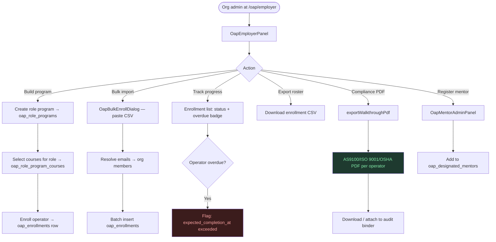
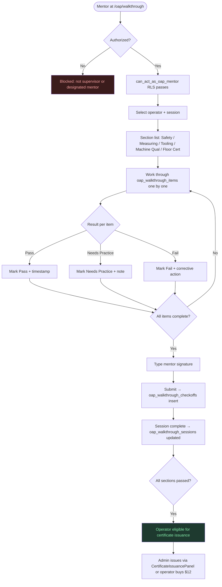
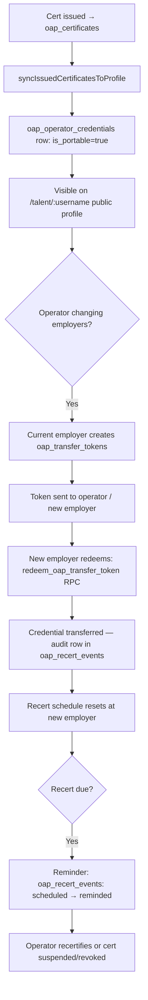

# OAP — Operator Acceptance Program — User Path

Last updated: 2026-04-18

---

## 1. Roles

| Role | Entry point | Requirement |
|---|---|---|
| **Anonymous visitor** | `/oap` | None |
| **Operator (self-study)** | `/oap/learn` | Free account |
| **Org operator** | Enrolled by employer | Org membership |
| **Designated mentor** | Registered by org admin | `oap_designated_mentors` row |
| **Org supervisor** | Any org supervisor | Org supervisor role |
| **Org admin** | `/oap/employer` | Org admin role |
| **Platform admin** | Training Library admin | Platform admin role |

---

## 2. Operator Self-Study Path

```mermaid
flowchart TD
    A([Operator visits /oap]) --> B[OAP Landing — hero, value props, FAQ]
    B --> C{CTA}
    C -- Start Learning --> D[/oap/learn — OapHub]
    C -- Verify cert --> E[/verify/:certId]

    D --> F{Signed in?}
    F -- No --> G[/auth Google sign-in]
    G --> D
    F -- Yes --> H[OapHub: 7 course cards + progress]
    H --> I[Click course → /oap/learn/:courseSlug]
    I --> J[Course overview: lessons + quiz status]
    J --> K[Click lesson → /oap/learn/:courseSlug/:lessonSlug]
    K --> L[OapCoursePlayer: markdown + TrainingMedia]
    L --> M[Embedded SVG diagrams / YouTube iframes]
    L --> N{Quiz available?}
    N -- Yes --> O[QuizPlayer: MCQ/multi/true-false]
    O --> P[Client-side scoring → oap_quiz_attempts insert]
    P --> Q{Passed?}
    Q -- No --> R[Review explanations → retry]
    R --> O
    Q -- Yes --> S[Quiz marked passed in OapHub]
    S --> T{≥50% overall completion?}
    T -- Yes --> U[Get my certificate $12 CTA appears]
    U --> V[BuyCertificateDialog]
    V --> W[create-cert-checkout edge fn]
    W --> X[Stripe $12 one-time checkout]
    X --> Y[Webhook → oap_certificates insert + Resend email]
    Y --> Z[/verify/:certId — public verification page]

    style Q fill:#1e3a2f,color:#86efac
    style R fill:#3b1c1c,color:#fca5a5
    style U fill:#1e3a5f,color:#93c5fd
```

---

## 3. Employer / Org Admin Path



---

## 4. Mentor Walkthrough Path



---

## 5. Portable Credential & Transfer Path



---

## 6. ITAR Considerations

- ITAR-flagged orgs: all walkthrough data, machine lists, and part programs are org-scoped — RLS enforces `org_id` isolation.
- Audit trail: `oap_recert_events` logs every lifecycle event with timestamp and actor.
- Compliance PDF contains operator name, sign-off dates, and section results — **no part numbers, programs, or controlled technical data**.
- `/oap/employer` and `/oap/my-transcript` are `noindex` — never indexed by search engines.
- Transfer tokens are single-use, expiring — enforced in `redeem_oap_transfer_token` RPC and RLS.
- Cross-org cert verification at `/verify/:certId` exposes only: cert ID, operator name, banks passed, issue date — no org-internal data.

---

## 7. Key Routes

| Route | Auth | Description |
|---|---|---|
| `/oap` | Public | Marketing landing |
| `/oap/learn` | Public (progress requires auth) | OapHub — 7 courses + progress |
| `/oap/learn/:courseSlug/:lessonSlug` | Auth | Lesson player + quiz |
| `/oap/walkthrough` | Mentor/supervisor | Mentor sign-off screen |
| `/oap/employer` | Org admin/supervisor | Program builder + enrollment |
| `/oap/my-transcript` | Auth | Operator transcript |
| `/verify/:certId` | Public | Certificate verification |

---

## 8. Database Tables

| Table | Purpose |
|---|---|
| `oap_courses` | 7 sections as authored courses |
| `oap_lessons` | Markdown + media per course |
| `oap_quizzes` / `oap_quiz_questions` / `oap_quiz_attempts` | Pass/fail comprehension testing |
| `oap_walkthrough_sections/items/sessions/checkoffs` | Mentor sign-off system |
| `oap_role_programs` / `oap_role_program_courses` | Employer curriculum per role |
| `oap_enrollments` | Operator → program with dates + overdue |
| `oap_certificates` / `oap_certificate_items` | Issued certs with QR token |
| `oap_operator_credentials` | Portable credential record |
| `oap_recert_events` | Full lifecycle audit trail |
| `oap_transfer_tokens` | Employer-to-employer transfer |
| `oap_designated_mentors` | Per-org mentor authorization |
